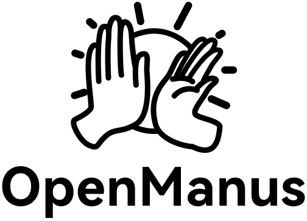
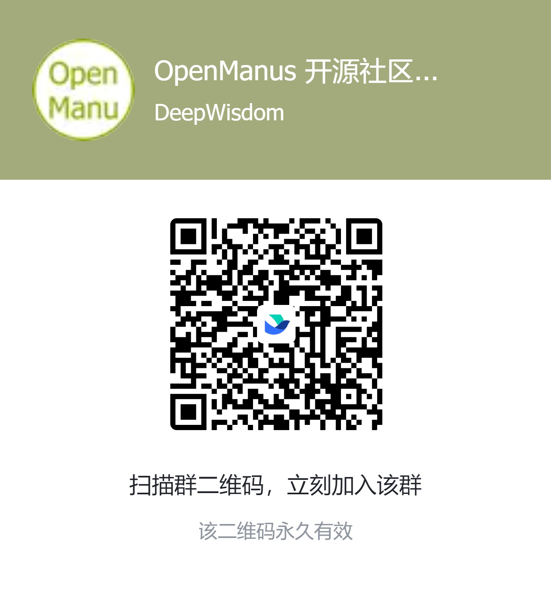

<p align="center">
  
</p>

[English](README.md) | [中文](README_zh.md) | 한국어 | [日本語](README_ja.md)

[](https://github.com/FoundationAgents/OpenManus/stargazers)
&ensp;
[](https://opensource.org/licenses/MIT) &ensp;
[](https://discord.gg/DYn29wFk9z)
[](https://huggingface.co/spaces/lyh-917/OpenManusDemo)
[](https://doi.org/10.5281/zenodo.15186407)

# 👋 OpenManus

Manus는 놀라운 도구지만, OpenManus는 *초대 코드* 없이도 모든 아이디어를 실현할 수 있습니다! 🛫

우리 팀의 멤버인 [@Xinbing Liang](https://github.com/mannaandpoem)와 [@Jinyu Xiang](https://github.com/XiangJinyu) (핵심 작성자), 그리고 [@Zhaoyang Yu](https://github.com/MoshiQAQ), [@Jiayi Zhang](https://github.com/didiforgithub), [@Sirui Hong](https://github.com/stellaHSR)이 함께 했습니다. 우리는 [@MetaGPT](https://github.com/geekan/MetaGPT)로부터 왔습니다. 프로토타입은 단 3시간 만에 출시되었으며, 계속해서 발전하고 있습니다!

이 프로젝트는 간단한 구현에서 시작되었으며, 여러분의 제안, 기여 및 피드백을 환영합니다!

OpenManus를 통해 여러분만의 에이전트를 즐겨보세요!

또한 [OpenManus-RL](https://github.com/OpenManus/OpenManus-RL)을 소개하게 되어 기쁩니다. OpenManus와 UIUC 연구자들이 공동 개발한 이 오픈소스 프로젝트는 LLM 에이전트에 대해 강화 학습(RL) 기반 (예: GRPO) 튜닝 방법을 제공합니다.

## 프로젝트 데모

<video src="https://private-user-images.githubusercontent.com/61239030/420168772-6dcfd0d2-9142-45d9-b74e-d10aa75073c6.mp4?jwt=eyJhbGciOiJIUzI1NiIsInR5cCI6IkpXVCJ9.eyJpc3MiOiJnaXRodWIuY29tIiwiYXVkIjoicmF3LmdpdGh1YnVzZXJjb250ZW50LmNvbSIsImtleSI6ImtleTUiLCJleHAiOjE3NDEzMTgwNTksIm5iZiI6MTc0MTMxNzc1OSwicGF0aCI6Ii82MTIzOTAzMC80MjAxNjg3NzItNmRjZmQwZDItOTE0Mi00NWQ5LWI3NGUtZDEwYWE3NTA3M2M2Lm1wND9YLUFtei1BbGdvcml0aG09QVdTNC1ITUFDLVNIQTI1NiZYLUFtei1DcmVkZW50aWFsPUFLSUFWQ09EWUxTQTUzUFFLNFpBJTJGMjAyNTAzMDclMkZ1cy1lYXN0LTElMkZzMyUyRmF3czRfcmVxdWVzdCZYLUFtei1EYXRlPTIwMjUwMzA3VDAzMjIzOVomWC1BbXotRXhwaXJlcz0zMDAmWC1BbXotU2lnbmF0dXJlPTdiZjFkNjlmYWNjMmEzOTliM2Y3M2VlYjgyNDRlZDJmOWE3NWZhZjE1MzhiZWY4YmQ3NjdkNTYwYTU5ZDA2MzYmWC1BbXotU2lnbmVkSGVhZGVycz1ob3N0In0.UuHQCgWYkh0OQq9qsUWqGsUbhG3i9jcZDAMeHjLt5T4" data-canonical-src="https://private-user-images.githubusercontent.com/61239030/420168772-6dcfd0d2-9142-45d9-b74e-d10aa75073c6.mp4?jwt=eyJhbGciOiJIUzI1NiIsInR5cCI6IkpXVCJ9.eyJpc3MiOiJnaXRodWIuY29tIiwiYXVkIjoicmF3LmdpdGh1YnVzZXJjb250ZW50LmNvbSIsImtleSI6ImtleTUiLCJleHAiOjE3NDEzMTgwNTksIm5iZiI6MTc0MTMxNzc1OSwicGF0aCI6Ii82MTIzOTAzMC80MjAxNjg3NzItNmRjZmQwZDItOTE0Mi00NWQ5LWI3NGUtZDEwYWE3NTA3M2M2Lm1wND9YLUFtei1BbGdvcml0aG09QVdTNC1ITUFDLVNIQTI1NiZYLUFtei1DcmVkZW50aWFsPUFLSUFWQ09EWUxTQTUzUFFLNFpBJTJGMjAyNTAzMDclMkZ1cy1lYXN0LTElMkZzMyUyRmF3czRfcmVxdWVzdCZYLUFtei1EYXRlPTIwMjUwMzA3VDAzMjIzOVomWC1BbXotRXhwaXJlcz0zMDAmWC1BbXotU2lnbmF0dXJlPTdiZjFkNjlmYWNjMmEzOTliM2Y3M2VlYjgyNDRlZDJmOWE3NWZhZjE1MzhiZWY4YmQ3NjdkNTYwYTU5ZDA2MzYmWC1BbXotU2lnbmVkSGVhZGVycz1ob3N0In0.UuHQCgWYkh0OQq9qsUWqGsUbhG3i9jcZDAMeHjLt5T4" controls="controls" muted="muted" class="d-block rounded-bottom-2 border-top width-fit" style="max-height:640px; min-height: 200px"></video>

## 설치 방법

두 가지 설치 방법을 제공합니다. **방법 2 (uv 사용)** 이 더 빠른 설치와 효율적인 종속성 관리를 위해 권장됩니다.

### 방법 1: conda 사용

1. 새로운 conda 환경을 생성합니다:

```bash
conda create -n open_manus python=3.12
conda activate open_manus
```

2. 저장소를 클론합니다:

```bash
git clone https://github.com/FoundationAgents/OpenManus.git
cd OpenManus
```

3. 종속성을 설치합니다:

```bash
pip install -r requirements.txt
```

### 방법 2: uv 사용 (권장)

1. uv를 설치합니다. (빠른 Python 패키지 설치 및 종속성 관리 도구):

```bash
curl -LsSf https://astral.sh/uv/install.sh | sh
```

2. 저장소를 클론합니다:

```bash
git clone https://github.com/FoundationAgents/OpenManus.git
cd OpenManus
```

3. 새로운 가상 환경을 생성하고 활성화합니다:

```bash
uv venv --python 3.12
source .venv/bin/activate  # Unix/macOS의 경우
# Windows의 경우:
# .venv\Scripts\activate
```

4. 종속성을 설치합니다:

```bash
uv pip install -r requirements.txt
```

### 브라우저 자동화 도구 (선택사항)
```bash
playwright install
```

## 설정 방법

OpenManus를 사용하려면 사용하는 LLM API에 대한 설정이 필요합니다. 아래 단계를 따라 설정을 완료하세요:

1. `config` 디렉토리에 `config.toml` 파일을 생성하세요 (예제 파일을 복사하여 사용할 수 있습니다):

```bash
cp config/config.example.toml config/config.toml
```

2. `config/config.toml` 파일을 편집하여 API 키를 추가하고 설정을 커스터마이징하세요:

```toml
# 전역 LLM 설정
[llm]
model = "gpt-4o"
base_url = "https://api.openai.com/v1"
api_key = "sk-..."  # 실제 API 키로 변경하세요
max_tokens = 4096
temperature = 0.0

# 특정 LLM 모델에 대한 선택적 설정
[llm.vision]
model = "gpt-4o"
base_url = "https://api.openai.com/v1"
api_key = "sk-..."  # 실제 API 키로 변경하세요
```

## 빠른 시작

OpenManus를 실행하는 한 줄 명령어:

```bash
python main.py
```

이후 터미널에서 아이디어를 작성하세요!

MCP 도구 버전을 사용하려면 다음을 실행하세요:
```bash
python run_mcp.py
```

불안정한 멀티 에이전트 버전을 실행하려면 다음을 실행할 수 있습니다:

```bash
python run_flow.py
```

## OrcaRouter

[OrcaRouter](https://www.orcarouter.ai)는 OpenAI 호환 AI 게이트웨이입니다. OpenManus는 다른 OpenAI 호환 공급자와 동일한 `api_type` 방식으로 연결합니다. 인증 방법별로 두 개의 provider 항목이 있으며, 둘 다 결국 같은 `sk-orca-...` 키로 `https://api.orcarouter.ai/v1`을 사용합니다.

| `api_type` | 인증 방법 |
| --- | --- |
| `orcarouter` | 기존 `sk-orca-...` 키를 `api_key`에 입력하거나 `ORCAROUTER_API_KEY`를 설정합니다. |
| `orcarouter-oauth` | `orcarouter login`을 실행하고 브라우저에서 승인합니다(OAuth 2.0 + PKCE). |

```bash
# 방법 1 - 기존 키 사용
export ORCAROUTER_API_KEY=sk-orca-...
# 방법 2 - OrcaRouter 계정으로 로그인 (브라우저가 열리고 키를 복사할 필요가 없습니다)
orcarouter login
```

```toml
[llm]
api_type = "orcarouter"          # `orcarouter login` 후에는 "orcarouter-oauth"
model = "orcarouter/auto"
base_url = "https://api.orcarouter.ai/v1"
api_key = "your OrcaRouter api key"   # 비워 두면 저장된 키/환경 변수 키를 사용합니다
max_tokens = 16000
temperature = 0.0

[llm.vision]
api_type = "orcarouter"
model = "google/gemini-3.5-flash"     # 카탈로그에서 이미지 입력을 지원하는 모델
base_url = "https://api.orcarouter.ai/v1"
api_key = "your OrcaRouter api key"
```

키는 사용자의 OrcaRouter 계정에 속하며, 요금도 사용자에게 청구되고 <https://www.orcarouter.ai/console/authorized-apps>에서 언제든지 폐기할 수 있습니다. 저장 위치는 `~/.openmanus/orcarouter.json`(권한 `0600`)이며 이 저장소에는 기록되지 않습니다.

```bash
orcarouter login            # 인증 (API 키 또는 브라우저를 통한 PKCE)
orcarouter login --code X   # 동의 화면에 코드가 표시된 경우의 PKCE 완료
orcarouter status           # 저장된 자격 증명과 재인증 필요 여부 확인
orcarouter models           # GET /v1/models에서 이 키로 호출 가능한 모델 목록
orcarouter logout           # 저장된 자격 증명 삭제
```

자체 호스팅 OrcaRouter는 `ORCA_BASE_URL`(단일 공유 오리진) 또는 `ORCA_AUTH_BASE_URL` / `ORCA_API_BASE_URL`(인증/추론 분리)로 자체 오리진을 지정할 수 있습니다. 루프백을 제외하면 HTTPS가 필수입니다.

모델 ID는 카탈로그 표기 그대로 vendor 네임스페이스를 유지합니다(`orcarouter/auto`, `google/gemini-3.5-flash`). 모든 진입점이 동일한 모델 카탈로그 서비스로 후보를 해석하므로, 선택기가 제시하는 옵션은 항상 카탈로그가 보증한 모델입니다. chat 진입점은 이미지/비디오/rerank 모델을 제외하고, 스크린샷을 업로드하는 진입점은 카탈로그 레코드에 `image` 입력을 명시한 모델만 제시합니다. 텍스트 전용 모델에 이미지를 첨부하면 이미지를 조용히 버리지 않고 모델 ID와 해결 방법을 알려 거부합니다. `orcarouter models`는 동일한 필터 결과를 능력별로 출력하고, 현재 능력에서 더 이상 허용되지 않는 저장된 모델을 표시합니다.


### 사용자 정의 다중 에이전트 추가

현재 일반 OpenManus 에이전트 외에도 데이터 분석 및 데이터 시각화 작업에 적합한 DataAnalysis 에이전트를 통합했습니다. 이 에이전트를 `config.toml`의 `run_flow`에 추가할 수 있습니다.

```toml
# run-flow에 대한 선택적 구성
[runflow]
use_data_analysis_agent = true     # 기본적으로 비활성화되어 있으며, 활성화하려면 true로 변경
```

또한, 에이전트가 제대로 작동하도록 관련 종속성을 설치해야 합니다: [상세 설치 가이드](app/tool/chart_visualization/README.md##Installation)

## 기여 방법

모든 친절한 제안과 유용한 기여를 환영합니다! 이슈를 생성하거나 풀 리퀘스트를 제출해 주세요.

또는 📧 메일로 연락주세요. @mannaandpoem : mannaandpoem@gmail.com

**참고**: pull request를 제출하기 전에 pre-commit 도구를 사용하여 변경 사항을 확인하십시오. `pre-commit run --all-files`를 실행하여 검사를 실행합니다.

## 커뮤니티 그룹
Feishu 네트워킹 그룹에 참여하여 다른 개발자들과 경험을 공유하세요!

<div align="center" style="display: flex; gap: 20px;">
    
</div>

## Star History

[](https://star-history.com/#FoundationAgents/OpenManus&Date)

## 감사의 글

이 프로젝트에 기본적인 지원을 제공해 주신 [anthropic-computer-use](https://github.com/anthropics/anthropic-quickstarts/tree/main/computer-use-demo)와
[browser-use](https://github.com/browser-use/browser-use)에게 감사드립니다!

또한, [AAAJ](https://github.com/metauto-ai/agent-as-a-judge), [MetaGPT](https://github.com/geekan/MetaGPT), [OpenHands](https://github.com/All-Hands-AI/OpenHands), [SWE-agent](https://github.com/SWE-agent/SWE-agent)에 깊은 감사를 드립니다.

또한 Hugging Face 데모 공간을 지원해 주신 阶跃星辰 (stepfun)에게 감사드립니다.

OpenManus는 MetaGPT 기여자들에 의해 개발되었습니다. 이 에이전트 커뮤니티에 깊은 감사를 전합니다!

## 인용
```bibtex
@misc{openmanus2025,
  author = {Xinbing Liang and Jinyu Xiang and Zhaoyang Yu and Jiayi Zhang and Sirui Hong and Sheng Fan and Xiao Tang},
  title = {OpenManus: An open-source framework for building general AI agents},
  year = {2025},
  publisher = {Zenodo},
  doi = {10.5281/zenodo.15186407},
  url = {https://doi.org/10.5281/zenodo.15186407},
}
```
