# OpenManus Architecture Review

## Table of Contents
1. [System Overview](#system-overview)
2. [Agent Hierarchy](#agent-hierarchy)
3. [Tool System](#tool-system)
4. [Execution Flow](#execution-flow)
5. [Planning Flow](#planning-flow)
6. [MCP Integration](#mcp-integration)
7. [Sandbox Architecture](#sandbox-architecture)
8. [LLM Layer](#llm-layer)
9. [Configuration System](#configuration-system)
10. [Component Details](#component-details)
11. [Design Patterns](#design-patterns)
12. [Entry Points](#entry-points)

---

## System Overview

OpenManus is an open-source general-purpose AI agent framework built in Python. Inspired by Anthropic's Manus agent, it provides a flexible architecture for building autonomous agents that can use tools, browse the web, execute code, and interact with various services.

### High-Level Architecture Diagram

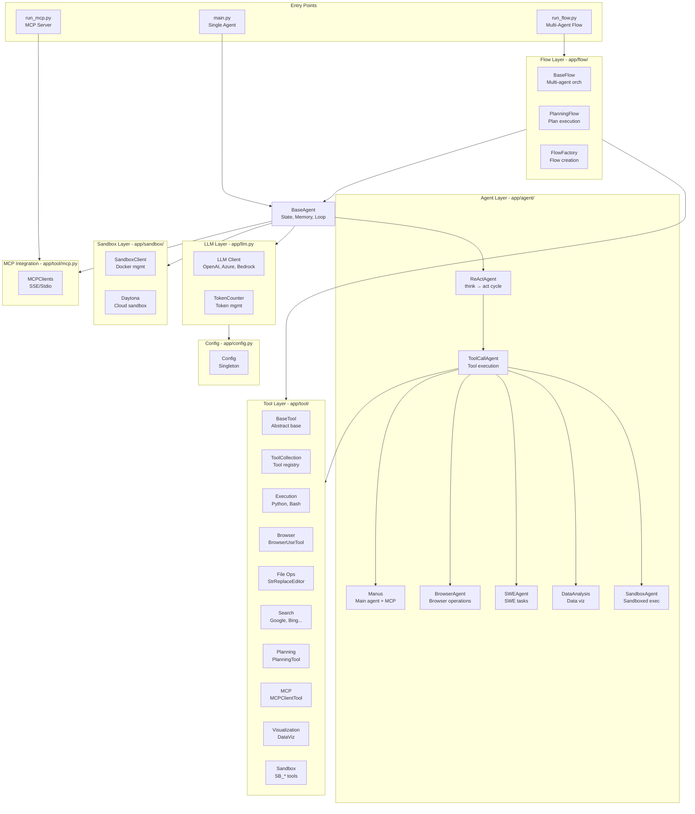

---

## Agent Hierarchy

### Agent Class Hierarchy Diagram

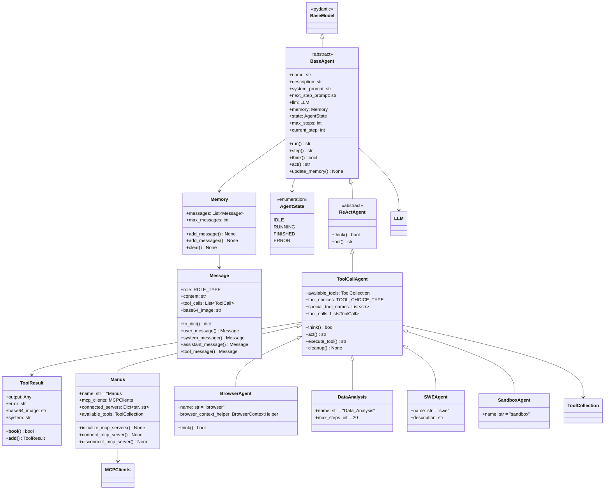

### Agent State Machine

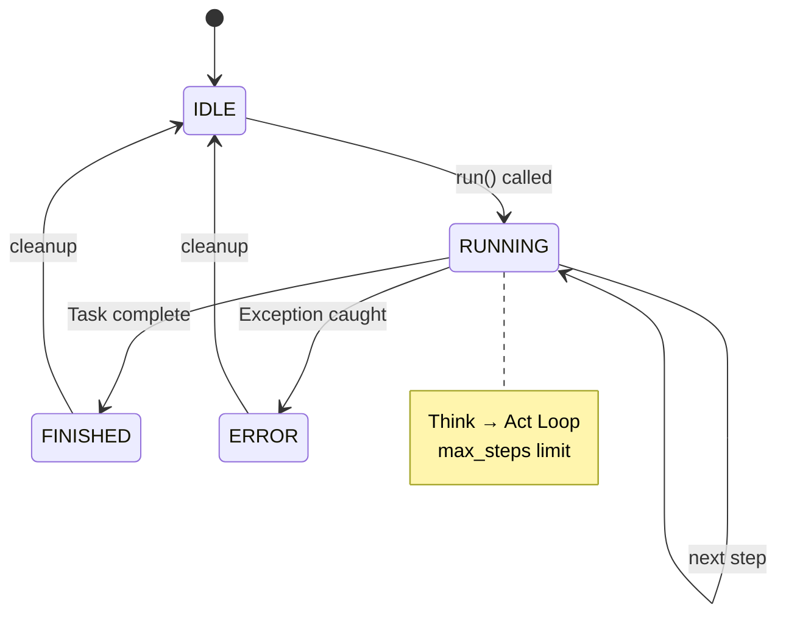

---

## Tool System

### Tool Architecture Diagram

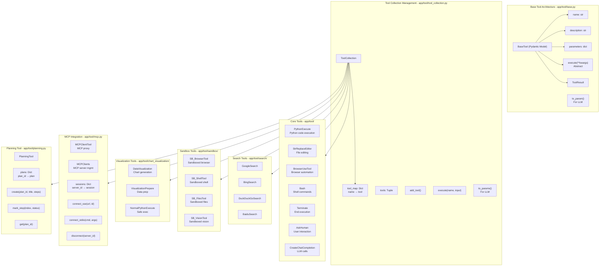

---

## Execution Flow

### Single Agent Execution Sequence

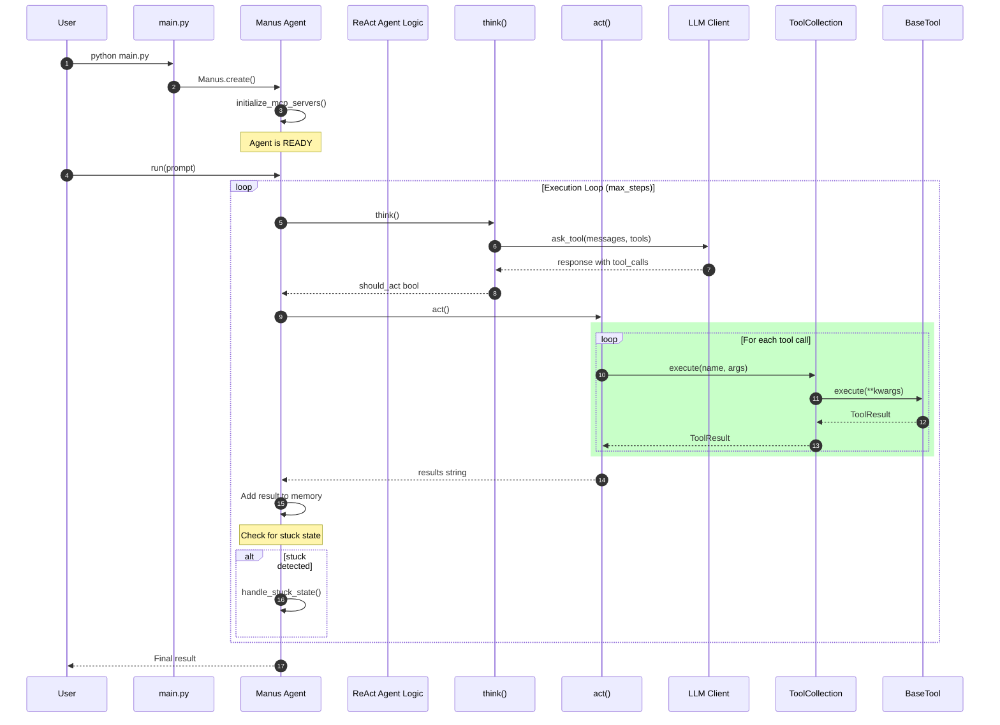

---

## Planning Flow

### Multi-Agent Planning Flow Sequence

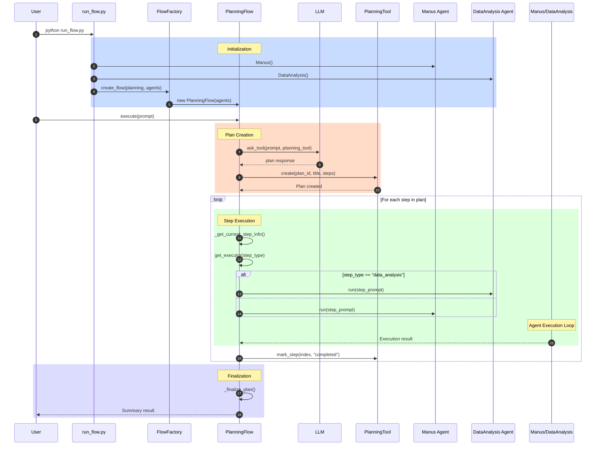

---

## MCP Integration

### MCP Architecture Diagram

```mermaid
flowchart TB
    subgraph MCPClients["MCP Clients - app/tool/mcp.py"]
        MCPC["MCPClients\nExtends ToolCollection"]
        sessions["sessions: Dict[str, ClientSession]"]
        exit_stacks["exit_stacks: Dict[str, AsyncExitStack]"]
    end

    subgraph MCPClientTool["MCPClientTool - app/tool/mcp.py"]
        MCPCT["MCPClientTool"]
        server_id["server_id: str"]
        session["session: ClientSession"]
        original_name["original_name: str"]
        execute["execute(**kwargs)"]
    end

    subgraph MCPTransport["MCP Transport Layer"]
        SSE["SSE Client\nServer-Sent Events"]
        Stdio["Stdio Client\nStandard I/O"]
        ClientSession["ClientSession\nfrom mcp package"]
    end

    subgraph ExternalMCP["External MCP Servers"]
        Server1["MCP Server 1\n(e.g., filesystem)"]
        Server2["MCP Server 2\n(e.g., github)"]
        Server3["MCP Server N\nCustom servers"]
    end

    MCPC --> SSE
    MCPC --> Stdio

    SSE --> ClientSession
    Stdio --> ClientSession

    ClientSession --> Server1
    ClientSession --> Server2
    ClientSession --> Server3

    Server1 --> MCPCT:1
    Server2 --> MCPCT:2
    Server3 --> MCPCT:N

    MCPCT --> ToolCollection

    Note over MCPC: Dynamic tool discovery<br/>Tool names: mcp_{server}_{tool_name}
```

### MCP Connection Sequence

```mermaid
sequenceDiagram
    autonumber

    participant Manus
    participant MCPClients
    participant MCPTool
    participant Transport
    participant MCPServer

    Note over Manus, MCPServer: SSE Connection Flow

    Manus->>MCPClients: connect_sse(server_url, server_id)

    rect rgb(200, 255, 200)
        MCPClients->>Transport: sse_client(url)
        Transport->>Transport: Establish SSE stream
        Transport-->>MCPClients: stream contexts
        MCPClients->>Transport: enter_async_context(ClientSession)
        Transport-->>MCPClients: ClientSession
    end

    MCPClients->>MCPServer: session.initialize()
    MCPServer-->>MCPClients: init result

    MCPClients->>MCPServer: session.list_tools()
    MCPServer-->>MCPClients: tools list

    rect rgb(220, 220, 255)
        Note over MCPClients: Create MCPClientTool instances
        loop For each tool
            MCPClients->>MCPClients: _sanitize_tool_name()
            MCPClients->>MCPTool: new MCPClientTool(
                name="mcp_server_tool",
                description=...,
                parameters=...,
                session=session,
                server_id=server_id
            )
        end
    end

    Note over MCPClients: Tools available in ToolCollection

    rect rgb(255, 220, 200)
        Note over Manus, MCPServer: Tool Execution Flow

        Manus->>MCPClients: execute("mcp_server_tool", args)
        MCPClients->>MCPTool: execute(**kwargs)
        MCPTool->>MCPServer: session.call_tool(tool_name, args)
        MCPServer-->>MCPTool: tool result
        MCPTool-->>MCPClients: ToolResult
        MCPClients-->>Manus: ToolResult
    end

    Manus->>MCPClients: disconnect(server_id)
    MCPClients->>Transport: exit_stack.aclose()
    MCPClients-->>Manus: Disconnected
```

---

## Sandbox Architecture

### Sandbox System Diagram

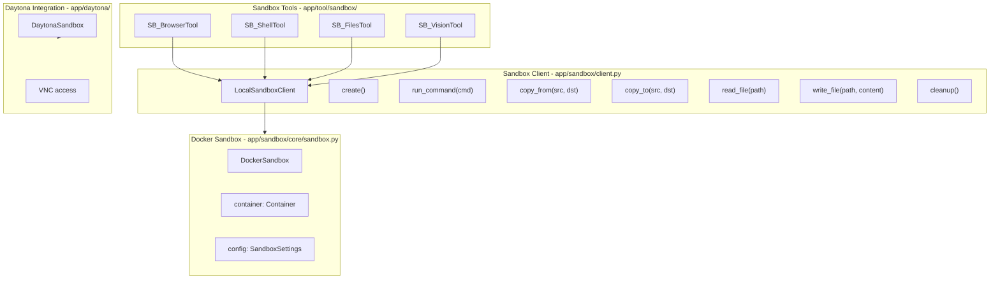

### Sandbox Execution Sequence

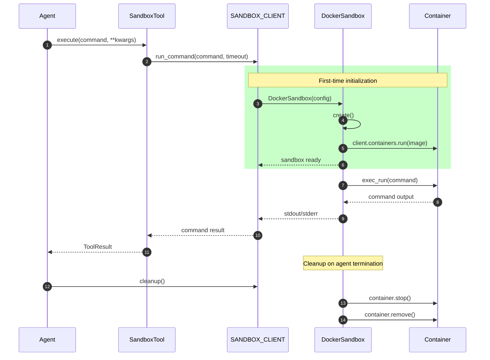

---

## LLM Layer

### LLM Architecture Diagram

```mermaid
flowchart TB
    subgraph LLMClient["LLM Client - app/llm.py"]
        LLM["LLM (Singleton)"]
        TokenCounter["TokenCounter"]
        client["AsyncOpenAI / AsyncAzureOpenAI"]
        BedrockClient["BedrockClient"]
    end

    subgraph Methods["Key Methods"]
        ask["ask(messages, system_msgs)"]
        ask_tool["ask_tool(messages, tools, tool_choice)"]
        ask_with_images["ask_with_images(messages, images)"]
        count_tokens["count_message_tokens(messages)"]
        check_limit["check_token_limit(input_tokens)"]
        update_count["update_token_count(input, output)"]
    end

    subgraph Config["LLM Configuration"]
        model["model: str"]
        api_key["api_key: str"]
        base_url["base_url: str"]
        api_type["api_type: str"]
        max_tokens["max_tokens: int"]
        max_input_tokens["max_input_tokens: Optional[int]"]
        temperature["temperature: float"]
    end

    subgraph Models["Supported Models"]
        Reasoning["REASONING_MODELS\no1, o3-mini"]
        Multimodal["MULTIMODAL_MODELS\ngpt-4o, gpt-4o-mini\nclaude-3-opus, claude-3-sonnet"]
    end

    LLM --> TokenCounter
    LLM --> Config
    LLM --> Methods

    alt api_type == "azure"
        client --> AsyncOpenAI
    else if api_type == "aws"
        client --> BedrockClient
    else
        client --> AsyncOpenAI
    end

    LLM --> Models
```

---

## Configuration System

### Configuration Hierarchy

```mermaid
flowchart TB
    subgraph Config["Config Singleton - app/config.py"]
        ConfigClass["Config"]
        _config["_config: AppConfig"]
        _instance["_instance: None"]
        _initialized["_initialized: bool"]
    end

    subgraph Settings["Configuration Classes"]
        LLMSettings["LLMSettings"]
        BrowserSettings["BrowserSettings"]
        SandboxSettings["SandboxSettings"]
        SearchSettings["SearchSettings"]
        MCPSettings["MCPSettings"]
        RunflowSettings["RunflowSettings"]
        DaytonaSettings["DaytonaSettings"]
    end

    subgraph Files["Configuration Files"]
        config_toml["config/config.toml"]
        config_example["config/config.example.toml"]
        mcp_json["config/mcp.json"]
    end

    ConfigClass --> Settings
    Settings --> Files

    ConfigClass --> ConfigClass: __new__()
```

---

## Component Details

### 1. BaseAgent (`app/agent/base.py`)

**Purpose**: Abstract base class for all agents

| Method | Purpose |
|--------|---------|
| `run(request)` | Main execution loop with state management |
| `step()` | Single step execution |
| `think()` | Abstract - decision making |
| `act()` | Abstract - action execution |
| `update_memory(role, content)` | Add message to history |
| `is_stuck()` | Detect loop condition |
| `handle_stuck_state()` | Recovery from loops |

**State Machine**: `IDLE → RUNNING → (FINISHED | ERROR) → IDLE`

**Stuck Detection**:
- Compares last message with previous assistant messages
- Threshold: 2 duplicate messages
- Triggers strategy change prompt

### 2. ReActAgent (`app/agent/react.py`)

**Purpose**: Implements Reasoning + Acting pattern

**Pattern**:
```
think() → decision → act() → result → next iteration
```

**think()**: Calls LLM to decide next action
**act()**: Executes decided actions

### 3. ToolCallAgent (`app/agent/toolcall.py`)

**Purpose**: Tool-calling agent implementation

| Method | Purpose |
|--------|---------|
| `think()` | LLM tool selection with function calling |
| `act()` | Execute tool calls sequentially |
| `execute_tool(command)` | Single tool execution with error handling |
| `cleanup()` | Cleanup all tool resources |

**Tool Selection Modes**:
- `NONE`: No tools allowed
- `AUTO`: LLM decides
- `REQUIRED`: Must use tools

### 4. Manus (`app/agent/manus.py`)

**Purpose**: Main general-purpose agent

**Features**:
- MCP server integration (SSE + stdio)
- Dynamic tool loading
- Browser context management
- Multi-step execution (max 20 steps)

**MCP Integration**:
```python
await connect_mcp_server(url, server_id, use_sse=True)
await connect_mcp_server(cmd, server_id, use_stdio=True, stdio_args=[...])
```

### 5. BrowserUseTool (`app/tool/browser_use_tool.py`)

**Purpose**: Full browser automation using Playwright

| Action | Parameters | Description |
|--------|------------|-------------|
| `go_to_url` | url | Navigate to URL |
| `click_element` | index | Click element by index |
| `input_text` | index, text | Input text into field |
| `scroll_down/up` | scroll_amount | Scroll page |
| `scroll_to_text` | text | Find and scroll to text |
| `extract_content` | goal | Extract based on goal |
| `web_search` | query | Search web |
| `switch_tab` | tab_id | Change tab |
| `open_tab` | url | New tab |
| `close_tab` | - | Close current tab |

**State Management**:
- Screenshot capture for LLM context
- DOM element indexing
- Tab management

### 6. PlanningTool (`app/tool/planning.py`)

**Purpose**: Task planning and progress tracking

| Command | Parameters | Purpose |
|---------|------------|---------|
| `create` | plan_id, title, steps | New plan |
| `update` | plan_id, title, steps | Modify plan |
| `get` | plan_id | Get plan details |
| `mark_step` | plan_id, index, status | Update step |
| `list` | - | List all plans |
| `delete` | plan_id | Delete plan |

**Step Status**:
- `not_started` → `in_progress` → `completed`
- `blocked` for blocked steps

### 7. MCPClients (`app/tool/mcp.py`)

**Purpose**: MCP protocol client implementation

| Method | Parameters | Purpose |
|--------|------------|---------|
| `connect_sse` | url, server_id | SSE transport |
| `connect_stdio` | command, args, server_id | stdio transport |
| `disconnect` | server_id | Cleanup connection |

**Tool Discovery**:
- `list_tools()` → Get all server tools
- Creates `MCPClientTool` proxies
- Namespaced: `mcp_{server_id}_{tool_name}`

### 8. LLM (`app/llm.py`)

**Purpose**: Unified LLM interface

**Providers**:
| Provider | Configuration | Class |
|----------|---------------|-------|
| OpenAI | api_key, base_url | AsyncOpenAI |
| Azure | api_key, base_url, api_version | AsyncAzureOpenAI |
| AWS Bedrock | - | BedrockClient |

**Key Methods**:
| Method | Purpose |
|--------|---------|
| `ask(messages, system_msgs)` | Simple completion |
| `ask_tool(messages, tools, tool_choice)` | Function calling |
| `ask_with_images(messages, images)` | Multimodal |
| `count_message_tokens(messages)` | Token counting |
| `check_token_limit(input_tokens)` | Limit enforcement |

### 9. Config (`app/config.py`)

**Purpose**: Singleton configuration management

**Configuration Files**:
- `config/config.toml` - Main config
- `config/config.example.toml` - Template
- `config/mcp.json` - MCP server definitions

**Settings Classes**:
| Class | Purpose |
|-------|---------|
| `LLMSettings` | LLM parameters |
| `BrowserSettings` | Browser options |
| `SandboxSettings` | Docker sandbox |
| `SearchSettings` | Search engine |
| `MCPSettings` | MCP servers |

### 10. PlanningFlow (`app/flow/planning.py`)

**Purpose**: Multi-agent task planning

**Workflow**:
```
1. Create initial plan (LLM + PlanningTool)
2. For each step:
   - Get current step
   - Select appropriate agent
   - Execute step
   - Mark complete
3. Finalize plan (LLM summary)
```

**Agent Selection**:
- Based on step type annotation: `[AGENT_NAME]`
- Falls back to primary agent

### 11. SandboxClient (`app/sandbox/client.py`)

**Purpose**: Containerized execution

| Method | Purpose |
|--------|---------|
| `create(config)` | Start container |
| `run_command(cmd, timeout)` | Execute command |
| `copy_from(container_path, local)` | File transfer |
| `copy_to(local, container_path)` | File transfer |
| `read_file(path)` | Read file |
| `write_file(path, content)` | Write file |
| `cleanup()` | Stop/remove container |

---

## Design Patterns

### 1. Template Method Pattern

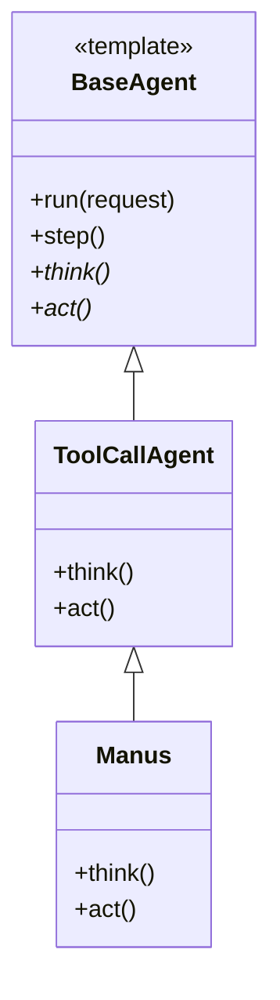

### 2. Factory Pattern

```mermaid
flowchart LR
    FlowFactory --> PlanningFlow
    FlowFactory --> FlowType
    FlowType --> "create_flow(type)"

    subgraph Flows
        PLANNING["PLANNING"]
    end
```

### 3. Strategy Pattern

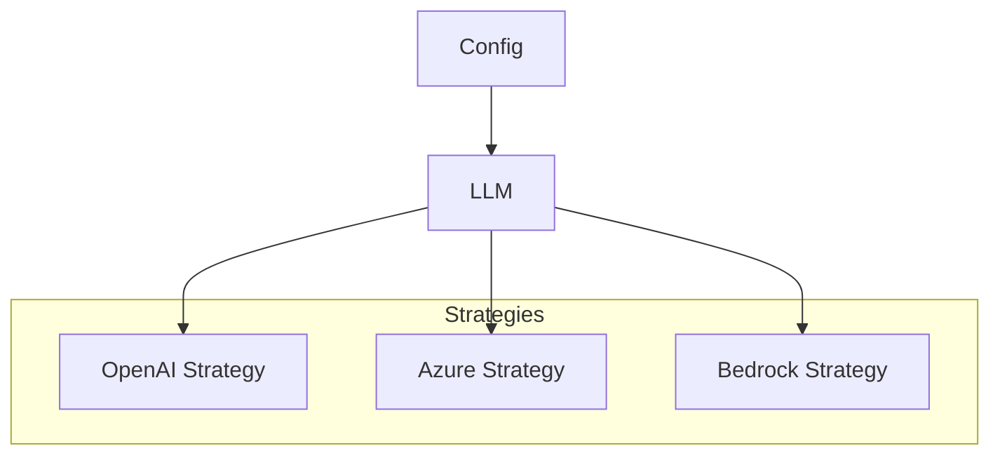

### 4. Singleton Pattern

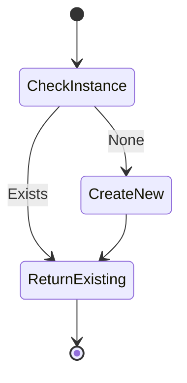

---

## Entry Points

| File | Mode | Use Case | Diagram |
|------|------|----------|----------|
| `main.py` | Single Agent | Simple task execution with Manus agent | See [Single Agent Execution](#single-agent-execution) |
| `run_flow.py` | Multi-Agent Flow | Complex tasks with planning | See [Planning Flow](#planning-flow) |
| `run_mcp.py` | MCP Server | Expose tools via MCP protocol | See [MCP Integration](#mcp-integration) |

---

## File Structure

```
OpenManus/
├── main.py                    # Single agent entry
├── run_flow.py                # Multi-agent flow entry
├── run_mcp.py                 # MCP server entry
├── config/
│   ├── config.toml           # Main config
│   ├── config.example.toml   # Config template
│   └── mcp.json              # MCP server definitions
├── app/
│   ├── agent/
│   │   ├── base.py          # BaseAgent (197 lines)
│   │   ├── react.py         # ReActAgent (39 lines)
│   │   ├── toolcall.py      # ToolCallAgent (251 lines)
│   │   ├── manus.py         # Manus (166 lines)
│   │   ├── browser.py       # BrowserAgent (130 lines)
│   │   ├── data_analysis.py # DataAnalysis (38 lines)
│   │   ├── swe.py           # SWE agent
│   │   └── sandbox_agent.py # Sandbox agent
│   ├── tool/
│   │   ├── base.py          # BaseTool (182 lines)
│   │   ├── tool_collection.py # ToolCollection (72 lines)
│   │   ├── browser_use_tool.py # Browser (568 lines)
│   │   ├── mcp.py           # MCPClients (195 lines)
│   │   ├── planning.py      # PlanningTool (364 lines)
│   │   ├── python_execute.py
│   │   ├── str_replace_editor.py
│   │   ├── bash.py
│   │   ├── search/          # Search tools
│   │   ├── sandbox/         # Sandbox tools
│   │   └── chart_visualization/ # Visualization
│   ├── flow/
│   │   ├── base.py          # BaseFlow (58 lines)
│   │   ├── planning.py      # PlanningFlow (443 lines)
│   │   └── flow_factory.py  # FlowFactory (31 lines)
│   ├── llm.py               # LLM client (767 lines)
│   ├── config.py            # Config (373 lines)
│   ├── schema.py            # Data models (188 lines)
│   ├── sandbox/             # Sandbox client
│   ├── prompt/              # Prompt templates
│   └── logger.py            # Logging
└── docs/
    └── ARCHITECTURE.md       # This document
```

---

## Key Features

- **Extensible Tool System**: Easy to add new tools
- **MCP Integration**: Dynamic tool loading from external servers
- **Multi-Agent Coordination**: Plan-based task decomposition
- **Sandboxed Execution**: Safe code execution
- **Multiple LLM Providers**: OpenAI, Azure, Bedrock
- **Browser Automation**: Full web interaction
- **Visualization**: Chart and data plot generation

---

## Dependencies

| Category | Key Dependencies |
|----------|------------------|
| Core | `pydantic`, `asyncio` |
| LLM | `openai`, `tenacity` |
| Browser | `playwright`, `browser-use` |
| Sandbox | `docker`, `daytona` |
| Utilities | `tiktoken`, `tomllib` |
| MCP | `mcp` package |

---

## Strengths

1. **Clean Architecture**: Clear separation of concerns
2. **Extensibility**: Easy to add new agents, tools, flows
3. **MCP Support**: Standards-compliant external tool integration
4. **Production Ready**: Error handling, logging, configuration
5. **Async First**: Modern Python async patterns throughout

---

## Areas for Improvement

1. **Documentation**: More inline docs and examples
2. **Testing**: Comprehensive unit/integration tests
3. **Error Recovery**: Better retry and fallback mechanisms
4. **Monitoring**: Metrics and observability integration
5. **Security**: Enhanced sandbox isolation options

---

## Quick Reference

### Execution Limits

| Component | Limit | Purpose |
|-----------|-------|---------|
| BaseAgent.max_steps | 10 | Prevent infinite loops |
| Manus.max_steps | 20 | Extended reasoning |
| DataAnalysis.max_steps | 20 | Complex analysis |
| Memory.max_messages | 100 | Context window management |
| TokenCounter | Dynamic | API limits |
| Sandbox timeout | 300s | Resource control |
| Planning timeout | 3600s | 1 hour max |

### Agent Comparison

| Agent | Tools | Use Case | Max Steps |
|--------|-------|----------|------------|
| Manus | Python, Browser, Search, File, MCP | General tasks | 20 |
| Browser | Browser only | Web scraping, automation | 20 |
| DataAnalysis | Python, Visualization | Data analysis | 20 |
| SWE | Code tools | Software engineering | Default |
| Sandbox | Sandbox tools | Isolated execution | Default |
