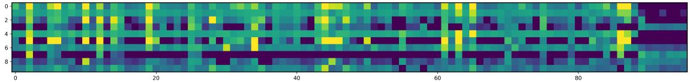

# INFNet论文介绍文档

> 论文：《INFNet: A Task-aware Information Flow Network for Large-Scale Recommendation Systems》
> 
> 作者：Kaiyuan Li, Dongdong Mao, Yongxiang Tang, Yanhua Cheng, Yanxiang Zeng, Chao Wang, Xialong Liu, Peng Jiang
> 
> 机构：快手科技
> 
> 发布时间：2025年

## 一、背景

### 1.1 大规模推荐系统的挑战

在当今的短视频平台如TikTok和快手等应用中，用户行为呈现出高度的多样性和复杂性，包括点击、滑动、评论、点赞等多种交互方式。这些平台面临着两个关键趋势的融合：一方面是特征规模和异质性的爆炸式增长，另一方面是多任务学习在优化多个业务目标方面的广泛应用。

在实际应用中，单个模型可能需要处理数千个序列特征、数百个稀疏分类字段，同时服务于数十个下游任务。用户行为通常由分类标识符（如用户ID、物品ID）和丰富的序列信号（如点击或点赞的物品历史记录，以及创作者或主题等上下文属性）混合表示。同时，现代多任务推荐系统旨在在单个统一框架内联合优化从点击率、观看时间到收入等多样化的目标。

这种规模和多样性带来了一个核心挑战：特征交互阶段必须（i）足够表达性强以捕捉异构输入之间的复杂依赖关系，（ii）足够高效以满足严格的延迟和内存约束，（iii）足够任务感知以减轻跨目标的负迁移。

  
图1：快手平台中的海量特征和多任务场景

### 1.2 现有方法的局限性

从特征交互的角度来看，早期架构如FM和DCN通过线性或交叉层嵌入很好地处理了高基数稀疏特征，但基本上忽略了序列信号或通过粗粒度池化压缩它们。在生产环境中，序列数据通常被截断并与侧信息一起展平，产生极大的token集合，直接将这些输入到深度交互层会产生过高的成本，而激进的池化则会丢弃细粒度的时间和上下文线索。

基于注意力的模型如DIN和DIEN通过应用目标感知注意力来选择单个目标项目的相关历史记录来缓解这个问题。然而，它们的单向、单目标设计限制了更广泛的跨特征和跨字段依赖关系的建模，特别是当多个属性共同影响相关性时。

从多任务学习的角度来看，代表性方法如MMoE、PLE、STEM和HoME引入了基于专家的路由来分离共享和任务特定的表示。然而，这些方法通常在任务路由之前执行特征交互，这意味着两个特征交互的方式是固定的，无论优化哪个任务。这忽略了交互阶段的任务感知依赖关系，导致次优表示和负迁移。在严格效率约束下联合优化目标的大规模部署中，这种错位可能会降低头部和尾部性能并减慢收敛速度。

## 二、核心贡献

为了解决这些挑战，本文提出了任务感知信息流网络（INFNeT），该架构引入了任务代理token，将任务感知直接注入到特征交互阶段。如图2所示，所有输入被表示为分类token、序列token和任务token。我们明确地将交互过程解耦为（i）同质流，使用轻量级门控单元执行类型内细化，以及（ii）异质流，通过带有token代理的交叉注意力实现跨类型交换。

  
图2：（a）先前的多任务流水线通常在路由之前执行特征交互；（b）INFNeT通过任务token和结构化信息流集成任务感知交互

这种设计产生了一个紧凑但表达性强的骨干网络，它（i）通过低开销的类型内细化和基于代理的跨类型交换满足工业效率预算，（ii）通过早期阶段任务调节减轻负迁移，（iii）将异构特征统一到单个结构化交互流中。

本文的核心贡献包括：

- **任务感知信息流架构**：引入了INFNeT，这是一个任务感知信息流架构，将分类、序列和任务token统一在单个交互空间中，使下游目标能够从最早阶段而不是仅在特征融合之后指导特征交互。

- **结构化交互机制**：设计了一个结构化交互机制，包含两个互补的流：（i）使用轻量级门控单元进行类型内细化的同质流，以及（ii）使用带有token代理的交叉注意力实现细粒度跨类型交换而不会产生二次成本增长的异质流。

- **任务代理token设计**：提出了任务特定和任务共享的代理token，明确地将任务感知注入到交互过程中，在保留有益的跨任务泛化的同时减轻跨目标的负迁移。

- **算法与系统收益验证**：展示了算法和系统级别的收益：在公共和大规模工业数据集上的一致改进，在生产广告系统中实现了+1.587%的收入（REV）和+1.155%的点击率（CTR）增益，所有这些都在严格的延迟和内存预算下实现。

## 三、核心贡献细节详细说明

### 3.1 特征预处理与token化

INFNeT将所有输入统一为三种token类型：分类token、序列token和任务token，每种类型都包含原始token（完整表示）和代理token（紧凑查询）。所有嵌入共享相同的维度d，确保在后续交互层中的兼容性并与信息流设计保持一致。

**分类特征token和代理token**：分类输入包括用户/物品ID、静态属性和分桶连续变量。对于第j个字段，其值$v_j \in \{1,...,V_j\}$，嵌入表$E_j^{cat} \in \mathbb{R}^{V_j \times d}$，分类token计算为$c_j = E_j^{cat}[v_j] \in \mathbb{R}^d$。将所有M个字段堆叠得到$C = [c_1 || ... || c_M]^\top \in \mathbb{R}^{M \times d}$。

为了形成分类代理，我们首先将所有字段嵌入展平为单个向量，然后通过共享的MLP $\phi_{cat}$投影并将其重塑为m个代理token：$\tilde{C} = \text{Reshape}(\phi_{cat}(\text{Flatten}(C))) \in \mathbb{R}^{m \times d}$。这保留了压缩前的全局跨字段上下文，在相同的token预算下产生更具信息量的代理。

**序列特征token和代理token**：用户行为被分组为F个特定动作序列（如点击、点赞、播放）。我们将所有行为特定序列连接起来形成统一的序列token矩阵：$S = [s_{1,1}, ..., s_{1,n_1}, ..., s_{F,1}, ..., s_{F,n_F}] \in \mathbb{R}^{L \times d}$，其中$L = \sum_{a=1}^F n_a$。

序列代理通过共享投影$\phi_{seq}$并在其行为类型内进行池化（求和池化）得到：$\tilde{S} = [\sum_{t=1}^{n_1} \phi_{seq}(s_{1,t}); ...; \sum_{t=1}^{n_F} \phi_{seq}(s_{F,t})] \in \mathbb{R}^{F \times d}$。这保留了每个类型的时间语义，同时在异质流中保持有界数量的查询token。

**任务特征token和代理token**：每个真实任务i由原始任务token表示，初始化为可学习向量：$T \in \mathbb{R}^{N_{task} \times d}$，作为任务特定的键/值，并形成相应预测头的基础。

此外，受专家网络的启发，我们引入了$N_s$个共享任务token来捕获跨任务的共同知识。这些共享token可以被视为任务代理token的特殊形式，类似于混合专家架构中的共享专家，提供紧凑的查询集：$\tilde{T} \in \mathbb{R}^{N_s \times d}$。它们作为查询参与异质注意力，实现早期任务感知调节而不增加总体查询数量。同时，原始T token保留在类型内细化阶段，确保足够的任务特定表达能力。

### 3.2 信息流架构设计

如图3所示，我们将信息流分为两个阶段：异质和同质特征交互，封装在可堆叠的INFNeT块中。我们将输入张量视为第0层；上标(l)索引块，在堆叠N个块后，我们用上标(N+1)表示输出。

  
图3：INFNeT整体架构图

**异质特征交互**：为了在不同特征类型之间实现信息交换，我们采用了一种交叉注意力机制，允许一组token查询另一组。直观上，交叉注意力可以被视为从键值集(K,V)到查询集Q的信息流，其中查询基于内容相似性决定检索什么信息。具体来说，给定Q、K和V，交叉注意力机制定义为：

$$\text{CA}(Q,K,V) = \text{softmax}\left(\frac{QW_Q(KW_K)^\top}{\sqrt{d_k}}\right)(VW_V)$$

其中$d_k$表示键和查询向量的维度。这种表述保留了基于内容的寻址的灵活性，同时避免了所有token之间自注意力的二次复杂度。

在信息流到分类中，分类代理token作为交叉注意力中的查询，而序列和任务token作为各自交叉注意力中的键和值。这些交叉注意力的输出被求和以产生该信息流的新结果$\tilde{C}^{(l+1)} = \text{CA}(\tilde{C}^{(l)}, S^{(l)}, S^{(l)}) + \text{CA}(\tilde{C}^{(l)}, T^{(l)}, T^{(l)})$。

类似地，在信息流到序列中，序列代理作为交叉注意力中的查询，而分类和任务token作为各自交叉注意力中的键和值。输出被求和以产生$\tilde{S}^{(l+1)} = \text{CA}(\tilde{S}^{(l)}, C^{(l)}, C^{(l)}) + \text{CA}(\tilde{S}^{(l)}, T^{(l)}, T^{(l)})$。

在信息流到任务中，任务代理和真实任务token都数量较少，每个都扮演不同的角色：任务代理捕获共享的跨任务模式，而真实任务token专注于任务特定的细微差别。为了充分利用它们的容量并允许这些角色相互补充，我们对两者都执行交叉注意力，使用分类和序列token作为键/值：

$$\tilde{T}^{(l+1)} = \text{CA}(\tilde{T}^{(l)}, C^{(l)}, C^{(l)}) + \text{CA}(\tilde{T}^{(l)}, S^{(l)}, S^{(l)})$$

$$\hat{T}^{(l+1)} = \text{CA}(T^{(l)}, C^{(l)}, C^{(l)}) + \text{CA}(T^{(l)}, S^{(l)}, S^{(l)})$$

这里，$\hat{T}^{(l+1)}$作为用任务特定信息丰富的中间输出，从而赋予任务token明确和具体的语义。

**同质特征交互**：在异质集成之后，我们进一步细化相同类型的特征。我们采用代理门控单元（PGU）进行同质流，以镜像Transformer中MLP的通道专业化角色：交叉注意力处理全局、跨类型信息交换，而PGU通过代理调节的通道调制细化类型内表示——避免冗余的token到token注意力，并确保在大规模系统中部署友好的复杂性。

让$X \in \mathbb{R}^{n \times d}$表示给定类型的token，$\tilde{X} \in \mathbb{R}^{\tilde{n} \times d}$表示来自异质阶段的$\tilde{n}$个代理token。我们首先沿token维度展平$\tilde{X}$以形成$\tilde{X}_f \in \mathbb{R}^{\tilde{n} \times d}$，通过轻量级MLP映射以产生通道门控向量$g \in \mathbb{R}^d$，然后在广播到所有token进行逐元素调制之前应用Sigmoid激活来限制门值：

$$\text{PGU}(X,\tilde{X}) = X \odot \sigma(\text{MLP}(\tilde{X}_f)) \in \mathbb{R}^{n \times d}$$

在我们的架构中，分类、序列和任务token都使用它们自己的代理进行细化：

$$C^{(l+1)} = \text{PGU}(C^{(l)}, \tilde{C}^{(l)})$$
$$S^{(l+1)} = \text{PGU}(S^{(l)}, \tilde{S}^{(l)})$$
$$T^{(l+1)} = \text{PGU}(\hat{T}^{(l+1)}, \tilde{T}^{(l)})$$

这种通道设计将PGU的复杂性与token长度n解耦，即使对于非常长的序列也保持高效，同时保留代理调节的调制。

### 3.3 优化目标

给定在多任务建模阶段获得的增强的每任务表示$T_i^{(N)}$，每个任务预测由任务特定MLP后跟Sigmoid激活产生：

$$\hat{y}_i = \sigma(\text{MLP}_i(T_i^{(N)}))$$

这个头在任务之间共享架构但保持单独的参数，将任务代理表示映射到校准的概率。

为了在单个网络中优化多个任务，我们采用加权多任务损失：

$$\mathcal{L} = \sum_{i=1}^{N_{task}} \lambda_i \mathcal{L}_i(\hat{y}_i, y_i)$$

其中$\hat{y}_i$和$y_i$分别表示任务i的预测和真实标签。$\mathcal{L}_i$是任务特定的损失函数。在本文中，我们选择二元交叉熵：

$$\mathcal{L}_i(\hat{y}_i, y_i) = -[y_i \log \hat{y}_i + (1 - y_i) \log(1 - \hat{y}_i)]$$

权重$\lambda_i$（默认=1）平衡跨任务的梯度幅度，当任务在大小或难度上变化时，可以通过网格搜索或基于不确定性的方法进行调整。网络参数$\Theta$通过最小化训练集上的$\mathcal{L}(\Theta)$进行端到端优化，实现共享和任务特定的学习。

## 四、实验分析与结论

### 4.1 实验设置

**数据集**：我们在三个公共短视频基准测试上评估INFNeT：KuaiRand-Pure、KuaiRand-27K和QB-Video，以及一个大规模内部数据集。如表2所示，KuaiRand-Pure相对紧凑，KuaiRand-27K扩展到更大的物品和日志规模，而QB-Video采用不同的模式和任务设置。这种组合涵盖了不同的稀疏度水平、特征丰富度和任务数量，为评估提供了多样化的测试平台。

| 数据集 | 用户数 | 物品数 | 交互数 | 分类特征数 | 序列特征数 | 任务数 |
|--------|--------|--------|--------|-------------|-------------|--------|
| kuairand-pure | 27,285 | 7,551 | 1,436,609 | 89 | 28 | 3 |
| kuairand-27k | 27,285 | 32,038,725 | 322,278,385 | 89 | 28 | 3 |
| QB-video | 34,240 | 130,637 | 1,726,886 | 6 | 12 | 4 |

表2：实验使用的数据集统计信息

**基线方法**：我们将INFNeT与两个基线家族进行比较：特征交互模型和多任务推荐模型，使用它们原始论文中的常见实例化，仅在需要时调整序列处理。

特征交互模型包括：FM（通过因子化嵌入和线性项建模二阶交互）、DIN（在用户历史上应用目标感知注意力）、DIEN（在DIN基础上通过注意力更新GRU和辅助损失建模兴趣提取和时间演化）、DCN v2（通过低秩残差混合增强交叉网络）、GDCN（使用门控交叉层和字段级维度优化）、WuKong（在缩放规则下深化和拓宽FM块）、HSTU（将推荐视为具有层次单元的生成序列转导）。

多任务推荐模型包括：Shared-Bottom（跨任务共享通用编码器）、MMoE（通过任务特定门组合多个专家）、OMoE（MMoE的较轻单门变体）、PLE（逐步分离共享和任务特定专家）、STEM（使用共享和任务特定嵌入与门控来平衡个性化和跨任务共享）。

**评估指标**：我们报告三个标准指标：AUC（接收者操作特征曲线下面积，衡量整体排名质量，越高越好）和gAUC（用户级平均AUC，更均匀地加权用户以反映个性化质量，越高越好）。

### 4.2 性能比较

表1总结了INFNeT在公共数据集上与特征交互和多任务推荐基线的整体比较。主要观察结果如下：

与特征交互模型相比，INFNeT在多个目标（如点击、点赞、长观看和分享）上始终实现更高的AUC和gAUC。这表明INFNET中的双向异质信息流更有效地将分类字段与多行为序列集成，导致更强的交互，同时保持计算成本可控。

与多任务模型相比，INFNeT在Shared-Bottom、MMoE、OMoE、PLE和STEM上显示出明显的增益，特别是在具有挑战性的目标和KuaiRand-27K上，其中行为稀疏性和噪声更加明显。带有token代理的交叉注意力，以及包含共享和真实任务token的混合任务表示，加强了跨任务的共性学习，同时捕获任务特定的细微差别，这减少了负迁移并提高了整体多任务性能。

  
图4：INFNeT在KuaiRand-pure数据集上不同超参数的性能

在不同设置下的鲁棒性：我们观察到在一系列嵌入大小和序列截断长度下的一致改进，表明INFNeT在不同容量和上下文预算下保持稳定优势。

总之，INFNeT在特征交互和多任务机制中都提供了相对于强基线的一致改进，支持其在大规模短视频推荐中的有效性和泛化性。

### 4.3 消融研究

我们通过依次移除每个主要组件来评估INFNeT，同时保持数据处理、优化和检查点选择与主要设置相同。实验在KuaiRand-pure和QB-video上进行，以涵盖短视频推荐和多行为广告。

消融变体：w/o1 — 移除任务token（可学习任务向量），阻止多任务信息的早期集成。w/o2 — 移除同质交互（分类、序列和任务token的PGU更新），削弱类型内建模。w/o3 — 移除异质交互（跨特征类型的交叉注意力），限制跨类型融合。

如表3所示，完整的INFNeT始终优于所有变体。（1）w/o1显示普遍下降，特别是在分享任务上（+0.0344 AUC），确认任务向量改善了与任务特定目标的对齐。（2）w/o2显著损害序列依赖任务（如长观看、关注、点赞），表明每个类型细化在跨类型混合之前改善了特征质量。（3）w/o3在大多数任务上造成最大损失，突出了在任务上下文中对齐分类和序列证据的重要性。

| 数据集 | 任务 | 指标 | w/o1 | w/o2 | w/o3 | INFNET |
|--------|------|------|------|------|------|--------|
| kuairand-pure | click | AUC | 0.7720 | 0.7716 | 0.7705 | 0.7736 |
| kuairand-pure | like | AUC | 0.8925 | 0.8926 | 0.8899 | 0.8960 |
| kuairand-pure | long-view | AUC | 0.7707 | 0.7713 | 0.7701 | 0.7727 |
| QB-video | click | AUC | 0.9747 | 0.9741 | 0.9741 | 0.9749 |
| QB-video | like | AUC | 0.9185 | 0.9183 | 0.9168 | 0.9225 |
| QB-video | follow | AUC | 0.8842 | 0.8852 | 0.8829 | 0.8881 |
| QB-video | share | AUC | 0.7747 | 0.7868 | 0.7854 | 0.8091 |

表3：INFNeT及其变体的性能比较。最佳结果以粗体显示。

总体而言，任务向量注入早期任务感知，同质流加强每个类型表示，异质流实现有效的跨类型融合。完整模型从所有三个中受益以获得最佳性能。

### 4.4 代理token数量的影响

我们研究了代理token数量如何影响INFNeT在KuaiRand-pure上的多任务性能，固定任务代理=4和共享任务token=2，除非另有说明。为了隔离每个因素的影响，我们在相同的数据流水线、优化计划和检查点选择下一次改变一个因素。

如图4a-4b所示，将分类/序列代理从2增加到4通过实现它们各自特征空间的更细粒度表示来提高AUC。更多代理允许模型保留分类和序列信息的多样化子空间，减少将多个信号压缩到单个向量中，并增强任务意图与相关区域之间的对齐。然而，将数量推到8会导致性能下降，与过参数化一致：过多的代理引入冗余，稀释注意力焦点，并增加优化难度。

共享任务token出现了类似的模式。从1增加到2通过在更好地总结跨任务模式的同时仍然允许足够的容量让任务特定token专门化，在点击和长观看指标上产生增益。将此值设置为3带来递减或负回报，与过度共享一致：太多的共享载体模糊任务边界并与真实任务token竞争，削弱每个任务的区分。总体而言，分类/序列代理=4和共享任务token=2在表示丰富性和稳定性之间提供了良好的权衡，并在我们的训练设置中作为稳健的默认值。

### 4.5 可视化分析

如图5所示，我们可视化了最终层的交叉注意力，其中任务查询所有分类和序列token（x轴：token位置；y轴：查询通道）。共享任务通道表现出更平滑、低频模式覆盖广泛区域，作为跨任务上下文的载体，而真实任务通道显示与少数显著位置对齐的尖锐峰值（例如，~60-70，~90），强调来自行为序列或关键分类字段的有影响力的token。暗色"走廊"表示效用有限的token。

  
图5：任务token与其代理之间最终层交叉注意力的可视化。x轴表示特征或注意力权重（越亮表示注意力越强）。

这些模式符合我们的设计目标：真实任务专门处理任务特定线索，共享任务提供广泛的先验来正则化和补充它们。注意力保持差异化但协调——广泛的共享覆盖不会压倒任务特定峰值，反映了我们的定量趋势，即适度共享比过度集中或分散的映射产生更有效的注意力。

### 4.6 效率分析

图6比较了代表性模型在KuaiRand-pure上的推理时间和参数数量，说明了复杂性和在线效率之间的权衡。X轴显示每批推理时间（越低越好），y轴表示模型大小（越小越容易部署），圆圈大小/颜色反映参数大小。

  
图6：INFNeT和基线在kuairand-pure数据集上的推理时间和参数

特征交互模型如DIN、DIEN和INFNET实现低延迟和紧凑大小，而高阶或多专家方法（如MMoE、OMoE、PLE、DCNv2、GDCN）由于额外的分支、路由或显式交叉而产生更高成本。像AITM、WuKong、Shared-Bottom和STEM这样的方法介于两者之间。

总体而言，更深的显式交互模型和多专家设计增加了参数和推理时间，而INFNET通过分层特征交互和带有可学习任务向量的任务感知融合保持紧凑性和低延迟，使其在严格的延迟和资源约束下实用。

### 4.7 在线分析

**在线部署**：本节详细介绍了我们的模型作为实时排名系统在大规模在线广告系统中的部署，针对浅层信号如点击、播放和完成。强调任务特定效率和收入影响，我们从训练和服务角度评估模型在流式训练设置下。为了确保公平评估，在线实验使用与生产基线相同的候选生成和请求路由，并在系统达到稳定状态后报告结果。

  
图7：INFNET部署阶段的特征生成逻辑

如图7所示，模型在流式训练中训练，说明了部署期间的特征生成和标签获取。在接收到排名阶段请求时，系统将其拆分为两个流水线：推理和训练。在推理中，上下文特征发送到特征服务器以检索用户和视频特征，然后由推理服务器评分。在训练中，样本生产者获取特征，标签匹配器对齐回调时间戳以生成标签。更新的模型部署到推理服务器。

**在线A/B测试**：我们在主feed场景中部署了我们的模型，该场景每天服务数十亿请求。基线（大约是DIN、DCNv2和PLE的组合）与我们的INFNeT模型在从2025-03-10到2025-04-10进行的A/B测试中进行了比较。如表4所示，结果显示在所有关键指标上都有统计显著的改进（p值<0.05），包括预期收入增加+1.587%和点击率（CTR）增加+1.155%。我们还观察到短期用户保留指标的持续增益，其中P3s、P5s和PEnd分别表示播放至少3秒、5秒和直到结束的视频比例：+0.105%、+0.317%和+0.351%。

| 方法 | REV (%) | CTR (%) | P3s (%) | P5s (%) | PEnd (%) | 预测延迟(ms) | 训练延迟(min) |
|------|----------|----------|----------|----------|-----------|---------------|---------------|
| Baseline | | | | | | 18.28 | 21.21 |
| INFNET | +1.587 | +1.155 | +0.105 | +0.317 | +0.351 | 18.17 | 20.04 |

表4：在线A/B测试结果（所有改进统计显著，p值<0.05）。延迟在相同硬件和配额设置下测量。

如延迟指标所示，我们的模型实现了与基线相当的效率，预测延迟略低（18.17 ms vs. 18.28 ms），训练延迟减少（20.04 min vs. 21.21 min）。在线逐步增加遵循固定流量比率以避免季节性伪影，所有比较在相同硬件和配额设置下进行以确保可比性。

### 4.8 结论

本文提出了INFNeT，一个用于推荐的大规模多任务特征交互框架。它将任务视为可学习特征，并通过双向异质和同质流集成稀疏、序列和任务特征。广泛的离线实验显示在数据集和目标上的显著增益。在线结果确认了业务指标和用户体验的显著改进，具有高效的推理。总体而言，INFNeT在大规模推荐的多源特征建模和多任务学习中展示了强大的潜力和广泛适用性。

## 五、业务中的启发

### 5.1 对工业推荐系统的实践价值

INFNeT的设计理念和架构为工业级推荐系统提供了重要的实践指导。其核心思想——将任务作为可学习特征并实现早期任务感知的特征交互——解决了传统多任务推荐系统中任务信息注入过晚的问题。在实际业务场景中，这种设计能够显著提升模型对复杂业务目标的适应能力。

在广告推荐、内容推荐、电商推荐等场景中，通常需要同时优化多个业务指标，如点击率、转化率、收入、用户留存等。INFNeT的任务token机制使得模型能够在特征交互的早期阶段就考虑不同任务的需求，避免了传统方法中特征交互与任务路由分离导致的次优表示问题。

### 5.2 特征交互架构的优化思路

INFNeT的双流设计（异质流和同质流）为大规模推荐系统的特征交互提供了新的架构范式。异质流通过代理token实现跨类型特征的高效交互，避免了传统方法中全连接交互带来的计算复杂度问题。这种设计特别适合处理海量特征场景，能够在保持模型表达能力的同时控制计算成本。

同质流中的代理门控单元（PGU）设计为类型内特征细化提供了轻量级但有效的解决方案。这种通道级调制机制避免了传统自注意力在长序列上的计算开销，同时保留了特征细化的能力。在实际部署中，这种设计能够显著降低模型推理延迟，满足工业级推荐系统对实时性的严格要求。

### 5.3 多任务学习的创新思路

INFNeT在任务表示方面的创新——同时使用任务特定token和任务共享token——为多任务学习提供了新的思路。这种设计既保证了任务特定的表达能力，又促进了跨任务的泛化能力。在实际业务中，这种平衡对于处理相关但不完全相同的任务组合具有重要意义。

例如，在短视频推荐中，点击预测、完播率预测、点赞预测等任务虽然目标不同，但存在内在关联。INFNeT的任务表示机制能够自动学习这些任务之间的共享知识和差异点，实现更好的多任务优化效果。

### 5.4 部署和工程实践的启示

INFNeT的在线部署经验为工业级推荐系统的工程实践提供了宝贵参考。其流式训练架构、特征生成逻辑和模型更新机制展示了如何在保证系统稳定性的同时实现模型的持续优化。

在实际业务中，INFNeT的部署模式可以借鉴到其他推荐系统的架构设计中。特别是其将推理和训练流水线分离的设计，能够有效处理大规模实时推荐场景中的并发和延迟问题。

### 5.5 对未来推荐系统发展的影响

INFNeT的成功实践表明，将任务感知引入特征交互阶段是提升多任务推荐系统性能的关键方向。这一思路可能会影响未来推荐系统架构的设计理念，推动更多研究关注早期任务信息注入的重要性。

同时，INFNeT的代理token机制为处理大规模特征交互提供了新的技术路径。随着推荐系统特征规模的持续增长，这种高效的特征交互方式可能会成为未来工业级推荐系统的标准组件。

### 5.6 在具体业务场景中的应用建议

基于INFNeT的设计理念，在实际业务中可以采取以下应用策略：

在构建多任务推荐系统时，应该考虑将任务信息尽早注入到特征交互过程中，而不是在特征融合之后才进行任务路由。

对于包含大量分类特征和序列特征的场景，可以采用代理token机制来平衡模型表达能力和计算效率，避免全连接交互带来的计算瓶颈。

在处理相关但不完全相同的任务组合时，可以借鉴INFNeT的任务表示设计，同时使用任务特定和任务共享的表示来平衡个性化和泛化能力。

在系统架构设计上，可以考虑采用流式训练和推理-训练分离的模式，以支持模型的持续优化和系统的稳定运行。

总体而言，INFNeT为工业级推荐系统的设计和优化提供了重要的技术参考和实践指导，其核心思想和方法论值得在相关业务场景中深入应用和探索。