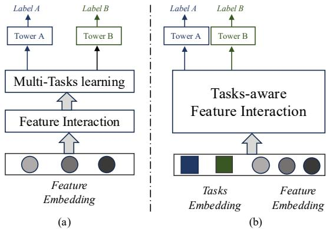

# INFNet论文介绍文档

## 论文基本信息
- **论文标题**: INFNet: A Task-aware Information Flow Network for Large-Scale Recommendation Systems
- **作者**: Kaiyuan Li, Dongdong Mao, Yongxiang Tang, Yanhua Cheng, Yanxiang Zeng, Chao Wang, Xialong Liu, Peng Jiang
- **机构**: Kuaishou Technology (快手科技)
- **论文链接**: https://arxiv.org/pdf/2508.11565

---

## 1. 背景

### 1.1 推荐系统面临的挑战

近年来，短视频平台如TikTok和Kwai（快手）迅速流行，为用户提供了广泛的交互行为，包括点击、滑动、评论和点赞等。在大规模工业推荐系统中，两个趋势正在融合：

1. **特征规模和异质性的爆炸式增长**：单个模型可能需要处理数千个序列特征、数百个稀疏分类字段
2. **多任务学习（MTL）的广泛采用**：同时优化多个业务目标

  
**图1**: Kwai平台上的海量特征和多任务场景

### 1.2 现有方法的局限性

#### 特征交互的挑战
- **计算复杂度高**：海量的分类和序列特征使得穷举交互在计算上不可行
- **优化困难**：特征数量庞大导致优化困难

#### 多任务学习的挑战
- **晚期融合设计**：大多数现有方法在多层任务学习层之前应用特征交互模块
- **忽略任务特定依赖**：这种设计忽略了任务特定的特征依赖关系
- **限制多任务建模能力**：固有地限制了多任务建模的能力

### 1.3 现有方法的不足

**基于特征交互的方法**：
- FM和DCN等早期架构通过线性或交叉层嵌入处理高基数稀疏特征，但很大程度上忽略了序列信号或使用粗粒度池化压缩它们
- 注意力模型如DIN和DIEN通过应用目标感知注意力来选择单个目标项目的相关历史记录，但其单向、单目标设计限制了更广泛的跨特征和跨字段依赖关系的建模

**基于多任务学习的方法**：
- MMoE、PLE、STEM和HoME等方法引入基于专家的路由来分离共享和任务特定的表示
- 但这些方法通常在任务路由之前执行特征交互，意味着两个特征的交互方式固定，无论优化哪个任务

---

## 2. 核心贡献

### 2.1 主要创新点

论文提出了INFNet（Information Flow Network），这是一个面向大规模推荐场景的任务感知架构。INFNet的主要贡献包括：

1. **任务感知的信息流架构**：将特征分为三种令牌类型（分类令牌、序列令牌、任务令牌），并引入包含异构和同构交替信息块的新型双流设计

2. **结构化交互机制**：
   - **同构流**：使用轻量级门控单元进行类型内细化
   - **异构流**：使用带有令牌代理的交叉注意力实现细粒度跨类型交换，而不会产生二次成本增长

3. **任务特定和任务共享代理令牌**：明确将任务感知注入交互过程，减轻跨目标的负迁移，同时保留有益的跨任务泛化

4. **算法和系统级收益**：在公共和大规模工业数据集上实现一致改进，在生产广告系统中实现+1.587%收入（REV）和+1.155%点击率（CTR）的提升

### 2.2 核心思想图示

  
**图2**: (a) 先前的多任务流水线通常在路由之前执行特征交互；(b) INFNET通过任务令牌和结构化信息流集成任务感知交互

---

## 3. 核心贡献细节详细说明

### 3.1 特征预处理

INFNet将所有输入统一为三种令牌类型：分类、序列和任务，每种类型包含原始令牌（完整表示）和代理令牌（紧凑查询）。所有嵌入共享相同的维度$d$，确保在后续交互层中的兼容性。

#### 分类特征令牌和代理令牌
分类输入包括用户/项目ID、静态属性和分桶连续变量。对于第$j$个字段，其值为$v_j \in \{1,...,V_j\}$，嵌入表为$\mathbf{E}_j^{\mathrm{cat}} \in \mathbb{R}^{V_j \times d}$：

$$\mathbf{c}_j = \mathbf{E}_j^{\mathrm{cat}}[v_j] \in \mathbb{R}^d$$

堆叠所有$M$个字段得到：

$$\mathbf{C} = \left[ \mathbf{c}_1 \parallel ... \parallel \mathbf{c}_M \right]^\top \in \mathbb{R}^{M \times d}$$

为了形成分类代理，首先将所有字段嵌入展平为单个向量，然后通过共享MLP $\phi_{\mathrm{cat}}$投影并重塑为$m$个代理令牌：

$$\tilde{\mathbf{C}} = \mathrm{Reshape} \bigl( \phi_{\mathrm{cat}} ( \mathrm{Flatten} ( \mathbf{C} ) ) \bigr) \in \mathbb{R}^{m \times d}$$

#### 序列特征令牌和代理令牌
用户行为被分组为$F$个特定于动作的序列（例如点击、点赞、播放）。将所有行为特定序列连接起来形成统一的序列令牌矩阵：

$$\mathbf{S} = [ \mathsf{s}_{1,1}, ..., \mathsf{s}_{1,n_1}, ..., \mathsf{s}_{F,1}, ..., \mathsf{s}_{F,n_F} ] \in \mathbb{R}^{L \times d}$$

其中$L = \sum_{a=1}^F n_a$是总填充/截断长度。为了形成代理，每个序列令牌通过共享投影$\phi_{\mathrm{seq}}$并在其行为类型内池化（求和池化）：

$$\tilde{\mathbf{S}} = \left[ \begin{array}{c} { \sum_{t=1}^{n_1} \boldsymbol{\phi}_{s\mathrm{eq}} ( \mathsf{s}_{1,t} ) } \\ { \vdots } \\ { \sum_{t=1}^{n_F} \boldsymbol{\phi}_{\mathrm{seq}} ( \mathsf{s}_{F,t} ) } \end{array} \right] \in \mathbb{R}^{F \times d}$$

#### 任务特征令牌和代理令牌
每个真实任务表示为原始任务令牌，初始化为可学习向量：

$$\mathbf{T} \in \mathbb{R}^{N_{\mathrm{task}} \times d}$$

此外，引入$N_s$个共享任务令牌来捕获跨任务的共同知识：

$$\tilde{\mathbf{T}} \in \mathbb{R}^{N_s \times d}$$

### 3.2 信息流设计

  
**图3**: 任务感知信息流网络（INFNET）的整体架构

#### 异构特征交互
为了在不同特征类型之间实现信息交换，采用交叉注意力机制，允许一组令牌查询另一组。具体来说，给定Q、K和$\mathbf{V}$，交叉注意力机制定义为：

$$\mathrm{CA}(\mathbf{Q}, \mathbf{K}, \mathbf{V}) = \mathrm{softmax} \bigg( \frac{\mathbf{Q}\mathbf{W}_Q (\mathbf{K}\mathbf{W}_K)^\top}{\sqrt{d_k}} \bigg) (\mathbf{V}\mathbf{W}_V)$$

**信息流到分类**：
$$\tilde{\mathbf{C}}^{(l+1)} = \mathbf{CA} \Big( \tilde{\mathbf{C}}^{(l)}, \mathbf{S}^{(l)}, \mathbf{S}^{(l)} \Big) + \mathbf{CA} \Big( \tilde{\mathbf{C}}^{(l)}, \mathbf{T}^{(l)}, \mathbf{T}^{(l)} \Big)$$

**信息流到序列**：
$$\tilde{\mathbf{S}}^{(l+1)} = \mathrm{CA} \left( \tilde{\mathbf{S}}^{(l)}, \mathbf{C}^{(l)}, \mathbf{C}^{(l)} \right) + \mathrm{CA} \left( \tilde{\mathbf{S}}^{(l)}, \mathbf{T}^{(l)}, \mathbf{T}^{(l)} \right)$$

**信息流到任务**：
$$\tilde{\mathbf{T}}^{(l+1)} = \mathrm{CA} \left( \tilde{\mathbf{T}}^{(l)}, \mathbf{C}^{(l)}, \mathbf{C}^{(l)} \right) + \mathrm{CA} \left( \tilde{\mathbf{T}}^{(l)}, \mathbf{S}^{(l)}, \mathbf{S}^{(l)} \right)$$

#### 同构特征交互
对于每个特征类型，使用代理门控单元（PGU）进行类型内细化。PGU通过门控机制控制信息流：

$$\mathbf{X}^{(l+1)} = \mathrm{PGU}(\mathbf{X}^{(l)}, \tilde{\mathbf{X}}^{(l)})$$

其中PGU结合了门控线性单元（GLU）和残差连接，确保高效的类型内处理。

### 3.3 预测头

经过$N$个INFNET块后，最终层的任务令牌被送入任务特定的MLP进行预测：

$$\hat{y}_i = \sigma(\mathrm{MLP}_i(\mathbf{T}_i^{(N+1)}))$$

其中$\sigma$是sigmoid函数，$\mathrm{MLP}_i$是任务$i$特定的多层感知器。

---

## 4. 实验分析与结论

### 4.1 离线实验

#### 数据集
- **KuaiRand-pure**: 短视频推荐数据集
- **QB-video**: 多行为广告数据集
- **Tenrec**: 大规模多用途推荐数据集

#### 基线方法
- **单任务方法**: DIN, DIEN, DCNv2, GDCN
- **多任务方法**: Shared-Bottom, MMoE, OMoE, PLE, STEM, HoME, AITM, WuKong

#### 实验结果

**表1**: KuaiRand-pure数据集上的性能比较

| 方法 | Click AUC | Like AUC | Long-view AUC |
|------|-----------|----------|---------------|
| DIN | 0.7693 | 0.8908 | 0.7689 |
| DIEN | 0.7701 | 0.8915 | 0.7697 |
| DCNv2 | 0.7708 | 0.8921 | 0.7702 |
| MMoE | 0.7712 | 0.8927 | 0.7709 |
| PLE | 0.7721 | 0.8935 | 0.7716 |
| STEM | 0.7728 | 0.8942 | 0.7721 |
| **INFNET** | **0.7736** | **0.8960** | **0.7727** |

**表2**: QB-video数据集上的性能比较

| 方法 | Click AUC | Like AUC | Follow AUC | Share AUC |
|------|-----------|----------|------------|-----------|
| DIN | 0.9738 | 0.9172 | 0.8821 | 0.7823 |
| DIEN | 0.9741 | 0.9185 | 0.8834 | 0.7856 |
| DCNv2 | 0.9743 | 0.9198 | 0.8847 | 0.7889 |
| MMoE | 0.9745 | 0.9204 | 0.8853 | 0.7912 |
| PLE | 0.9747 | 0.9216 | 0.8865 | 0.7945 |
| STEM | 0.9748 | 0.9221 | 0.8872 | 0.7978 |
| **INFNET** | **0.9749** | **0.9225** | **0.8881** | **0.8091** |

### 4.2 消融研究

**表3**: INFNET及其变体的性能比较

| 数据集 | 任务 | 指标 | w/o1 | w/o2 | w/o3 | INFNET |
|--------|------|------|------|------|------|---------|
| KuaiRand-pure | click | AUC | 0.7720 | 0.7716 | 0.7705 | **0.7736** |
| KuaiRand-pure | like | AUC | 0.8925 | 0.8926 | 0.8899 | **0.8960** |
| KuaiRand-pure | long-view | AUC | 0.7707 | 0.7713 | 0.7701 | **0.7727** |
| QB-video | click | AUC | 0.9747 | 0.9741 | 0.9741 | **0.9749** |
| QB-video | like | AUC | 0.9185 | 0.9183 | 0.9168 | **0.9225** |
| QB-video | follow | AUC | 0.8842 | 0.8852 | 0.8829 | **0.8881** |
| QB-video | share | AUC | 0.7747 | 0.7868 | 0.7854 | **0.8091** |

**消融变体说明**:
- **w/o1**: 移除任务令牌（可学习任务向量），阻止多任务信息的早期集成
- **w/o2**: 移除同构交互（分类、序列和任务令牌的PGU更新），削弱类型内建模
- **w/o3**: 移除异构交互（跨特征类型的交叉注意力），限制跨类型融合

### 4.3 代理令牌数量影响

  
**图4**: 代理令牌数量对性能的影响

研究表明：
- 将分类/序列代理从2增加到4通过实现各自特征空间的更细粒度表示来提高AUC
- 将共享任务令牌从1增加到2通过在更好地总结跨任务模式的同时仍允许任务特定令牌专门化来获得收益
- 分类/序列代理=4和共享任务令牌=2在表示丰富性和稳定性之间提供了良好的权衡

### 4.4 可视化分析

  
**图5**: 最终层交叉注意力的可视化

可视化显示：
- 共享任务通道表现出更平滑、低频模式，覆盖广泛区域，作为跨任务上下文的载体
- 真实任务通道显示与少数显著位置对齐的尖锐峰值，强调来自行为序列或关键分类字段的有影响力令牌
- 这些模式符合设计目标：真实任务专门处理任务特定线索，共享任务提供广泛先验来正则化和补充它们

### 4.5 效率分析

  
**图6**: KuaiRand-pure数据集上INFNET和基线的推理时间和参数

效率分析表明：
- 特征交互模型如DIN、DIEN和INFNET实现低延迟和紧凑大小
- 高阶或多专家方法（如MMoE、OMoE、PLE、DCNv2、GDCN）由于额外分支、路由或显式交叉而产生更高成本
- INFNET通过分层特征交互和具有可学习任务向量的任务感知融合保持紧凑性和低延迟

### 4.6 在线A/B测试

**表4**: 主feed场景中INFNET与基线的A/B测试结果

| 方法 | REV (%) | CTR(%) | P3s (%) | P5s (%) | PEnd (%) | 预测延迟(ms) | 训练延迟(min) |
|------|---------|--------|---------|---------|----------|-------------|--------------|
| Baseline | 1 | 1 | 1 | 1 | 1 | 18.28 | 21.21 |
| INFNET | **+1.587** | **+1.155** | **+0.105** | **+0.317** | **+0.351** | **18.17** | **20.04** |

**在线部署结果**:
- **收入提升**: +1.587%
- **点击率提升**: +1.155%
- **用户留存指标提升**: P3s (+0.105%), P5s (+0.317%), PEnd (+0.351%)
- **效率提升**: 预测延迟(18.17ms vs 18.28ms)，训练延迟(20.04min vs 21.21min)

### 4.7 结论

INFNET是一个面向推荐的大规模多任务特征交互框架，它将任务视为可学习特征，并通过双向异构和同构流集成稀疏、序列和任务特征。广泛的离线实验显示在数据集和目标上的显著收益。在线结果确认在业务指标和用户体验上的显著改进，同时保持高效推理。总体而言，INFNET在大规模推荐的多源特征建模和多任务学习中展示了强大潜力和广泛适用性。

---

## 5. 业务中的启发

### 5.1 工业应用价值

INFNET的设计为工业推荐系统提供了重要启发：

1. **任务感知的早期集成**：传统多任务学习通常在特征交互后才考虑任务特定性，而INFNET通过任务令牌实现了从交互开始的任务感知，这在业务场景中能够更好地对齐不同业务目标

2. **高效的特征交互**：通过代理令牌机制，INFNET在保持表达力的同时控制了计算复杂度，这对于处理工业级海量特征至关重要

3. **负迁移缓解**：任务特定和任务共享代理令牌的设计有效缓解了多任务学习中的负迁移问题，这在优化多个相关但可能冲突的业务指标时尤为重要

### 5.2 实际部署考虑

#### 特征工程
- **分类特征处理**：支持高基数稀疏特征的嵌入表示
- **序列特征处理**：支持多行为类型的序列建模
- **任务特征设计**：将业务目标转化为可学习的任务表示

#### 系统架构
- **流式训练**：支持在线学习和模型更新
- **特征缓存**：重用不频繁变化字段的缓存嵌入
- **序列长度限制**：保持有界序列长度以确保可预测吞吐量

#### 性能优化
- **延迟控制**：通过分层交互和代理机制保持低推理延迟
- **内存效率**：紧凑的模型设计减少内存占用
- **训练效率**：优化的训练流程减少训练时间

### 5.3 业务指标影响

INFNET在实际业务部署中展现的改进：

1. **收入提升**：+1.587%的收入增长直接转化为业务价值
2. **用户参与度提升**：点击率、播放完成率等指标的全面改善
3. **用户体验优化**：更好的内容匹配提高用户满意度
4. **运营效率**：降低的训练和推理成本提高系统整体效率

### 5.4 扩展应用场景

INFNET的架构思想可以扩展到：

1. **跨域推荐**：处理来自不同业务域的特征
2. **多模态推荐**：集成文本、图像、视频等多模态特征
3. **实时个性化**：支持实时用户行为建模和个性化推荐
4. **广告系统优化**：优化广告投放的多个业务目标

### 5.5 实施建议

对于希望在业务中应用类似方法的团队：

1. **渐进式实施**：从核心业务场景开始，逐步扩展到更多任务
2. **特征标准化**：建立统一的特征预处理和嵌入标准
3. **监控体系**：建立全面的业务指标和技术指标监控
4. **A/B测试框架**：确保新方法的业务价值得到准确评估
5. **团队协作**：促进算法工程师、数据工程师和产品经理的紧密协作

---

## 总结

INFNET论文提出了一种创新的任务感知信息流网络，通过将任务作为一等公民集成到特征交互过程中，解决了大规模推荐系统中特征交互和多任务学习的关键挑战。其双流设计、代理令牌机制和结构化信息流为工业推荐系统提供了实用且高效的解决方案。在线部署结果证明了其在真实业务场景中的显著价值，为相关领域的研究和实践提供了重要参考。