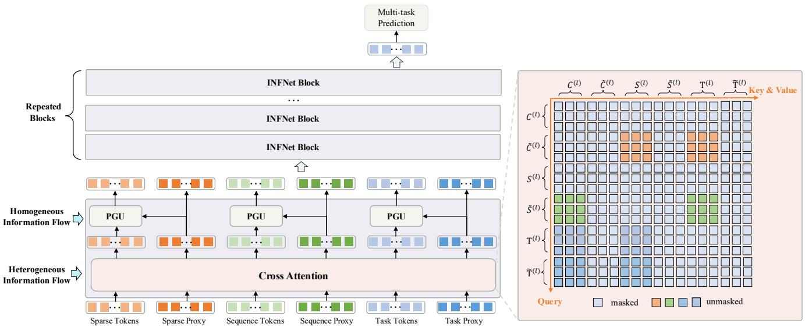
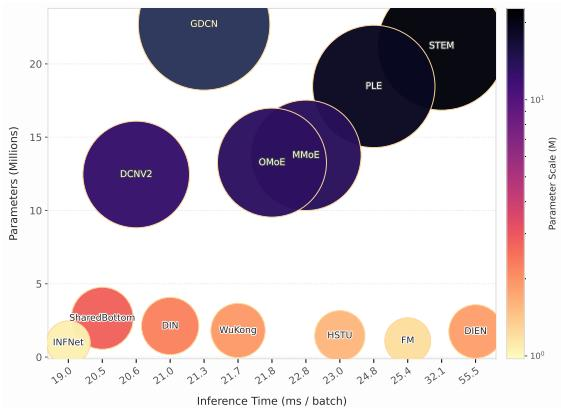

# INFNet论文介绍文档

## 论文基本信息

**论文标题**: INFNet: A Task-aware Information Flow Network for Large-Scale Recommendation Systems  
**作者**: Kaiyuan Li, Dongdong Mao, Yongxiang Tang, Yanhua Cheng, Yanxiang Zeng, Chao Wang, Xialong Liu, Peng Jiang  
**机构**: 快手科技  
**论文链接**: https://arxiv.org/pdf/2508.11565

---

## 1. 背景

### 1.1 推荐系统面临的挑战

在当今大规模推荐系统（如抖音、快手等短视频平台）中，面临着两个关键挑战：

1. **特征交互的复杂性**: 推荐系统需要处理海量的分类特征和序列特征，传统的特征交互方法在计算上变得不可行
2. **多任务学习的局限性**: 现实推荐系统通常涉及多个预测目标，但现有方法通常在特征交互模块之后才进行多任务学习，这种"后融合"设计忽视了任务特定的特征依赖关系

### 1.2 现有方法的不足

- **传统特征交互模型**（如FM、DCN）能够很好地处理高基数稀疏特征，但很大程度上忽略了序列信号或通过粗粒度池化压缩它们
- **基于注意力的模型**（如DIN、DIEN）通过目标感知注意力来选择相关历史，但其单向、单目标设计限制了更广泛的跨特征和跨字段依赖关系的建模
- **多任务学习方法**（如MMoE、PLE）通常在特征交互之前执行任务路由，这意味着两个特征的交互方式固定，无论优化哪个任务

  
*图1: 快手平台中的海量特征和多任务场景*

---

## 2. 核心贡献

### 2.1 主要创新点

INFNet提出了一个任务感知的信息流网络，主要贡献包括：

1. **任务感知架构**: 将特征统一为分类token、序列token和任务token，在单一交互空间中实现下游目标从最早阶段指导特征交互
2. **结构化交互机制**: 设计包含异构和同构交替信息块的双流设计
3. **代理token设计**: 提出任务特定和任务共享的代理token，将任务感知显式注入交互过程
4. **工业级部署验证**: 在商业在线广告系统中成功部署，获得显著业务收益

### 2.2 与传统方法的对比

  
*图2: (a) 传统多任务流水线通常在路由之前执行特征交互；(b) INFNET通过任务token和结构化信息流集成任务感知交互*

---

## 3. 核心贡献细节详细说明

### 3.1 特征预处理

INFNET将所有输入统一为三种token类型：

#### 3.1.1 分类特征token和代理token

- 分类输入包括用户/物品ID、静态属性和分桶连续变量
- 对于第j个字段，其嵌入表示为：$\mathbf{c}_j = \mathbf{E}_j^{\mathrm{cat}}[v_j] \in \mathbb{R}^d$
- 所有M个字段堆叠得到：$\mathbf{C} = [\mathbf{c}_1 \parallel ... \parallel \mathbf{c}_M]^\top \in \mathbb{R}^{M \times d}$
- 分类代理通过共享MLP $\phi_{\mathrm{cat}}$形成：$\tilde{\mathbf{C}} = \mathrm{Reshape}(\phi_{\mathrm{cat}}(\mathrm{Flatten}(\mathbf{C}))) \in \mathbb{R}^{m \times d}$

#### 3.1.2 序列特征token和代理token

- 用户行为被分组为F个动作特定序列（如点击、喜欢、播放）
- 统一序列token矩阵：$\mathbf{S} = [\mathsf{s}_{1,1},...,\mathsf{s}_{1,n_1},...,\mathsf{s}_{F,1},...,\mathsf{s}_{F,n_F}] \in \mathbb{R}^{L \times d}$
- 序列代理通过共享投影$\phi_{\mathrm{seq}}$形成：$\tilde{\mathbf{S}} = \left[\begin{array}{c}{\sum_{t=1}^{n_1} \boldsymbol{\phi}_{s\mathrm{eq}}(\mathsf{s}_{1,t})} \\ {\vdots} \\ {\sum_{t=1}^{n_F} \boldsymbol{\phi}_{\mathrm{seq}}(\mathsf{s}_{F,t})} \end{array}\right] \in \mathbb{R}^{F \times d}$

#### 3.1.3 任务特征token和代理token

- 每个真实任务表示为可学习向量的原始任务token：$\mathbf{T} \in \mathbb{R}^{N_{\mathrm{task}} \times d}$
- 引入$N_s$个共享任务token来捕获跨任务的共同知识：$\tilde{\mathbf{T}} \in \mathbb{R}^{N_s \times d}$

### 3.2 信息流设计

#### 3.2.1 异构特征交互

使用交叉注意力机制实现不同类型token之间的信息交换：

$$\mathrm{CA}(\mathbf{Q},\mathbf{K},\mathbf{V}) = \mathrm{softmax}\bigg(\frac{\mathbf{Q}\mathbf{W}_Q(\mathbf{K}\mathbf{W}_K)^\top}{\sqrt{d_k}}\bigg)(\mathbf{V}\mathbf{W}_V)$$

**信息流向分类**:
$$\tilde{\mathbf{C}}^{(l+1)} = \mathbf{CA}\Big(\tilde{\mathbf{C}}^{(l)}, \mathbf{S}^{(l)}, \mathbf{S}^{(l)}\Big) + \mathbf{CA}\Big(\tilde{\mathbf{C}}^{(l)}, \mathbf{T}^{(l)}, \mathbf{T}^{(l)}\Big)$$

**信息流向序列**:
$$\tilde{\mathbf{S}}^{(l+1)} = \mathrm{CA}\left(\tilde{\mathbf{S}}^{(l)}, \mathbf{C}^{(l)}, \mathbf{C}^{(l)}\right) + \mathrm{CA}\left(\tilde{\mathbf{S}}^{(l)}, \mathbf{T}^{(l)}, \mathbf{T}^{(l)}\right)$$

**信息流向任务**:
$$\tilde{\mathbf{T}}^{(l+1)} = \mathrm{CA}\left(\tilde{\mathbf{T}}^{(l)}, \mathbf{C}^{(l)}, \mathbf{C}^{(l)}\right) + \mathrm{CA}\left(\tilde{\mathbf{T}}^{(l)}, \mathbf{S}^{(l)}, \mathbf{S}^{(l)}\right)$$

#### 3.2.2 同构特征交互

使用代理门控单元（PGU）处理每种特征类型内的同构交互：

$$\mathbf{C}^{(l+1)} = \mathrm{PGU}_{\mathrm{cat}}(\mathbf{C}^{(l)}, \tilde{\mathbf{C}}^{(l)})$$
$$\mathbf{S}^{(l+1)} = \mathrm{PGU}_{\mathrm{seq}}(\mathbf{S}^{(l)}, \tilde{\mathbf{S}}^{(l)})$$
$$\mathbf{T}^{(l+1)} = \mathrm{PGU}_{\mathrm{task}}(\mathbf{T}^{(l)}, \tilde{\mathbf{T}}^{(l)})$$

### 3.3 整体架构

  
*图3: INFNET的整体架构。输入被标记化为分类C及其代理集$\tilde{\mathbf{C}}$、序列S及其代理集$\tilde{\mathbf{S}}$、任务T及其代理$\tilde{\mathbf{T}}$。每个块交替进行代理引导的异构融合和同构细化。堆叠N个块产生融合代理$\bar{\tilde{\mathbf{C}}}^{(N+1)}, \tilde{\mathbf{S}}^{(N+1)}$和$\tilde{\mathbf{T}}^{(N+1)}$；多任务头将最终层任务token馈送到任务特定MLP中。*

---

## 4. 实验分析与结论

### 4.1 离线实验

在多个公开数据集和工业数据集上进行广泛实验：

- **KuaiRand-pure**: 短视频推荐数据集
- **QB-video**: 多行为广告数据集
- **Tenrec**: 多用途推荐基准数据集

**主要发现**:
- INFNET在所有数据集上都实现了最先进的性能
- 在KuaiRand-pure上，点击AUC达到0.7736，喜欢AUC达到0.8960
- 在QB-video上，点击AUC达到0.9749，分享AUC达到0.8091

### 4.2 消融研究

通过移除主要组件评估INFNET：

- **w/o1**: 移除任务token，阻止多任务信息的早期集成
- **w/o2**: 移除同构交互，削弱类型内建模
- **w/o3**: 移除异构交互，限制跨类型融合

**结果**: 完整INFNET在所有变体上表现最佳，确认了任务向量、同构流和异构流的重要性

### 4.3 代理token数量影响

研究代理token数量对多任务性能的影响：

- 分类/序列代理从2增加到4可提高AUC
- 共享任务token从1增加到2可提高性能
- 过度增加会导致性能下降，表明存在过参数化问题

### 4.4 可视化分析

  
*图5: 最终层交叉注意力的可视化。x轴表示特征或序列位置，y轴对应个体和共享任务的查询通道，颜色强度反映注意力权重（更亮表示更强的注意力）。*

**发现**:
- 共享任务通道表现出更平滑、低频模式，覆盖广泛区域
- 真实任务通道显示更尖锐的峰值，与少数显著位置对齐
- 这种模式符合设计目标：真实任务专门处理任务特定线索，共享任务提供广泛先验

### 4.5 效率分析

  
*图6: INFNET和基线在KuaiRand-pure数据集上的推理时间和参数比较*

**效率优势**:
- INFNET保持紧凑性和低延迟
- 通过分层特征交互和任务感知融合实现高效推理
- 在严格延迟和资源约束下实用

### 4.6 在线部署结果

  
*图7: INFNET部署阶段的特征生成逻辑*

**在线A/B测试结果**:
- **收入(REV)**: +1.587%
- **点击率(CTR)**: +1.155%
- **播放完成度**: P3s +0.105%, P5s +0.317%, PEnd +0.351%
- **推理延迟**: 18.17ms（略低于基线的18.28ms）
- **训练延迟**: 20.04分钟（低于基线的21.21分钟）

---

## 5. 业务中的启发

### 5.1 工业应用价值

INFNET的成功部署为大规模推荐系统提供了重要启示：

1. **任务感知设计的重要性**: 将任务信息早期注入特征交互过程，显著提升多任务学习效果
2. **结构化信息流的优势**: 异构和同构流的交替设计平衡了表达能力和计算效率
3. **代理机制的有效性**: 通过代理token实现信息压缩，在保持性能的同时控制计算复杂度

### 5.2 技术迁移可能性

INFNET的设计思想可迁移到其他领域：

- **电商推荐**: 处理用户浏览、购买、收藏等多行为序列
- **内容分发**: 优化点击率、阅读时长、分享率等多目标
- **广告系统**: 平衡点击率、转化率、收入等多业务指标

### 5.3 工程实践建议

基于INFNET的部署经验，提出以下工程建议：

1. **特征处理**: 重用缓存嵌入，维护有界序列长度，应用一致快照
2. **模型优化**: 利用代理机制控制计算复杂度，确保在线推理效率
3. **系统设计**: 分离推理和训练流水线，保持特征和模型版本的时间对齐

### 5.4 未来发展方向

1. **扩展性**: 支持更多特征类型和任务类型
2. **自动化**: 自动确定最优代理token数量和配置
3. **跨域应用**: 将INFNET架构应用于其他多模态多任务场景

---

## 总结

INFNET通过创新的任务感知信息流网络设计，成功解决了大规模推荐系统中特征交互和多任务学习的关键挑战。其结构化交互机制、代理token设计和高效架构使其在保持工业级效率的同时实现了显著的性能提升。在线部署结果验证了其在实际业务中的巨大价值，为推荐系统的发展提供了重要技术方向。