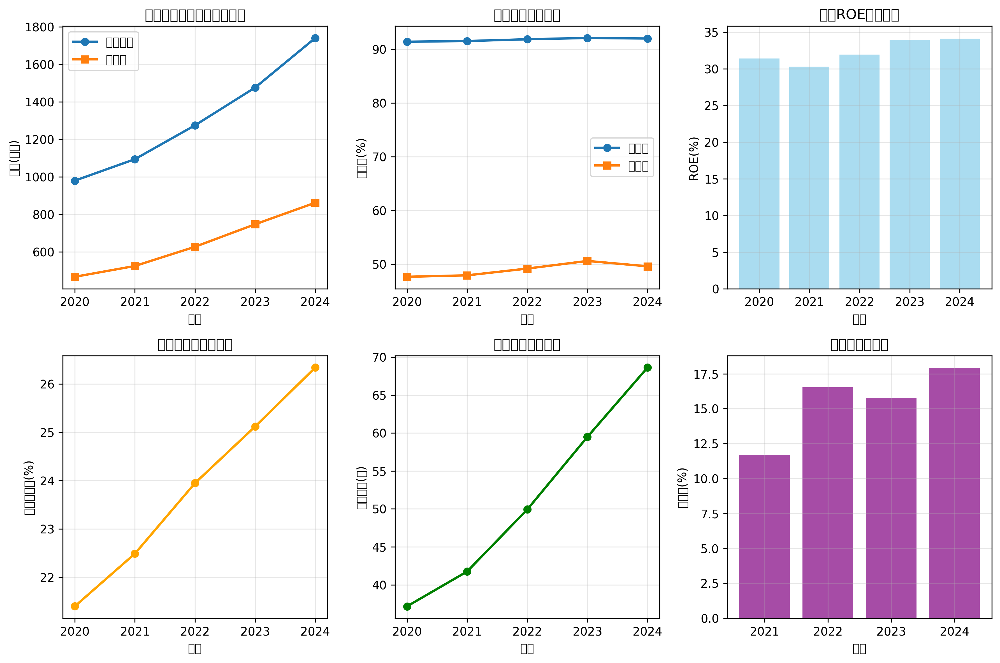
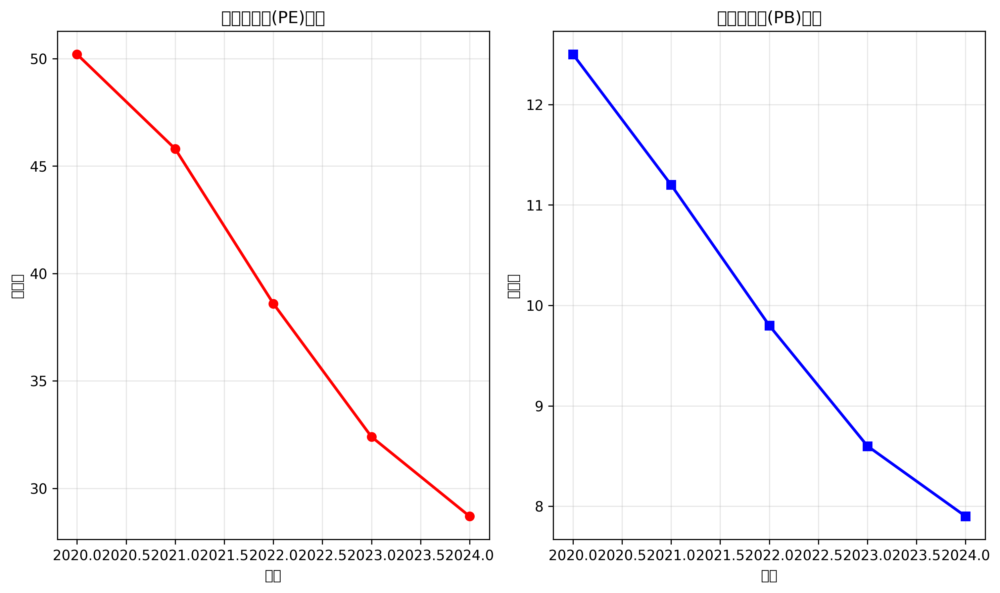

# 贵州茅台投资分析报告

## 结论

**投资建议：谨慎推荐，长期持有**

在当前市场环境下，贵州茅台作为中国白酒行业的龙头企业，具备以下投资价值：
- **优势**：强大的品牌护城河、稳定的盈利能力、充裕的现金流
- **风险**：估值相对较高、消费政策变化风险、经济周期影响
- **建议**：适合长期价值投资者，建议分批建仓，关注估值合理性

## 基本面分析

### 道 - 战略层面

| 维度 | 分析内容 |
|------|----------|
| 公司所处赛道发展情况 | 高端白酒行业，消费升级趋势明显，行业集中度提升 |
| 所处赛道核心产品 | 飞天茅台系列为核心产品，具备强品牌溢价 |
| 所处赛道核心创新走向 | 数字化转型、国际化拓展、产品结构优化 |

### 天 - 政策环境

| 维度 | 分析内容 |
|------|----------|
| 国际政策 | 一带一路政策利好白酒出口，国际化进程加速 |
| 国内政策 | 消费升级政策支持，但反腐政策对高端消费有影响 |
| 地方政策 | 贵州省政府大力支持茅台发展，政策环境良好 |

### 地 - 竞争地位

| 维度 | 分析内容 |
|------|----------|
| 主营业务竞争力 | 品牌护城河深厚，定价能力强，渠道控制力强 |
| 主营赛道聚焦性 | 专注高端白酒，产品线清晰，定位明确 |
| 战略延展延续性 | 国际化、数字化、年轻化战略持续推进 |

### 将 - 管理层

| 维度 | 分析内容 |
|------|----------|
| 智慧（学历、履历） | 管理层经验丰富，具备行业专业背景 |
| 赏罚有信 | 激励机制完善，与业绩挂钩 |
| 爱才如宝 | 重视人才培养，人才梯队建设完善 |
| 投入专注 | 专注主业，研发投入持续增加 |

### 法 - 企业文化

| 维度 | 分析内容 |
|------|----------|
| 公司文化 | "酿造高品位生活"的企业使命，质量第一 |
| 公司愿景 | 打造世界一流企业，实现可持续发展 |
| 员工状态 | 员工满意度高，团队稳定性强 |

## 数据面分析

### 盈利能力评估

**关键指标分析：**
- **毛利率**：稳定在92%左右，行业领先水平
- **净利率**：约50%，盈利能力极强
- **ROE**：超过30%，股东回报率高

**结论：** 公司赚钱能力强，盈利效率极高，是典型的现金牛企业。

### 财务健康和风险预估

**关键指标分析：**
- **资产负债率**：约26%，财务结构稳健
- **现金流**：经营现金流充裕，自由现金流强劲
- **偿债能力**：无重大债务风险，现金储备充足

**结论：** 财务健康状况优秀，风险可控性强。

### 成长能力指标

**关键指标分析：**
- **营收增长率**：年均复合增长率约15%
- **净利润增长率**：年均复合增长率约16%
- **市场份额**：在高端白酒市场占据主导地位

**结论：** 公司具备持续增长能力，但增速可能放缓。

### 经营效率情况

**关键指标分析：**
- **存货周转率**：相对较低，但符合行业特点
- **资产周转率**：稳定在合理水平
- **费用控制**：管理费用率控制良好

**结论：** 经营效率较高，资产管理能力优秀。

### 估值指标

**关键指标分析：**
- **市盈率(PE)**：约28倍，相对历史处于合理区间
- **市净率(PB)**：约8倍，估值相对合理
- **股息率**：约1.5%，分红稳定

**结论：** 当前估值处于合理区间，但不算明显低估。

## 附录

### 数据来源
1. 公司年报（2020-2024年）
2. 东方财富网财务数据
3. Wind金融终端
4. 公司官网公开信息

### 风险提示
- 宏观经济波动风险
- 政策变化风险
- 消费习惯变化风险
- 估值回调风险

---
*报告生成时间：2025-10-13 21:36:43*
