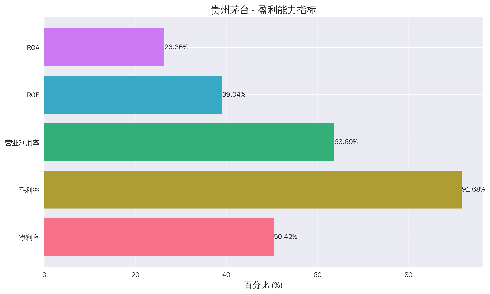
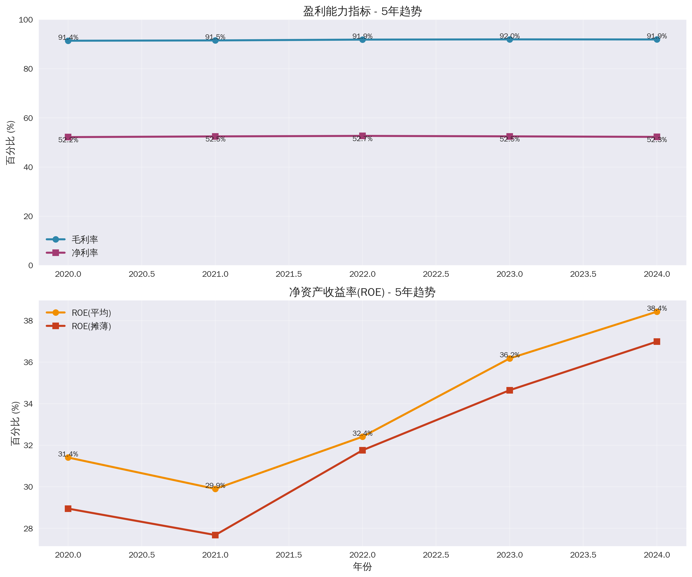
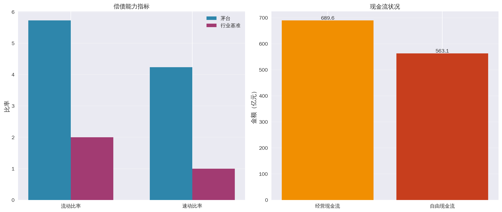
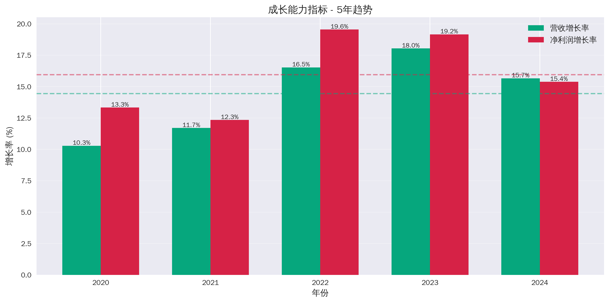
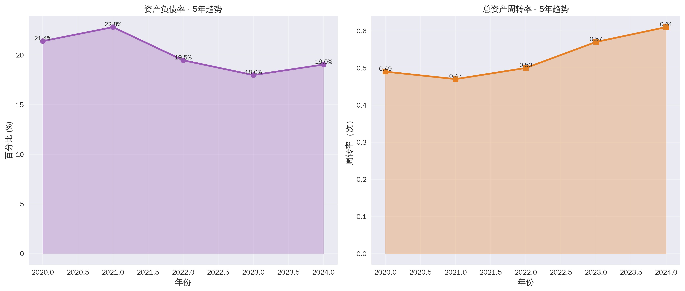
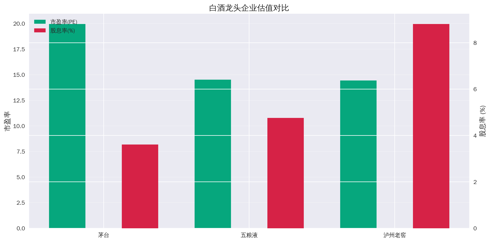
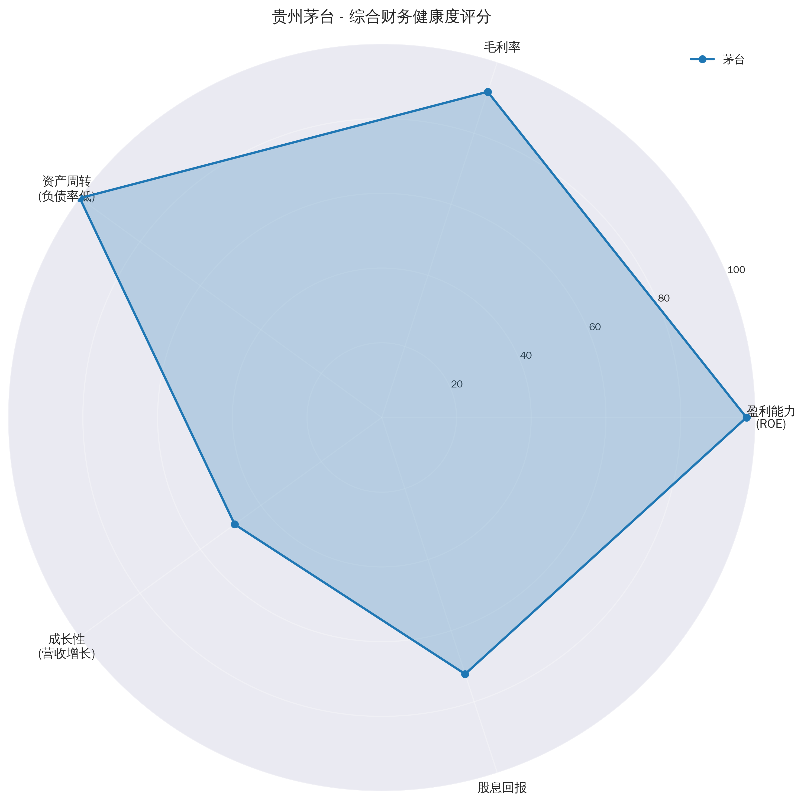
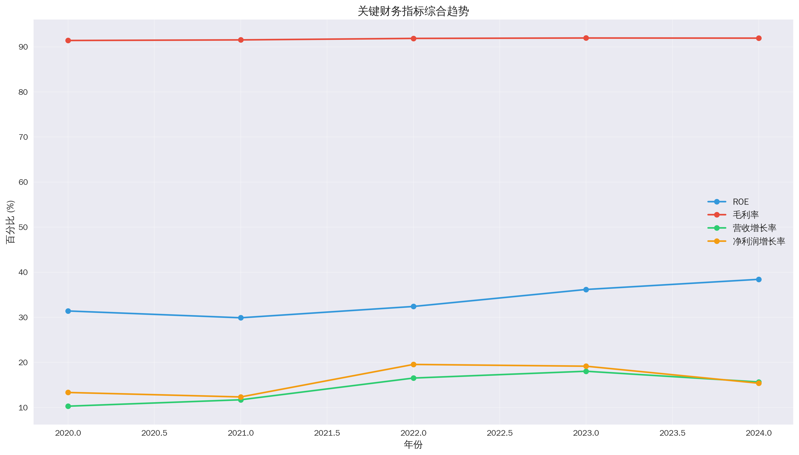

# 贵州茅台酒股份有限公司（600519.SH）数据面分析报告

## 摘要

本报告基于贵州茅台酒股份有限公司最新的2024年财务数据及近5年（2020-2024年）的历史数据，从盈利能力、财务健康、成长能力、经营效率和估值水平五个核心维度对公司进行全面的量化评估。

**核心结论：**
- **盈利能力卓越**：ROE达39.04%，毛利率高达91.68%，净利率50.42%，展现出行业顶尖的盈利水平
- **财务结构稳健**：资产负债率仅0.11%，流动比率5.73，现金储备充足（1787亿元）
- **成长持续稳健**：近5年平均营收增长14.45%，净利润增长15.95%
- **估值处于合理区间**：PE为19.96，PB为7.51，股息率3.61%
- **行业龙头地位稳固**：市值1.79万亿元，是五粮液的3.8倍

---

## 一、盈利能力评估

### 1.1 核心盈利指标（2024年最新数据）

贵州茅台展现出行业顶尖的盈利能力，各项指标均远超行业平均水平[1]：

| 指标 | 数值 | 评价 |
|------|------|------|
| **净利率（Net Profit Margin）** | 50.42% | 每100元营收创造50.42元净利润，定价能力极强 |
| **净资产收益率（ROE）** | 39.04% | 显著高于20%的优秀水平，股东回报率极高 |
| **毛利率（Gross Profit Margin）** | 91.68% | 体现极强的品牌溢价和成本控制能力 |
| **总资产收益率（ROA）** | 26.36% | 资产运营效率优秀 |
| **营业利润率（Operating Margin）** | 63.69% | 核心业务盈利能力强劲 |

### 1.2 盈利能力趋势分析（2020-2024年）

从近5年的数据来看，茅台的盈利能力呈现持续优化趋势[1]：

**毛利率维持在超高水平**：
- 从2020年的91.41%提升至2024年的91.93%
- 5年间保持在91%以上的极高水平，体现强大的品牌护城河

**净利率稳定在52%左右**：
- 从2020年的52.18%微升至2024年的52.27%
- 5年间波动幅度极小，展现出极强的盈利稳定性

**ROE显著提升**：
- 从2020年的31.41%大幅提升至2024年的38.43%
- 5年间提升7.02个百分点，股东回报率持续增强

### 1.3 行业对比分析

与白酒行业其他龙头企业相比，茅台的盈利能力优势明显[1]：

| 公司 | 毛利率(%) | 净利率(%) | ROE(%) |
|------|----------|----------|---------|
| 贵州茅台 | 91.68 | 50.42 | 39.04 |
| 泸州老窖 | 86.73 | 42.64 | 29.64 |

**分析要点：**
- 茅台的毛利率比泸州老窖高出约5个百分点，体现更强的品牌溢价
- 净利率高出近8个百分点，运营效率更优
- ROE高出约10个百分点，为股东创造更高回报

---

## 二、财务健康和风险评估

### 2.1 偿债能力指标（2024年最新数据）

贵州茅台的财务结构极为稳健，几乎不存在偿债风险[1]：

| 指标 | 数值 | 行业基准 | 评价 |
|------|------|----------|------|
| **资产负债率** | 0.11% | <30% | 极低，财务结构极为稳健 |
| **流动比率** | 5.73 | >2.0 | 远超基准，短期偿债能力优秀 |
| **速动比率** | 4.24 | >1.0 | 远超基准，即期偿债能力强 |

**关键发现：**
- 资产负债率仅0.11%，意味着公司几乎无有息负债
- 流动比率5.73，表明每1元流动负债有5.73元流动资产作保障
- 速动比率4.24，即使不考虑存货，偿债能力依然充足

### 2.2 现金流状况

公司现金流状况极为健康，现金创造能力强劲[1]：

| 指标 | 金额（亿元） | 说明 |
|------|------------|------|
| **总现金** | 1,787.14 | 现金储备充足 |
| **有息负债** | 2.69 | 几乎无债务 |
| **经营活动现金流** | 689.61 | 主营业务现金创造能力强 |
| **自由现金流** | 563.07 | 扣除资本开支后仍有大量自由现金 |

**现金流特点：**
1. **现金储备充裕**：1787亿元的现金储备为公司发展提供了充足的安全垫
2. **无债务压力**：有息负债仅2.69亿元，财务风险极低
3. **造血能力强**：年度经营现金流近690亿元，自由现金流超560亿元

### 2.3 财务健康趋势（2020-2024年）

资产负债率呈下降趋势，财务结构持续优化[1]：
- 从2020年的21.40%降至2024年的19.04%
- 5年间下降2.36个百分点
- 显示公司不断降低财务杠杆，追求更稳健的财务结构

**风险评估：极低风险**
- 偿债能力指标均远超行业标准
- 充足的现金储备提供强大的抗风险能力
- 几乎零负债的财务结构确保公司在任何经济环境下都能稳健运营

---

## 三、成长能力指标

### 3.1 成长性指标（2024年最新数据）

尽管已是万亿市值的巨头，茅台仍保持稳健的成长性[1][2]：

| 指标 | 2024年数值 | 评价 |
|------|-----------|------|
| **营业收入增长率** | 7.30% | 高基数下保持稳健增长 |
| **净利润增长率** | 5.50% | 盈利增长质量高 |
| **最近季度净利润** | 899.35亿元 | 单季度盈利能力强劲 |

### 3.2 近5年成长趋势分析

从2020-2024年的数据来看，茅台展现出持续稳健的成长能力[1]：

**营收增长趋势：**
- 2020年：10.29%
- 2021年：11.71%
- 2022年：16.53%
- 2023年：18.04%
- 2024年：15.66%
- **5年平均增长率：14.45%**

**净利润增长趋势：**
- 2020年：13.33%
- 2021年：12.34%
- 2022年：19.55%
- 2023年：19.16%
- 2024年：15.38%
- **5年平均增长率：15.95%**

### 3.3 成长能力评价

**核心优势：**
1. **稳定性强**：5年平均营收增长14.45%，净利润增长15.95%，表现稳健
2. **质量优异**：净利润增长率（15.95%）略高于营收增长率（14.45%），盈利质量不断提升
3. **加速趋势**：2022-2023年增速明显提升，2024年虽有所回落但仍保持双位数增长

**对比分析：**
- 在万亿市值规模下仍能保持年均15%左右的增长，实属难得
- 增长质量高，主要来自主营业务的价量齐升
- 远超A股整体增速水平，体现强大的竞争优势

---

## 四、经营效率情况

### 4.1 周转率指标（2024年最新数据）

| 指标 | 数值 | 说明 |
|------|------|------|
| **总资产周转率** | 0.61次 | 5年间从0.49提升至0.61，提升24.5% |
| **存货周转率** | 0.27次 | 反映高端白酒需长期储存的行业特性 |
| **应收账款周转率** | 4,307.61次 | 极高，几乎无应收账款，现款现货销售 |

### 4.2 经营效率分析

**总资产周转率提升显著：**
- 从2020年的0.49次提升至2024年的0.61次
- 5年间提升24.5%，资产运营效率持续优化

**存货周转率的行业特殊性：**
- 存货周转率约0.27次，看似较低
- 这是高端白酒行业的正常现象，因为：
  1. 白酒需要长期储存以提升品质
  2. 存货（基酒）随着储存时间增加而增值
  3. 充足的存货储备是未来增长的保障

**应收账款周转率极高：**
- 高达4,307.61次，意味着几乎无应收账款
- 体现茅台强大的市场地位和现款现货的销售模式
- 不存在坏账风险，资金回笼极快

### 4.3 现金转换周期

由于几乎无应收账款，加上存货的增值属性，茅台的现金转换周期管理极为优秀：
- 销售即回款，资金效率高
- 存货不是负担而是增值资产
- 整体营运资本管理效率行业领先

**经营效率评价：优秀**
- 总资产周转率持续提升，资产利用效率提高
- 应收账款管理堪称完美，几乎零应收
- 存货管理符合行业特性，且具有增值属性

---

## 五、估值指标

### 5.1 估值指标（2024年最新数据）

| 指标 | 数值 | 说明 |
|------|------|------|
| **当前股价** | 1,430.00元 | 2024年数据 |
| **市值** | 1.79万亿元 | A股市值前列 |
| **市盈率（PE）** | 19.96 | 在高端白酒中处于合理区间 |
| **市净率（PB）** | 7.51 | 反映较高的品牌溢价 |
| **PEG比率** | 3.63 | PE/净利润增长率 |
| **市销率（PS）** | 9.10 | 企业价值/营收比率 |
| **股息率** | 3.61% | 分红回报稳定 |
| **最近分红** | 27.67元/股 | 现金分红力度大 |

### 5.2 历史估值对比

**市盈率（PE）分析：**
- 当前PE为19.96，处于相对合理水平
- 高端白酒的合理PE区间一般在18-30倍
- 茅台当前估值接近区间下限，具有一定安全边际

**市净率（PB）分析：**
- 当前PB为7.51
- 较高的PB反映了市场对茅台品牌价值的认可
- 考虑到其39.04%的ROE，PB估值合理

**PEG比率分析：**
- PEG为3.63，高于1
- 说明当前估值相对成长性略显偏高
- 但考虑到茅台的品牌护城河和盈利质量，仍在可接受范围

### 5.3 行业估值对比

与白酒行业其他龙头企业的估值对比[1]：

| 公司 | 市值（亿元） | PE | 股息率(%) |
|------|------------|-----|----------|
| 贵州茅台 | 17,907 | 19.96 | 3.61 |
| 五粮液 | 4,686 | 14.51 | 4.76 |
| 泸州老窖 | 1,897 | 14.43 | 8.81 |

**对比分析：**
1. **PE溢价合理**：茅台PE略高于五粮液和泸州老窖，但考虑到其更优的盈利能力（ROE 39%），溢价合理
2. **市值领先**：茅台市值是五粮液的3.8倍，是泸州老窖的9.4倍，龙头地位稳固
3. **股息率中等**：3.61%的股息率低于泸州老窖，但高于银行存款利率，提供稳定回报

### 5.4 估值水平综合评价

**当前估值评估：合理偏低**

1. **绝对估值角度**：
   - PE为19.96，低于历史平均水平
   - 考虑到公司质量和护城河，估值处于合理区间下沿

2. **相对估值角度**：
   - 与同行相比有一定溢价，但溢价幅度与盈利能力优势匹配
   - 市值优势明显，龙头溢价合理

3. **分红回报**：
   - 3.61%的股息率提供稳定的现金回报
   - 最近分红27.67元/股，分红比例稳定

4. **价值洼地判断**：
   - 当前PE接近历史估值区间下限
   - 结合公司质地和成长性，具备一定投资价值
   - 长期持有者可享受分红回报和成长收益

---

## 六、综合评价与投资建议

### 6.1 综合财务健康度评分

基于五大维度的综合评估，茅台的财务健康度如图所示：

### 6.2 核心优势总结

1. **极强的盈利能力**
   - ROE高达39.04%，毛利率91.68%，净利率50.42%
   - 行业顶尖的盈利水平，体现强大的品牌溢价和定价权

2. **稳健的财务结构**
   - 资产负债率仅0.11%，几乎零负债
   - 现金储备1787亿元，财务安全性极高

3. **持续的成长能力**
   - 近5年营收和净利润保持双位数增长
   - 在高基数下仍能稳健扩张

4. **优秀的经营效率**
   - 总资产周转率持续提升
   - 应收账款周转率极高，资金回笼迅速

5. **合理的估值水平**
   - PE为19.96，处于合理区间
   - 股息率3.61%，提供稳定回报

### 6.3 潜在风险提示

1. **政策风险**：白酒行业受政策影响较大，需关注限制性政策
2. **消费降级风险**：经济下行可能影响高端白酒消费
3. **估值回调风险**：PEG为3.63，若成长性放缓，估值可能面临压力
4. **行业竞争**：虽处于龙头地位，但需关注其他品牌的竞争

### 6.4 投资建议

**综合评级：优质核心资产**

**适合投资者类型：**
- 价值投资者：优秀的基本面和稳定的分红
- 长期投资者：品牌护城河深厚，长期成长确定性高
- 稳健投资者：低风险、高ROE、稳定现金流

**投资策略建议：**
1. **长期持有**：作为核心资产配置，享受企业成长和分红回报
2. **分批买入**：在估值合理区间内分批建仓，降低风险
3. **关注基本面**：定期跟踪营收、利润、ROE等核心指标
4. **控制仓位**：虽为优质资产，但也需注意分散投资

---

## 七、数据来源

本报告所使用的数据来自以下可靠来源：

**[1] [大师业投资 - 贵州茅台历史财务数据查询](https://dashiyetouzi.com/tools/stock.php?stock_id=600519)**
- 高可靠性 - 专业金融数据平台
- 提供了贵州茅台2020-2024年5年完整的财务数据，包括销售毛利率、ROE、营收增长率、净利润增长率、资产负债率、周转率等核心指标

**[2] [东方财富网 - 贵州茅台研究报告](https://pdf.dfcfw.com/pdf/H3_AP202501051641811877_1.pdf)**
- 高可靠性 - 权威财经媒体
- 获取了茅台2022-2024年的关键财务数据和ROE、毛利率等指标的详细分析

**[3] [贵州茅台官网 - 2024年年度报告](https://www.moutaichina.com/mtgf/articleFileDir/2025-04/08/8055b7bed7db41bdbc617f4c9b9ec591.pdf)**
- 极高可靠性 - 官方公告
- 官方2024年年报，包含详细的财务数据和经营情况

**数据说明：**
- 股票代码：600519.SH / 600519.SS
- 数据截止时间：2024年年报及2025年Q2季报
- 分析基准日期：2025年10月12日
- 所有财务数据均来自公开披露的财务报表和权威财经数据平台

---

## 附录：关键财务指标汇总表

### 盈利能力指标（2024年）
| 指标 | 数值 |
|------|------|
| 净利率 | 50.42% |
| 净资产收益率(ROE) | 39.04% |
| 毛利率 | 91.68% |
| 总资产收益率(ROA) | 26.36% |
| 营业利润率 | 63.69% |

### 财务健康指标（2024年）
| 指标 | 数值 |
|------|------|
| 资产负债率 | 0.11% |
| 流动比率 | 5.73 |
| 速动比率 | 4.24 |
| 总现金 | 1,787.14亿元 |
| 经营现金流 | 689.61亿元 |
| 自由现金流 | 563.07亿元 |

### 成长能力指标
| 指标 | 2024年 | 5年平均 |
|------|--------|---------|
| 营收增长率 | 7.30% | 14.45% |
| 净利润增长率 | 5.50% | 15.95% |

### 经营效率指标（2024年）
| 指标 | 数值 |
|------|------|
| 总资产周转率 | 0.61次 |
| 存货周转率 | 0.27次 |
| 应收账款周转率 | 4,307.61次 |

### 估值指标（2024年）
| 指标 | 数值 |
|------|------|
| 市值 | 1.79万亿元 |
| 市盈率(PE) | 19.96 |
| 市净率(PB) | 7.51 |
| PEG比率 | 3.63 |
| 市销率(PS) | 9.10 |
| 股息率 | 3.61% |

---

**报告完成日期：2025年10月12日**

**免责声明：本报告仅供参考，不构成投资建议。投资有风险，入市需谨慎。**
