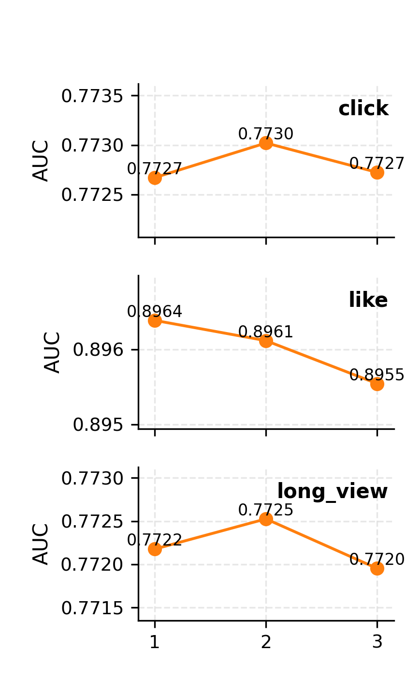
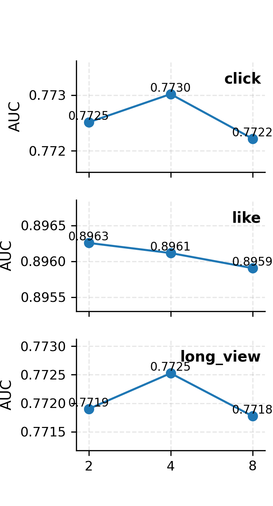
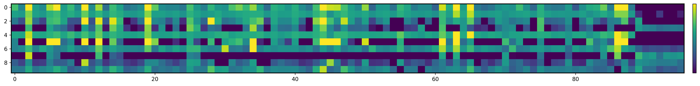

# INFNet: 面向大规模推荐系统的任务感知信息流网络

**论文标题：** INFNet: A Task-aware Information Flow Network for Large-Scale Recommendation Systems

**作者：** Kaiyuan Li, Dongdong Mao, Yongxiang Tang等（快手科技）

**论文地址：** https://arxiv.org/pdf/2508.11565

**撰写人：** MiniMax Agent

---

## 目录

1. [背景](#1-背景)
2. [核心贡献](#2-核心贡献)
3. [核心贡献细节详细说明](#3-核心贡献细节详细说明)
4. [实验分析与结论](#4-实验分析与结论)
5. [业务中的启发](#5-业务中的启发)

---

## 1. 背景

### 1.1 推荐系统的演进趋势

在短视频平台（如TikTok、快手）快速发展的背景下，现代推荐系统呈现出两大核心趋势：

1. **特征规模和异构性爆炸式增长**：工业级推荐系统需要处理数千个序列特征、数百个稀疏类别字段
2. **多任务学习（MTL）的广泛采用**：需要同时优化多个业务目标（如点击率CTR、观看时长、收入等）


如上图所示，用户在短视频平台上产生了丰富的交互行为（点击、滑动、评论、点赞等），这些行为需要被建模为各种特征，并同时服务于多个预测目标。

### 1.2 面临的核心挑战

当前推荐系统在特征交互和多任务学习方面面临两大关键挑战：

#### 挑战一：特征交互的效率与表达力矛盾

**问题描述：**
- 海量的类别特征和序列特征使得穷举式交互在计算上不可行
- 现有方法要么通过粗粒度池化丢失细粒度信息，要么因二次复杂度而无法部署

**具体表现：**
- **序列特征处理困难**：用户行为序列包含丰富的时序信息（如点击历史、点赞历史），但传统方法如FM、DCN主要关注类别特征，对序列信号的建模不足
- **计算成本高昂**：基于注意力的模型（如DIN、DIEN）虽然能捕获序列依赖，但单向、单目标的设计限制了跨特征、跨字段依赖的建模能力
- **优化困难**：当特征数量达到数千级别时，端到端的特征交互训练面临收敛困难

#### 挑战二：多任务学习中的任务感知不足

**问题描述：**
- 大多数现有方法在特征交互之后才进行任务路由
- 这种"后融合"设计忽略了任务特定的特征依赖关系

**具体表现：**
- **负迁移问题**：不同任务可能需要不同的特征交互模式，但传统方法（如MMoE、PLE、STEM）的特征交互方式对所有任务是固定的
- **表达能力受限**：任务信号在特征交互阶段缺失，导致学到的特征表示次优
- **效率约束**：在严格的延迟和内存预算下，同时优化多个目标时，缺乏任务感知会降低头部和尾部任务的性能

### 1.3 相关工作的局限性

#### 特征交互方法的演进

1. **早期分解方法**（FM及其变体）
   - 优点：高效、可解释
   - 局限：仅限于二阶交互

2. **深度混合方法**（DeepFM、xDeepFM、DCN/DCN-V2）
   - 优点：通过高阶语义或多项式展开增强表达力
   - 局限：依赖扁平化的全局交互，在严格的延迟和内存预算下效率不足

3. **序列感知模型**（DIN、DIEN、DSIN）
   - 优点：针对行为建模采用目标感知注意力
   - 局限：序列常被过早池化，削弱了条件信息；任务信号通常后注入，限制了多目标场景下的任务感知交叉

#### 多任务推荐方法的演进

1. **专家混合架构**（MMoE、PLE、STEM、HoME）
   - 优点：通过分离共享和任务特定组件改善表示共享
   - 局限：遵循"先特征交互、后任务路由"的两阶段流程，忽略了交互模式可能是任务依赖的事实

这些局限性促使了本文提出一种统一的方法，将类别特征、序列特征和任务代理标记整合到结构化的信息流中，实现早期阶段的任务感知交互，同时控制工业规模部署的计算成本。

---

## 2. 核心贡献

本文提出了**INFNet（Information Flow Network）**，一种面向大规模推荐场景的任务感知架构。INFNet的核心创新可以概括为以下四个方面：

### 2.1 任务感知的信息流架构

**创新点：** 将任务视为可学习的特征，从最早阶段引导特征交互

INFNet将所有输入统一为三种标记类型：
- **类别标记（Categorical Tokens）**：用户ID、物品ID等稀疏特征
- **序列标记（Sequence Tokens）**：点击历史、点赞历史等行为序列
- **任务标记（Task Tokens）**：可学习的任务表示向量

这种设计使得下游目标能够从最早阶段引导特征交互，而不是仅在特征融合之后。

### 2.2 双流信息交互机制

**创新点：** 通过异构流和同构流的交替设计，实现高效且表达力强的特征交互

INFNet设计了两种互补的信息流：

1. **异构信息流（Heterogeneous Flow）**
   - 采用**带代理的交叉注意力机制**
   - 实现跨模态标记交互，计算成本可控
   - 复杂度与代理数量成正比，而非原始标记基数

2. **同构信息流（Homogeneous Flow）**
   - 设计**代理门控单元（PGU）**
   - 实现细粒度的类型内特征处理
   - 通过通道级调制避免冗余的标记到标记注意力

### 2.3 任务特定与共享代理标记

**创新点：** 通过代理标记机制，在减轻负迁移的同时保留跨任务泛化能力

INFNet引入两类代理标记：

- **任务特定代理标记（Task-specific Proxy Tokens）**：捕获任务独有的特征依赖
- **任务共享代理标记（Task-shared Proxy Tokens）**：类似于专家混合网络中的共享专家，提供紧凑的查询集

这种设计在交互过程中显式注入任务感知，减轻了目标间的负迁移，同时保留了有益的跨任务泛化。

### 2.4 算法与系统级的双重优势

**创新点：** 在严格的延迟和内存预算下，实现了显著的业务指标提升

#### 离线实验表现

- 在多个公开基准数据集上达到最先进性能
- 在KuaiRand和QB-Video数据集上，各项指标全面领先基线方法

#### 在线生产系统收益

INFNet已成功部署在快手的商业在线广告系统中，取得显著提升：
- **收入（REV）**：+1.587%
- **点击率（CTR）**：+1.155%
- **用户留存指标**：P3s +0.105%，P5s +0.317%，PEnd +0.351%

同时，INFNet保持了与基线相当甚至更优的效率：
- 预测延迟：18.17ms（基线18.28ms）
- 训练延迟：20.04分钟（基线21.21分钟）

### 2.5 核心价值总结

INFNet的核心贡献在于：

1. **理论创新**：首次将任务感知引入特征交互的最早阶段，打破了传统"先交互、后路由"的范式
2. **架构创新**：通过代理机制和双流设计，在保持表达力的同时控制计算复杂度
3. **工程价值**：在工业级推荐系统中验证了方法的可行性和有效性，实现了算法优势到业务价值的转化

---

## 3. 核心贡献细节详细说明

本节详细介绍INFNet的技术架构，包括特征预处理、信息流机制和优化目标。

### 3.1 整体架构概览

INFNet的整体架构如下图所示：



**架构要点：**
- 输入被标记化为类别C（及其代理集C̃）、序列S（及其代理集S̃）、任务T（及其代理T̃）
- 每个块交替进行代理引导的异构融合（交叉注意力）和同构精炼（PGU）
- 堆叠N个块后，得到融合后的代理C̃^(N+1)、S̃^(N+1)和T̃^(N+1)
- 多任务头将最终层的任务标记馈送到任务特定的MLP

### 3.2 特征预处理与标记化

INFNet将所有输入统一为三种标记类型，每种类型包含**原始标记**（完整表示）和**代理标记**（紧凑查询）。所有嵌入共享相同的维度d，确保后续交互层的兼容性。

#### 3.2.1 类别特征标记与代理标记

**原始类别标记：**

类别输入包括用户/物品ID、静态属性和分桶的连续变量。对于第j个字段，值为v_j ∈ {1,...,V_j}，嵌入表为E_j^cat ∈ ℝ^(V_j×d)：

```
c_j = E_j^cat[v_j] ∈ ℝ^d
```

堆叠所有M个字段得到：

```
C = [c_1, ..., c_M]^⊤ ∈ ℝ^(M×d)
```

**类别代理标记：**

为了形成类别代理，首先将所有字段嵌入展平为单个向量，然后通过共享MLP φ_cat投影，并重塑为m个代理标记：

```
C̃ = Reshape(φ_cat(Flatten(C))) ∈ ℝ^(m×d)
```

**设计要点：** 这种方法在压缩前保留了全局跨字段上下文，在相同标记预算下生成更具信息量的代理。

#### 3.2.2 序列特征标记与代理标记

**原始序列标记：**

用户行为被分组为F个特定动作的序列（如点击、点赞、播放）。我们连接所有行为特定序列以形成统一的序列标记矩阵：

```
S = [s_1,1, ..., s_1,n1, ..., s_F,1, ..., s_F,nF] ∈ ℝ^(L×d)
```

其中L = Σ_{a=1}^F n_a是填充/截断后行为标记的总数。

**序列代理标记：**

为了形成代理，每个序列标记通过共享投影φ_seq，然后在其行为类型内进行池化（求和池化）：

```
S̃ = [Σ_{t=1}^{n1} φ_seq(s_1,t); ...; Σ_{t=1}^{nF} φ_seq(s_F,t)] ∈ ℝ^(F×d)
```

**设计要点：** 这保留了每种类型的时序语义，同时在异构流中保持有界数量的查询标记。

#### 3.2.3 任务特征标记与代理标记

**真实任务标记：**

每个真实任务i用原始任务标记表示，初始化为可学习向量：

```
T ∈ ℝ^(N_task×d)
```

这些标记作为任务特定的键/值，并构成相应预测头的基础。

**共享任务代理标记：**

受专家网络启发，引入N_s个共享任务标记来捕获跨任务的公共知识。这些共享标记可以视为任务代理标记的一种特殊形式，类似于专家混合架构中的共享专家：

```
T̃ ∈ ℝ^(N_s×d)
```

**设计要点：** 共享标记作为异构注意力中的查询参与，实现早期任务感知调节而不增加总查询数量。同时，原始T标记保留在类型内精炼阶段，确保足够的任务特定表达能力。

### 3.3 信息流机制

INFNet的核心是将信息流分为两个阶段：**异构特征交互**和**同构特征交互**，封装在可堆叠的INFNet Block中。

#### 3.3.1 异构特征交互

**目标：** 实现不同特征类型之间的信息交换

**机制：** 采用交叉注意力（Cross Attention）机制，允许一组标记查询另一组标记。

**交叉注意力定义：**

```
CA(Q, K, V) = softmax(QW_Q(KW_K)^⊤ / √d_k)(VW_V)
```

其中d_k表示键和查询向量的维度。

**三种信息流模式：**

1. **流向类别（Flow to Categorical）**

类别代理标记作为查询，序列和任务标记作为键/值：

```
C̃^(l+1) = CA(C̃^(l), S^(l), S^(l)) + CA(C̃^(l), T^(l), T^(l))
```

2. **流向序列（Flow to Sequence）**

序列代理标记作为查询，类别和任务标记作为键/值：

```
S̃^(l+1) = CA(S̃^(l), C^(l), C^(l)) + CA(S̃^(l), T^(l), T^(l))
```

3. **流向任务（Flow to Task）**

与流向类别和序列不同，由于任务代理和真实任务标记数量都很少，且各有独特作用：
- 任务代理捕获共享的跨任务模式
- 真实任务标记专注于任务特定的细微差别

因此，对两者都执行交叉注意力：

```
T̃^(l+1) = CA(T̃^(l), C^(l), C^(l)) + CA(T̃^(l), S^(l), S^(l))
T̂^(l+1) = CA(T^(l), C^(l), C^(l)) + CA(T^(l), S^(l), S^(l))
```

其中T̂^(l+1)作为富含任务特定信息的中间输出。

**设计要点：**
- 代理作为注意力瓶颈：用作查询以限制扇出
- 更丰富的（非代理）标记可作为键/值以保留信息
- 跨类型复杂度与代理数量成正比，而非原始标记基数

#### 3.3.2 同构特征交互

**目标：** 在异构整合后，进一步精炼相同类型的特征

**机制：** 采用代理门控单元（Proxy Gated Unit, PGU）

**PGU的设计思想：** 类似于Transformer中MLP的通道级专业化角色：
- 交叉注意力处理全局、跨类型信息交换
- PGU通过代理条件的通道级调制精炼类型内表示
- 避免冗余的标记到标记注意力，确保大规模系统中部署友好的复杂度

**PGU的数学定义：**

给定类型的标记X ∈ ℝ^(n×d)和其异构阶段的ñ个代理标记X̃ ∈ ℝ^(ñ×d)：

1. 沿标记维度展平X̃形成X̃_f ∈ ℝ^(ñd)
2. 通过轻量级MLP映射为通道级门控向量g ∈ ℝ^d
3. 应用Sigmoid激活限制门控值
4. 广播到所有标记进行逐元素调制

```
PGU(X, X̃) = X ⊙ σ(MLP(X̃_f)) ∈ ℝ^(n×d)
```

**应用到三种类型：**

```
C^(l+1) = PGU(C^(l), C̃^(l))
S^(l+1) = PGU(S^(l), S̃^(l))
T^(l+1) = PGU(T̂^(l+1), T̃^(l))
```

**设计要点：**
- 通道级设计将PGU的复杂度与标记长度n解耦
- 即使对于非常长的序列也保持高效
- 保留了代理条件的调制能力

#### 3.3.3 INFNet Block的完整流程

每个INFNet Block接收上一层的输出，执行以下步骤：

1. **异构交互**：通过交叉注意力实现跨类型信息融合
2. **同构精炼**：通过PGU实现类型内特征增强
3. **残差连接**：提高训练效率

堆叠N个Block后，输出C̃^(N+1)、S̃^(N+1)、T̃^(N+1)馈送到预测头。

### 3.4 多任务预测头与优化目标

#### 3.4.1 任务特定预测

给定多任务建模阶段获得的增强的每任务表示T_i^(N)，每个任务预测由任务特定MLP后跟Sigmoid激活产生：

```
ŷ_i = σ(MLP_i(T_i^(N)))
```

**设计特点：**
- 跨任务共享架构，但维护独立参数
- 将任务代理表示映射到校准概率

#### 3.4.2 多任务联合优化

采用加权多任务损失：

```
L = Σ_{i=1}^{N_task} λ_i L_i(ŷ_i, y_i)
```

其中：
- ŷ_i和y_i分别表示任务i的预测标签和真实标签
- L_i是任务特定的损失函数（本文选择二元交叉熵）
- λ_i是任务权重（默认=1），可通过网格搜索或基于不确定性的方法调整

**二元交叉熵损失：**

```
L_i(ŷ_i, y_i) = -[y_i log ŷ_i + (1-y_i) log(1-ŷ_i)]
```

网络参数Θ通过在训练集上最小化L(Θ)进行端到端优化，实现共享学习和任务特定学习。

### 3.5 与传统方法的对比

下图展示了INFNet与传统多任务流程的对比：



**关键区别：**
- **(a) 传统多任务流程**：先进行特征交互，然后才进行任务路由，任务信息在交互阶段缺失
- **(b) INFNet方法**：通过任务标记和结构化信息流，将任务感知集成到交互阶段

这种设计使得目标优化能够从流程的最开始就影响异构特征交互，而不仅仅是在特征融合之后。

---

## 4. 实验分析与结论

本节详细介绍INFNet的实验设置、性能对比、消融研究和在线部署结果。

### 4.1 实验设置

#### 4.1.1 数据集

实验使用三个公开短视频基准数据集和一个大规模内部数据集：

| 数据集 | 用户数 | 物品数 | 交互数 | 类别特征 | 序列特征 | 任务数 |
|--------|--------|---------|---------|----------|----------|--------|
| **KuaiRand-Pure** | 27,285 | 7,551 | 1,436,609 | 8 | 28 | 3 |
| **KuaiRand-27K** | 27,285 | 32,038,725 | 322,278,385 | 9 | 28 | 3 |
| **QB-Video** | 34,240 | 130,637 | 1,726,886 | 8 | 12 | 4 |

**数据集特点：**
- **KuaiRand-Pure**：相对紧凑
- **KuaiRand-27K**：扩展到更大的物品和日志规模（相同用户）
- **QB-Video**：采用不同的模式和任务设置

这种组合覆盖了不同的稀疏性水平、特征丰富度和任务数量，提供了多样化的测试平台。

#### 4.1.2 基线方法

**特征交互模型：**
- **FM**：通过分解嵌入和线性项建模二阶交互
- **DIN**：对用户历史应用目标感知注意力
- **DIEN**：通过注意力更新的GRU建模兴趣提取和时序演化
- **DCN v2**：通过低秩残差混合增强交叉网络
- **GDCN**：使用门控交叉层和字段级维度优化
- **WuKong**：在缩放规则下加深和加宽FM块
- **HSTU**：将推荐视为生成式序列转导

**多任务推荐模型：**
- **Shared-Bottom**：跨任务共享公共编码器
- **MMoE**：通过任务特定门组合多个专家
- **OMoE**：MMoE的轻量级单门变体
- **PLE**：逐步分离共享和任务特定专家
- **STEM**：使用共享和任务特定嵌入与门控

#### 4.1.3 评估指标

- **AUC**：ROC曲线下面积，衡量整体排序质量（越高越好）
- **gAUC**：用户级平均AUC，更均匀地加权用户以反映个性化质量（越高越好）

#### 4.1.4 实验参数设置

为了公平比较，所有方法在相同的数据处理流程和一致的超参数调优协议下评估：

- **批大小**：4096
- **嵌入维度**：在{8, 16, 32, 64, 96, 128}中调优
- **优化器**：从{Adam, Adagrad}中选择
- **学习率**：在{1e-4, 3e-4, 1e-3}中搜索
- **L2正则化**：从{0, 1e-7, 1e-6, 1e-5}中调优
- **Dropout率**：在{0.0, 0.1, 0.2}中搜索
- **早停**：验证AUC连续5次评估无改善时停止
- **报告结果**：三次不同随机种子运行的平均值

### 4.2 性能对比

#### 4.2.1 整体性能

实验结果显示INFNet在所有数据集和任务上都取得了最佳或次佳的性能（加粗为最佳，下划线为次佳）。

**主要观察：**

1. **相对于特征交互模型**
   - INFNet在点击、点赞、长时观看和分享等多个目标上持续获得更高的AUC和gAUC
   - 这表明INFNet中的双向异构信息流更有效地整合了类别字段与多行为序列
   - 在保持可管理计算成本的同时实现了更强的高阶交互

2. **相对于多任务模型**
   - INFNet相对于Shared-Bottom、MMoE、OMoE、PLE和STEM显示出明显优势
   - 特别是在具有挑战性的目标和KuaiRand-27K（行为稀疏性和噪声更明显）上表现突出
   - 带有代理标记的交叉注意力，加上包含共享和真实任务标记的混合任务表示，增强了跨任务的共性学习，同时捕获任务特定的细微差别
   - 减少了负迁移，提高了整体多任务性能

3. **跨设置的鲁棒性**
   - 在不同的嵌入大小和序列截断长度范围内观察到一致的改进
   - 表明INFNet在不同容量和上下文预算下保持稳定优势

### 4.3 消融研究

#### 4.3.1 消融实验设计

在KuaiRand-pure和QB-video数据集上评估INFNet，通过依次移除每个主要组件：

- **w/o1**：移除任务标记（可学习任务向量），阻止多任务信息的早期集成
- **w/o2**：移除同构交互（类别、序列和任务标记的PGU更新），削弱类型内建模
- **w/o3**：移除异构交互（跨特征类型的交叉注意力），限制跨类型融合

#### 4.3.2 消融实验结果

| 数据集 | 任务 | 指标 | w/o1 | w/o2 | w/o3 | **INFNet** |
|--------|------|------|------|------|------|-----------|
| KuaiRand-Pure | click | AUC | 0.7720 | 0.7716 | 0.7705 | **0.7736** |
| | like | AUC | 0.8925 | 0.8926 | 0.8899 | **0.8960** |
| | long-view | AUC | 0.7707 | 0.7713 | 0.7701 | **0.7727** |
| QB-Video | click | AUC | 0.9747 | 0.9741 | 0.9741 | **0.9749** |
| | like | AUC | 0.9185 | 0.9183 | 0.9168 | **0.9225** |
| | follow | AUC | 0.8842 | 0.8852 | 0.8829 | **0.8881** |
| | share | AUC | 0.7747 | 0.7868 | 0.7854 | **0.8091** |

**关键发现：**

1. **w/o1（无任务标记）**显示普遍下降，特别是在share任务上（+0.0344 AUC），证实任务向量改善了与任务特定目标的对齐

2. **w/o2（无同构交互）**显著影响序列依赖任务（如long-view、follow、like），表明每类型精炼在跨类型混合之前改善了特征质量

3. **w/o3（无异构交互）**在大多数任务上造成最大损失，突出了在任务上下文下对齐类别和序列证据的重要性

**结论：**
- 任务向量注入早期任务感知
- 同构流增强每类型表示
- 异构流实现有效的跨类型融合
- 完整模型从所有三者中受益，实现最佳性能

### 4.4 超参数分析

#### 4.4.1 代理标记数量的影响

在KuaiRand-pure数据集上研究代理标记数量如何影响INFNet的多任务性能，固定任务代理=4和共享任务标记=2。



**实验发现：**

1. **类别/序列代理数量（图4a-4b）**
   - 从2增加到4提高了AUC，通过实现其各自特征空间的更细粒度表示
   - 更多代理允许模型保留类别和序列信息的多样化子空间
   - 减少将多个信号压缩到单个向量中，增强任务意图与相关区域之间的对齐
   - 推至8会导致性能下降，符合过度参数化：过多代理引入冗余，稀释注意力焦点，增加优化难度

2. **共享任务标记数量**
   - 从1增加到2在点击和长时观看指标上都有收益，通过更好地总结跨任务模式
   - 同时仍允许任务特定标记有足够容量进行专业化
   - 设置为3带来递减或负回报，符合过度共享：太多共享载体模糊任务边界并与真实任务标记竞争，削弱每任务区分

**最佳配置：**
- 类别/序列代理 = 4
- 共享任务标记 = 2
- 在表示丰富性和稳定性之间提供良好的权衡

### 4.5 可视化分析

#### 4.5.1 注意力模式可视化

下图展示了最终层交叉注意力的可视化，其中任务查询所有类别和序列标记：


**图示说明：**
- **x轴**：标记位置（特征或序列位置）
- **y轴**：单个任务和共享任务的查询通道
- **颜色强度**：注意力权重（更亮表示更强注意力）

**观察结果：**

1. **共享任务通道**
   - 显示更平滑的低频模式，覆盖广泛区域
   - 作为跨任务上下文的载体

2. **真实任务通道**
   - 显示更尖锐的峰值，对齐到少数显著位置（例如~60-70，~90）
   - 强调来自行为序列或关键类别字段的有影响力标记

3. **暗"走廊"**
   - 表示效用有限的标记

**结论：**
- 这些模式与设计目标一致：真实任务专注于任务特定线索，共享任务提供正则化和补充的广泛先验
- 注意力保持差异化但协调：广泛的共享覆盖不会压倒任务特定的峰值
- 反映了定量趋势：适度共享比过度集中或扩散的映射产生更有效的注意力

### 4.6 效率分析

#### 4.6.1 推理时间与参数量对比

下图比较了KuaiRand-pure数据集上代表性模型的推理时间和参数数量：


**图示说明：**
- **x轴**：每批推理时间（越低越好）
- **y轴**：模型大小（越小越易部署）
- **圆圈大小/颜色**：反映参数量级

**观察结果：**

1. **特征交互模型**（如DIN、DIEN、INFNet）实现低延迟和紧凑大小

2. **高阶或多专家方法**（如MMoE、OMoE、PLE、DCNv2、GDCN）由于额外分支、路由或显式交叉而产生更高成本

3. **中间方法**（如AITM、WuKong、Shared-Bottom、STEM）介于两者之间

**结论：**
- 更深的显式交互模型和多专家设计增加了参数和推理时间
- INFNet通过分层特征交互和任务感知融合与可学习任务向量保持紧凑性和低延迟
- 在严格的延迟和资源约束下实用

### 4.7 在线A/B测试

#### 4.7.1 部署场景

INFNet已部署在快手的主信息流场景中，该场景每天服务数十亿次请求。基线方法（大约是DIN、DCNv2和PLE的组合）与INFNet进行了A/B测试。

**测试周期：** 2025-03-10至2025-04-10

#### 4.7.2 在线实验结果

| 方法 | REV (%) | CTR (%) | P3s (%) | P5s (%) | PEnd (%) | 预测延迟 (ms) | 训练延迟 (min) |
|------|---------|---------|---------|---------|----------|---------------|---------------|
| Baseline | - | - | - | - | - | 18.28 | 21.21 |
| **INFNet** | **+1.587** | **+1.155** | **+0.105** | **+0.317** | **+0.351** | **18.17** | **20.04** |

**注：** 所有改进均具有统计显著性（p值<0.05）

**指标说明：**
- **REV**：预期收入
- **CTR**：点击率
- **P3s/P5s/PEnd**：分别表示播放至少3秒、5秒和播放完成的视频比例

**关键发现：**

1. **业务指标显著提升**
   - 收入提升1.587%，这在大规模系统中是非常显著的提升
   - 点击率提升1.155%
   - 所有用户留存指标均有提升

2. **系统效率优于基线**
   - 预测延迟略低（18.17ms vs 18.28ms）
   - 训练延迟降低（20.04min vs 21.21min）
   - 在相同硬件和配额设置下实现

3. **部署稳定性**
   - 在线推广遵循固定流量比率以避免季节性伪影
   - 所有比较在相同硬件和配额设置下进行，确保可比性

### 4.8 总体结论

基于全面的离线和在线实验，可以得出以下结论：

1. **算法有效性**
   - INFNet在多个公开基准数据集上达到最先进性能
   - 在特征交互和多任务推荐两个维度上均优于强基线

2. **工程可行性**
   - 保持紧凑的模型大小和低推理延迟
   - 满足工业级推荐系统的严格效率要求

3. **业务价值**
   - 在大规模在线广告系统中取得显著收益
   - 收入和点击率的提升转化为实际商业价值

4. **方法泛化性**
   - 在不同数据集、不同任务、不同设置下均表现稳定
   - 证明了INFNet的广泛适用性

---

## 5. 业务中的启发

INFNet的设计思想和实践经验为推荐系统的工程实践提供了多方面的启发。本节从架构设计、特征工程、多任务学习、系统优化和业务应用五个角度总结可借鉴的经验。

### 5.1 架构设计层面的启发

#### 5.1.1 任务感知应尽早引入

**核心观点：** 不要等到特征交互完成后再考虑任务差异

**传统做法的问题：**
- 大多数多任务推荐系统采用"先交互、后路由"的两阶段流程
- 所有任务共享相同的特征交互模式
- 导致任务特定的特征依赖关系被忽略

**INFNet的解决方案：**
- 将任务视为可学习的特征向量
- 从特征交互的第一阶段就让任务参与进来
- 通过任务标记引导特征交互过程

**业务应用建议：**
1. 在设计多任务模型时，思考"哪些特征组合对哪些任务更重要"
2. 不要假设所有任务需要相同的特征交互模式
3. 考虑让任务信息在架构的早期阶段就发挥作用

**实践案例：**
- 电商场景：点击任务可能更关注视觉特征，而购买任务可能更关注价格和评价
- 视频场景：短时点击可能受标题影响大，长时观看可能受内容质量影响大

#### 5.1.2 代理机制在大规模系统中的重要性

**核心观点：** 在海量特征场景下，引入代理（Proxy）机制可以在保持表达力的同时控制计算复杂度

**大规模系统的挑战：**
- 序列特征可能包含数千个标记
- 类别特征可能有数百个字段
- 直接进行全连接交互计算复杂度为O(n²)

**INFNet的代理机制：**
- 为每种特征类型维护少量代理标记（通常4-8个）
- 代理作为查询，原始标记作为键/值
- 将复杂度从O(n²)降低到O(m·n)，其中m<<n

**业务应用建议：**
1. 对于长序列特征，不要直接应用自注意力机制
2. 考虑引入可学习的"摘要向量"来表示大规模特征集
3. 在保持信息保真度和计算效率之间找到平衡点

**技术实现要点：**
- 代理标记应该是可学习的参数
- 代理数量需要根据特征复杂度调优（实验建议4个是较好的默认值）
- 避免过多代理导致的过参数化问题

#### 5.1.3 异构与同构信息流的分离设计

**核心观点：** 将跨类型交互和类型内精炼分离，提高架构的模块化和可解释性

**INFNet的双流设计：**
- **异构流**：通过交叉注意力实现类别、序列、任务之间的信息交换
- **同构流**：通过PGU实现每种类型内部的特征增强

**这种设计的优势：**
1. **职责清晰**：跨类型融合和类型内精炼各司其职
2. **易于调试**：可以单独分析每个流的贡献（如消融实验所示）
3. **灵活扩展**：可以针对特定类型设计专门的精炼模块

**业务应用建议：**
1. 不要将所有特征一股脑放入一个大模型中
2. 根据特征的异质性（图像vs文本vs ID）设计不同的处理路径
3. 在融合异构特征前，先在每个模态内做充分建模

### 5.2 特征工程层面的启发

#### 5.2.1 序列特征的精细化处理

**核心观点：** 不要过早池化序列特征，保留细粒度的时序和上下文信息

**传统方法的问题：**
- 常见做法是对用户行为序列进行均值池化或最后一个元素提取
- 丢失了大量时序模式和上下文线索
- 限制了模型对用户兴趣演化的建模能力

**INFNet的处理方式：**
- 保留完整的序列标记矩阵
- 通过注意力机制让模型自己学习关注哪些历史行为
- 只在形成代理时才进行有信息量的聚合

**业务应用建议：**
1. 尽可能保留原始序列结构，让模型学习时序模式
2. 如果必须压缩，使用注意力池化而非简单平均
3. 考虑为不同行为类型（点击、点赞、购买）维护独立序列

**实践技巧：**
- 序列长度可以根据业务场景调整（实验中使用了截断和填充）
- 可以为序列添加位置编码来保留时序信息
- 对于超长序列，可以采用分层建模策略

#### 5.2.2 特征类型的标准化表示

**核心观点：** 将不同类型的特征统一到相同的表示空间，便于后续交互

**INFNet的做法：**
- 所有嵌入（类别、序列、任务）共享相同的维度d
- 确保后续交互层的兼容性
- 简化架构设计

**业务应用建议：**
1. 建立统一的特征表示框架
2. 不同特征通过不同的编码器映射到相同维度
3. 方便特征的即插即用和模型的快速迭代

### 5.3 多任务学习层面的启发

#### 5.3.1 共享与专有的平衡

**核心观点：** 在跨任务共享和任务特定建模之间找到平衡

**INFNet的双轨设计：**
- **共享任务标记**：捕获跨任务的公共知识，类似于MMoE的共享专家
- **真实任务标记**：专注于任务特定的细微差别

**实验发现：**
- 共享标记从1增加到2有收益
- 继续增加到3反而有害（过度共享）
- 说明存在一个最优共享程度

**业务应用建议：**
1. 不要走极端：既不能完全共享（Shared-Bottom），也不能完全隔离
2. 通过实验找到适合业务的共享程度
3. 对于相关性高的任务（如点击和曝光），可以增加共享；对于差异大的任务（如点击和购买），应保持更多独立性

#### 5.3.2 任务权重的动态调整

**核心观点：** 不同任务的难度和重要性不同，需要合理设置任务权重

**INFNet的做法：**
- 采用加权多任务损失：L = Σ λ_i L_i
- 权重λ_i可以通过网格搜索或基于不确定性的方法调整

**业务应用建议：**
1. 初始阶段可以从均等权重开始
2. 观察各任务的loss scale，调整权重使其在相似数量级
3. 重要任务可以适当增加权重
4. 考虑使用自动任务权重学习方法（如Uncertainty Weighting）

#### 5.3.3 负迁移的识别与缓解

**核心观点：** 警惕多任务学习中的负迁移现象

**负迁移的表现：**
- 某些任务的性能反而低于单任务基线
- 消融实验中移除某个任务后其他任务性能提升

**INFNet的缓解策略：**
- 早期引入任务感知
- 为每个任务保留专有表示
- 通过代理机制控制任务间的信息流

**业务应用建议：**
1. 定期监控各任务的单独性能
2. 如果发现负迁移，考虑减少相关任务的共享
3. 可以尝试任务分组：将相似任务归为一组，组间较少共享

### 5.4 系统优化层面的启发

#### 5.4.1 延迟与性能的权衡

**核心观点：** 工业系统必须在模型性能和推理延迟之间找到平衡

**INFNet的实践：**
- 通过代理机制控制计算复杂度
- 使用轻量级PGU而非重型MLP
- 在线实验中实现了比基线更低的延迟（18.17ms vs 18.28ms）

**业务应用建议：**
1. 设定严格的延迟预算（如<20ms）
2. 在这个预算内最大化模型能力
3. 使用模型压缩技术：剪枝、量化、知识蒸馏
4. 考虑异步特征计算和结果缓存

#### 5.4.2 训练效率的提升

**核心观点：** 在流式训练场景下，训练效率直接影响模型更新速度

**INFNet的优势：**
- 训练延迟从21.21分钟降低到20.04分钟
- 这在需要频繁更新模型的场景中很重要

**业务应用建议：**
1. 优化数据加载和预处理流程
2. 使用混合精度训练（FP16）
3. 合理设置批大小和梯度累积
4. 考虑分布式训练

#### 5.4.3 特征生成的工程实践

**核心观点：** 在线服务需要高效的特征生成逻辑

**INFNet的部署实践：**
- 对不常变化的字段复用缓存嵌入
- 为行为序列维护有界长度
- 应用一致的快照策略确保特征和模型版本时间对齐

**业务应用建议：**
1. 建立特征服务层，统一管理特征计算和缓存
2. 对热点特征（如用户画像）进行预计算
3. 实时特征（如最近点击）和离线特征分开处理
4. 确保训练和推理的特征一致性

### 5.5 业务应用层面的启发

#### 5.5.1 在线实验的规范化流程

**核心观点：** 严格的A/B测试是验证算法价值的唯一标准

**INFNet的A/B测试实践：**
- 使用相同的候选生成和请求路由
- 固定流量比率避免季节性伪影
- 等待系统达到稳态后才收集数据
- 报告多个指标（REV、CTR、留存指标）

**业务应用建议：**
1. 设计全面的指标体系，不要只看单一指标
2. 确保实验组和对照组的流量分配随机且稳定
3. 收集足够长时间的数据以获得统计显著性
4. 考虑分层指标（按用户群、时段等分析）

#### 5.5.2 算法迭代的增量策略

**核心观点：** 不要试图一次性解决所有问题，采用增量改进策略

**INFNet的演进可能路径：**
1. 基础版本：只实现异构交互
2. 增强版本：加入同构精炼（PGU）
3. 完整版本：引入任务标记实现任务感知

**业务应用建议：**
1. 新算法分阶段上线，每次验证一个核心假设
2. 建立消融实验体系，量化每个组件的贡献
3. 在小流量上验证后再全量推广
4. 保持快速迭代能力，根据数据反馈调整

#### 5.5.3 跨业务场景的泛化

**核心观点：** 好的架构应该能够泛化到不同的业务场景

**INFNet的泛化能力：**
- 在短视频推荐、视频广告等多个场景验证
- 在不同数据集（KuaiRand、QB-Video）上表现稳定
- 支持不同数量的任务（3-4个任务）

**业务应用建议：**
1. 设计通用的模型框架，而非针对单一场景定制
2. 通过配置而非代码调整来适配不同场景
3. 建立模型能力的可移植性评估机制
4. 在多个场景间共享架构经验和最佳实践

### 5.6 团队协作层面的启发

#### 5.6.1 算法与工程的紧密配合

**核心观点：** 工业级推荐系统需要算法和工程团队的深度协作

**INFNet的成功要素：**
- 算法设计考虑工程约束（延迟、内存）
- 工程实现支持算法创新（流式训练、特征服务）
- 共同优化端到端性能

**团队协作建议：**
1. 算法团队应了解系统的延迟和资源限制
2. 工程团队应理解算法的核心思想和关键模块
3. 建立联合评审机制，在设计阶段就考虑可行性
4. 设置算法和系统的双重KPI

#### 5.6.2 知识沉淀与传承

**核心观点：** 将实践经验系统化，形成可复用的方法论

**可沉淀的知识：**
- 特征工程最佳实践（如何处理序列、如何设计代理）
- 超参数调优经验（代理数量、学习率等）
- 系统优化技巧（缓存策略、批处理）
- 在线实验方法（流量分配、指标设计）

**建议做法：**
1. 建立技术文档库，记录关键设计决策
2. 定期进行技术分享和复盘
3. 将经验抽象为可复用的组件和工具
4. 培养"算法+工程"的复合型人才

### 5.7 未来展望与发展方向

基于INFNet的实践，未来可以在以下方向继续探索：

#### 5.7.1 自适应架构搜索

- 使用神经架构搜索（NAS）自动确定代理数量、层数等超参数
- 针对不同业务场景自动生成最优架构配置

#### 5.7.2 更细粒度的任务感知

- 不仅在特征交互阶段引入任务感知，在特征编码阶段也可以考虑
- 探索任务条件的动态路由机制

#### 5.7.3 跨域推荐与迁移学习

- 将INFNet的思想扩展到跨域场景
- 利用任务标记机制实现领域适配

#### 5.7.4 可解释性增强

- 分析注意力权重，理解模型的决策逻辑
- 为业务人员提供可解释的特征重要性报告

#### 5.7.5 实时个性化

- 将INFNet与在线学习结合
- 实现更快速的模型更新和个性化

### 5.8 总结

INFNet为大规模推荐系统的设计和优化提供了宝贵的实践经验：

**核心理念：**
1. **早期任务感知**：从特征交互的第一阶段就引入任务信息
2. **代理机制**：通过代理标记平衡表达力和计算效率
3. **双流设计**：分离异构交互和同构精炼，提高模块化
4. **共享与专有平衡**：在跨任务泛化和任务特定建模之间找到最优点

**实践价值：**
- 在快手的商业广告系统中取得显著业务提升（REV +1.587%，CTR +1.155%）
- 在保持高性能的同时满足严格的延迟和资源约束
- 提供了从算法设计到工程实现的完整解决方案

**适用场景：**
- 多任务推荐系统
- 大规模序列建模
- 需要同时优化多个业务目标的场景
- 对延迟和计算资源有严格要求的工业应用

INFNet不仅是一个技术创新，更是算法研究与工程实践深度融合的典范，为推荐系统的工业化应用提供了重要参考。

---

## 参考文献

本文主要参考资料：

- **论文原文**：[INFNet: A Task-aware Information Flow Network for Large-Scale Recommendation Systems](https://arxiv.org/pdf/2508.11565)
- **作者单位**：快手科技（Kuaishou Technology）
- **相关数据集**：KuaiRand-Pure, KuaiRand-27K, QB-Video

---

**文档撰写说明：**
- 本文档由MiniMax Agent基于论文原文撰写
- 文档结构按照用户要求的五个章节组织
- 包含论文中的原始图表以图文并茂地展示内容
- 详细阐述了INFNet的背景、核心贡献、技术细节、实验结果和业务启发

**最后更新时间：** 2025年10月14日
