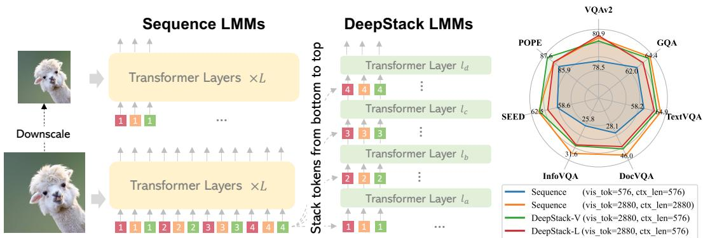
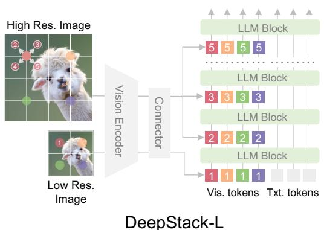
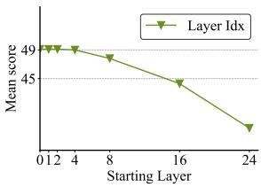
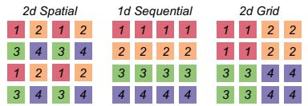
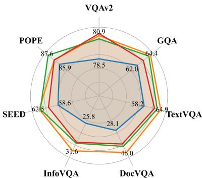

# DeepStack论文详细介绍

## 1. 背景

### 1.1 大语言模型与多模态模型的发展

近年来，随着大语言模型（LLMs）[62, 63, 87, 6, 65, 59]的巨大进步，我们见证了开发大型多模态模型（LMMs）[51, 88]的努力激增。为了连接视觉和语言模型，传统的方法是将图像使用预训练的视觉编码器（如CLIP [61]）转换为多个视觉特征，并将它们展平为"语言标记"序列，然后输入到LLM中。

### 1.2 现有方法的局限性

当前大多数LMMs通过将视觉标记作为序列馈送到大语言模型的第一层来实现。这种架构虽然简单，但显著增加了计算和内存成本，因为它必须在输入层处理大量额外的标记。当涉及高分辨率图像和多帧视频时，这个问题尤其显著。

现有的解决方案主要分为两类：

1. **标记压缩策略**：通过空间分组减少标记数量[70, 47]，或沿特征维度连接局部标记以保留视觉信息[11, 48]
2. **更复杂的标记重采样**：如Q-Former [43]、Perceiver [4]和Abstractor [8]等

然而，所有这些方法本质上都牺牲了细粒度的视觉信息，以在计算开销和信息流入LLMs之间达到平衡。最近的一些工作[22, 48, 50, 19, 20]提出了多裁剪策略，将几倍多的视觉标记串联起来以支持高分辨率场景，但代价是巨大的开销。

### 1.3 DeepStack的创新动机

所有当前将视觉与LLMs连接的努力都遵循相同的常规：视觉标记总是作为1D序列滚动在一起，并作为输入馈送到LLMs的第一层。在这项工作中，我们跳出常规，质疑是否可以在效果和效率方面找到更好的策略来处理大量视觉标记。

*图1：DeepStack与传统方法的对比。左：传统LMMs将所有视觉标记串联成序列；中：我们的DeepStack LMMs将标记堆叠成网格，并通过残差连接将它们注入到第一层和中间transformer层中；右：我们将DeepStack分别应用于Vicuna-7B（DeepStack-L）和CLIP ViT-L（DeepStack-V）*

## 2. 核心贡献

### 2.1 DeepStack核心思想

DeepStack是一种简单而新颖的将视觉标记馈送到LLMs的方法。与从左到右放置长序列的视觉标记不同，我们将视觉标记重新组织成一个分层堆栈，其中堆栈的每一层通过简单的残差连接连接到LLMs中的一层。

**主要创新点**：
- 不增加上下文长度的情况下，可以向LLMs馈送几倍多的视觉标记来处理复杂的视觉输入
- 每层并行注意力和逐层进展的组合可以有效地利用LLMs的能力来建模视觉标记的依赖关系
- 无需架构修改，同时显著增加了LLMs可以处理的标记数量

### 2.2 主要贡献总结

1. **提出DeepStack策略**：为LMMs中的视觉和语言连接提出了一种简单而有效的DeepStack策略。这种新策略无需架构更改，同时显著增加了LLMs可以处理的标记数量。

2. **构建DeepStack模型**：使用DeepStack策略，我们提出了新的DeepStack模型，并在广泛的多模态任务中与LMMs进行比较。我们的模型在基线方法上展示了一致的改进，特别是在高分辨率任务上。

3. **全面消融研究**：对我们提出的方法的不同方面进行了全面的消融研究，为设计选择提供了有用的指导和见解。

### 2.3 技术优势

- **效率提升**：在上下文长度不变的情况下，可以处理更多视觉标记
- **性能提升**：在多个基准测试中显著优于基线模型
- **通用性**：虽然我们只在LMMs的背景下展示了我们提出的方法的有效性，但我们注意到这种简单策略可以推广到任何基于transformer层的模型或任务

## 3. 核心贡献细节详细说明

### 3.1 DeepStack架构设计

DeepStack是一种多功能策略，可以在不增加视觉上下文长度的情况下为LMMs提供更细粒度的视觉信息。它通过将图像特征提取分为两个流来实现这一点：

1. **全局视图流**：捕获全局信息
2. **高分辨率流**：通过在不同LLM层中堆叠扩张的高分辨率图像特征来增强全局信息

*图2：DeepStack架构。主要创新在于将视觉标记注入不同层的DeepStack策略。左：用于LLMs的DeepStack；右：用于ViTs的DeepStack*

### 3.2 技术实现细节

#### 3.2.1 视觉标记化

先前的工作[45, 43, 51]广泛探索了如何将输入图像编码为视觉标记。标记化方案通常利用视觉语言预训练图像编码器 $\mathcal{F}^v$（例如CLIP [61]）从输入图像 $\mathbf{I}$ 中提取图像特征 $\mathbf{f}^{\mathbf{v}}$。然后，使用连接模块 $\mathcal{M}$ 将图像特征转换为视觉标记：

$$
\mathbf {X} = \mathcal {M} \left(\mathbf {f} ^ {\mathbf {v}}\right); \quad \mathbf {f} ^ {\mathbf {v}} = \mathcal {F} ^ {v} (\mathbf {I}) \tag {3}
$$

#### 3.2.2 DeepStack策略

为了在保持效率的同时融入细粒度的图像信息，我们通过将高分辨率视觉标记堆叠到不同的LLM解码器层中来增强输入视觉标记 $\mathbf{X}$。

在实践中，我们首先根据其宽高比对输入图像进行上采样，并同时对其进行标记化以获得高分辨率视觉标记。为了准备层次堆叠的标记，我们使用空间扩张[80, 14]将高分辨率视觉标记分割成不同的标记集 $\mathbf{X}^{\mathrm{stack}^i}$。这种采样方法确保视觉标记 $\mathbf{X}^{\mathrm{stack}^i}$ 与全局视觉标记 $\mathbf{X}$ 具有相同的长度。

$$
\begin{array}{l} \mathbf {X} ^ {\text {s t a c k}} = \left\{\mathbf {X} ^ {\text {s t a c k} ^ {1}}, \mathbf {X} ^ {\text {s t a c k} ^ {2}}, \dots , \mathbf {X} ^ {\text {s t a c k} ^ {\mathbf {S}}} \right\} \\ = \text {S a m p l i n g 2 D} \left(\mathcal {M} \left(\mathcal {F} ^ {v} \left(\mathbf {I} ^ {\text {h i r e s}}\right)\right)\right) \\ \end{array}
$$

#### 3.2.3 层间连接机制

给定一个具有 $L$ 个解码器层的LLM，LLM首先被分割成不同的块。具体来说，DeepStack将LLM $\mathcal{P}$ 的早期层分割成一组deepstack块 $\mathcal{B}^V = \{\mathcal{P}^{V^1},\mathcal{P}^{V^2},\dots,\mathcal{P}^{V^n}\}$ 用于堆叠视觉标记，并将后期层分割成一个普通块 $\mathcal{P}^{\mathbb{L}}$ 用于原始前缀序列建模：

$$
\begin{array}{l} \mathbf {H} ^ {V ^ {1}} = \mathcal {P} ^ {V ^ {1}} (\mathbf {X}) + \mathbf {X} ^ {\text {s t a c k} ^ {1}} \\ \mathbf {H} ^ {V ^ {2}} = \mathcal {P} ^ {V ^ {2}} \left(\mathbf {H} ^ {V ^ {1}}\right) + \mathbf {X} ^ {\text {s t a c k} ^ {2}} \tag {5} \\ \mathbf {H} ^ {L} = \mathcal {P} ^ {\mathbb {L}} \left(\mathbf {H} ^ {V ^ {n}}\right) \\ \end{array}
$$

### 3.3 与其他视觉标记增强策略的比较

为了更深入地理解DeepStack机制，我们通过检查最终LLM解码器层之后的视觉标记的隐藏状态 $\mathbf{H}^L$ 来比较我们的策略与先前的视觉标记增强策略。先前的方法可以大致分为两种方法：序列连接和维度连接。

#### 3.3.1 序列连接方法

整个图像和局部裁剪的视觉标记被顺序连接，显著增加了整体序列长度和计算成本。LLM解码器将这些连接的视觉标记作为更长的视觉前缀处理，直接建模扩展的序列：

$$
\mathbf {H} ^ {L} = \mathcal {P} (\operatorname {S e q C a t} [ \mathbf {X}, \mathbf {X} ^ {\mathbf {s t a c k}} ]) \tag {6}
$$

#### 3.3.2 维度连接方法

视觉标记沿特征维度连接，保持序列长度不变。当使用投影模块作为连接模块时，增强的视觉标记可以视为来自两个独立投影模块的特征之和：

$$
\begin{array}{l} \begin{array}{l} \mathbf {H} ^ {L} = \mathcal {P} \left(\mathcal {M} (\text {D i m C a t} [ \mathbf {f}, \mathbf {f} ^ {\text {h i r e s}} ])\right) \\ \mathcal {P} (1 + 1 (x), \dots , 1 + 3 (x h i r e s)) \end{array} \tag {7} \\ \approx \mathcal {P} \left(\mathcal {M} ^ {1} (\mathbf {f}) + \mathcal {M} ^ {2} \left(\mathbf {f} ^ {\mathrm {h i r e s}}\right)\right) \\ \end{array}
$$

#### 3.3.3 DeepStack的双阶段处理

在我们的DeepStack中，我们采用了一种独特的方法，其中增强从底层到顶层逐层发生。DeepStack中 $\mathbf{H}^L$ 的处理在两个阶段展开：

- **早期层**：解码器的早期层类似于编码器，通过残差添加高分辨率视觉标记来递归地增强输入视觉标记
- **后期层**：解码器像往常一样执行普通序列建模

这种双阶段处理通过结合编码和序列建模，充分利用了LLM的能力。通过在多个层集成高分辨率视觉信息，DeepStack有效地增强了视觉标记表示，而无需增加视觉上下文长度，展示了其相对于先前方法的优越性。

$$
\mathbf {H} ^ {L} = \overbrace {\mathcal {P} ^ {\mathbb {L}}} ^ {\downarrow} \left(\overbrace {\mathcal {P} ^ {V ^ {n}} \left(\dots \left(\mathcal {P} ^ {V 1} \left(\mathbf {X} + \mathbf {X} ^ {\mathbf {s t a c k} ^ {1}}\right) + \mathbf {X} ^ {\mathbf {s t a c k} ^ {2}}\right) \dots\right) + \mathbf {X} ^ {\mathbf {s t a c k} ^ {n}}}\right)\left. \right. \tag {8}
$$

### 3.4 DeepStack在视觉变换器中的应用

我们的DeepStack也可以应用于ViTs以获得更好的特征提取和图像标记化，如图2（DeepStack-V）所示。与LMM相比，我们使用补丁嵌入层PatchEmbedding和前几个ViT编码器层进行标记化，其余的ViT编码器层用于DeepStack。

形式上，我们将方程（4）中的 $\mathcal{F}$ 和 $\mathcal{M}$ 替换为补丁嵌入层和前几个编码器层，并使用其余的编码器层作为方程（5）中的 $\mathcal{P}$。

## 4. 实验分析

### 4.1 实验设置

我们主要遵循Llava [51]的训练配方，其训练流程包括两个阶段，即预训练（PT）阶段和监督微调（SFT）阶段。我们使用预训练的CLIP-large-336 [61]作为默认的图像编码器。为了获得高分辨率特征图，我们将高分辨率图像分割成补丁以符合分辨率要求，并将图像特征拼接在一起作为整个图像特征。

**预训练数据集**：我们使用LCS-558k [51]作为基于LLaVA-1.5和LLaVA-Next的实验的预训练数据，其中包含来自LAION [66]、CC [9]和SBU [84]的558k样本，由BLIP [45]标注。

**微调数据集**：我们使用LLaVA-mixed-665k [51]作为基于LLaVA-1.5的实验的指令跟随数据。

### 4.2 定量结果

我们在多个基准测试上评估DeepStack，包括学术任务导向评估和最近的大型多模态语言模型（LMM）基准测试。

#### 4.2.1 通用VQA和LMM基准测试

我们在两个经典的通用VQA基准测试VQAv2 [23]和GQA [25]以及五个最近的LMM基准测试上评估DeepStack：SEED [40]、POPE [46]、MMMU [83]和MM-Vet [81]。

如表1所示，DeepStack在其直接基线模型LLaVA上在VQAv2和GQA上都表现出色，在传统VQA任务中展示了最先进的性能。此外，DeepStack在最近的LMM基准测试上持续超越其他方法。

#### 4.2.2 文本导向基准测试

为了进一步验证DeepStack的有效性，我们在更多文本导向基准测试上评估它，包括ChartQA [54]、DocVQA [56]、InfoVQA [55]、MultiDocVQA [72]和TextVQA [69]。这些基准测试包含高分辨率图像，通常需要模型基于细粒度视觉输入回答问题。

如表2所示，为我们的模型配备DeepStack在所有基准测试上带来了一致的增益。这强烈表明DeepStack即使不增加序列长度也能增强视觉标记。

### 4.3 模型检查与分析

我们进行了充分的实验，为DeepStack的机制提供深入的见解。

#### 4.3.1 LLMs可以在早期解码器层很好地处理视觉标记

为了理解为什么LLMs的早期层适合处理视觉标记，我们进行了关于视觉标记插入层的实验。传统上，视觉标记插入在输入层，例如第0层。我们逐步将它们插入更深层，将相应的输入嵌入初始化为零。

*图3(a)：将视觉标记插入不同起始层的分析*

如图3(a)所示，在Phi-3的32个解码器层中的第8层之前插入视觉标记会导致可接受的性能变化。然而，在超过中点插入它们会导致显著的性能下降。这证实了早期层有效地处理初始视觉信息集成。

#### 4.3.2 更好的空间一致性带来更好的性能

不同的采样策略可能导致不同的结果。在表5中，我们比较了我们的默认策略与组织视觉标记的另外两个变体。如图5所示，保持空间一致性，即2d Spatial，如我们的默认设置，可以实现最佳性能。

*图5：DeepStack三种采样方法的可视化*

#### 4.3.3 DeepStack从高分辨率标记中提升LMMs，而不是残差连接

我们通过将原始视觉标记堆叠到不同层中来实验评估高分辨率图像和残差连接在DeepStack中的影响。如表6所示，堆叠重复的原始标记（虚拟标记）不会提高性能。这表明DeepStack中的性能提升来自高分辨率标记，而不是残差连接。

### 4.4 可视化结果

*图4：可视化。顶部：我们用红色圆圈标记每个问题对应的区域。DeepStack可以很好地回答需要高分辨率和细粒度理解的问题。底部：DeepStack在详细的视觉描述中展示了更准确的视觉理解。*

从图4的可视化结果可以看出，DeepStack在需要高分辨率和细粒度视觉理解的任务上表现显著优于LLaVA-1.5。例如：

- **问题**："右下角写的是什么？"
  - LLaVA-1.5：'Congratulations'
  - DeepStack：'3'

- **问题**："你能在白板上看到多少颗星星？"
  - LLaVA-1.5：1
  - DeepStack：'Postcode'

- **问题**："下面是什么糖果棒？"
  - LLaVA-1.5：Honey maid
  - DeepStack：Hershey's

- **问题**："手机是什么品牌？"
  - LLaVA-1.5：Samsung
  - DeepStack：HTC

这些结果表明DeepStack在细粒度视觉理解方面具有显著优势。

## 5. 结论

### 5.1 主要贡献总结

在这项工作中，我们提出了DeepStack，一种在LMMs背景下连接视觉和语言的简单而有效的方法。与先前总是将（压缩的）视觉标记串联成序列的工作不同，我们另辟蹊径地引入了对LLMs中transformer解码器层的新视角，并提出了一种DeepStack策略，将不同的视觉标记馈送到LLMs的不同层中。

**DeepStack的主要优势**：
- **效率提升**：这种策略显著减轻了视觉标记引入的效率开销，使得向LLMs传达更多视觉信息成为可能
- **性能提升**：我们的DeepStack在两个基线模型上展示了跨广泛基准测试的一致改进
- **高分辨率优势**：在本质上需要更多标记的任务上，这些好处尤其显著，例如高分辨率图像理解

### 5.2 实验结果总结

通过广泛的实验验证，DeepStack在多个重要方面表现出色：

1. **基准测试性能**：使用相同的上下文长度，我们的DeepStack 7B和13B参数分别比其对应模型在9个基准测试上平均高出2.7和2.9分

2. **高分辨率任务优势**：在TextVQA、DocVQA和InfoVQA等高分辨率任务上，相比LLaVA-1.5-7B分别提高了4.2、11.0和4.0分

3. **效率优势**：仅使用五分之一的上下文长度，DeepStack就能与使用完整上下文长度的对应模型相媲美

4. **视觉变换器应用**：将DeepStack应用于视觉变换器层也带来了类似的改进量，相比LLaVA-1.5-7B平均提高了3.8分

### 5.3 局限性与未来工作

**当前局限性**：
- 我们当前的DeepStack只是通过启发式方式通过残差连接将视觉标记插入到中间LLMs层中
- 尽管已经展示了有希望的结果，但我们可能找到更强大的方式来注入视觉信息，例如通过门控函数或逐层位置嵌入
- 如何系统地决定起始层和层数也值得更多研究

**未来研究方向**：
1. **更智能的视觉信息融合**：探索使用门控机制或自适应权重来更有效地融合视觉信息
2. **系统化的层选择策略**：开发自动化的方法来选择最佳的起始层和堆叠层数
3. **扩展到其他模态**：将DeepStack策略应用于其他模态，如音频、视频等
4. **优化训练策略**：研究更有效的训练策略来充分利用DeepStack架构

### 5.4 研究意义与影响

DeepStack策略为如何连接视觉和语言以构建更快更好的多模态模型开辟了新的思路。这种简单而有效的设计有望在以下方面产生重要影响：

- **架构创新**：为多模态模型的设计提供了新的视角，突破了传统序列连接的限制
- **效率优化**：在保持性能的同时显著降低了计算和内存开销
- **应用扩展**：为处理高分辨率图像和视频等复杂视觉任务提供了更有效的解决方案

我们希望这种新的DeepStack策略能够为在LMMs体系中连接视觉和语言以构建更快更好的多模态模型开辟新的思路和探索方向。