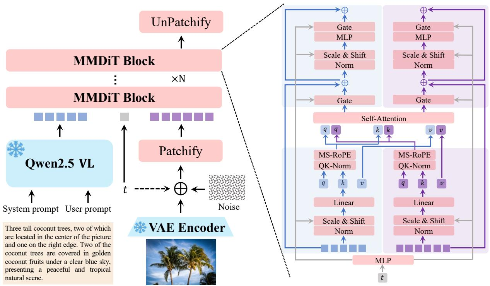
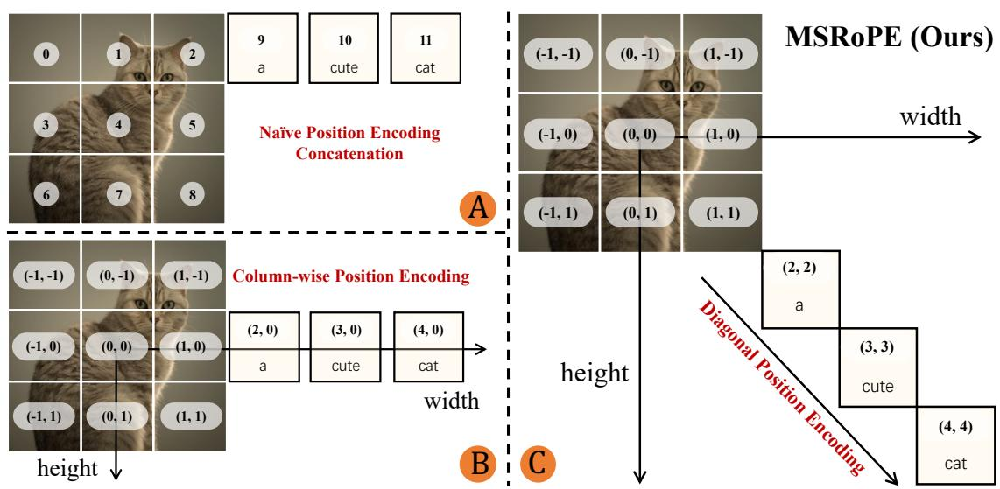
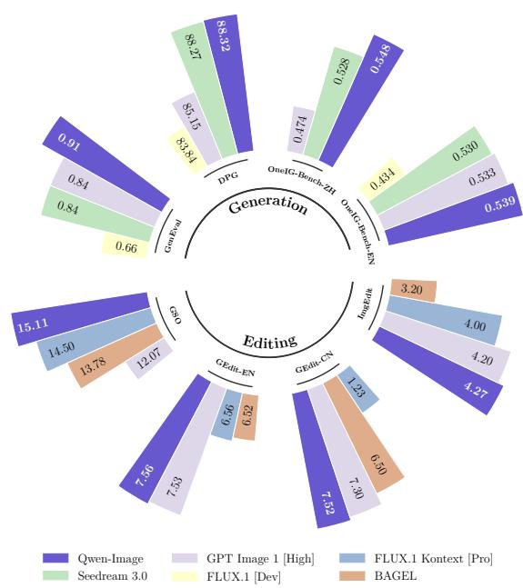
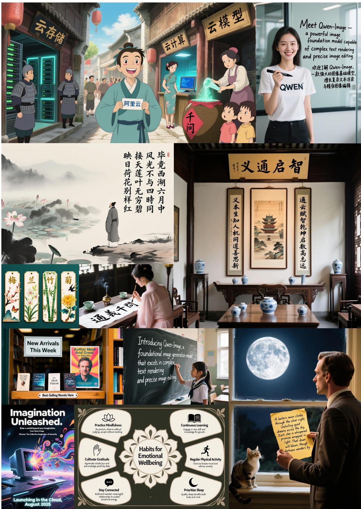

# Qwen多模态大模型对比综述

## 摘要

本文对Qwen系列中的两个重要多模态大模型进行深入对比分析：**Qwen-Image**（图像生成模型）和**Qwen2.5-VL**（视觉语言理解模型）。通过系统分析两篇技术报告，本文重点探讨了以下核心问题：

1. **共同点与区别**：分析两篇论文在技术架构、数据策略、训练方法等方面的共同基础与核心差异
2. **核心技术贡献**：详细解析两个模型的关键技术创新和实现细节
3. **联系与协同**：深入探讨两个模型之间的技术依赖关系和协同发展路径

两篇论文代表了Qwen在多模态人工智能领域的最新进展，分别聚焦于图像生成和视觉理解两个关键方向，形成了理解与生成能力的互补发展格局。

## 引言

本文对Qwen系列中的两个重要多模态大模型进行深入对比分析：**Qwen-Image**（图像生成模型）和**Qwen2.5-VL**（视觉语言理解模型）。这两篇论文代表了Qwen在多模态人工智能领域的最新进展，分别聚焦于图像生成和视觉理解两个关键方向。

## 1. 两篇论文的共同点与区别

### 1.1 共同点

#### 1.1.1 技术架构基础

两篇论文都基于Qwen系列的技术栈，共享以下核心技术组件：

- **视觉编码器（ViT）**：两篇论文都采用了重新设计的Vision Transformer架构
- **大语言模型（LLM）**：都基于Qwen2.5 LLM作为语言理解的基础
- **多模态融合机制**：都实现了视觉和语言模态的有效融合

#### 1.1.2 数据工程策略

两篇论文都强调了高质量数据的重要性：

- **大规模数据收集**：都采用了数十亿级别的训练数据
- **多阶段数据过滤**：都实现了精细的数据质量控制流程
- **多语言支持**：都特别关注中文等多语言场景

#### 1.1.3 技术演进路径

两篇论文都体现了Qwen系列的技术演进：

- **渐进式训练策略**：从基础任务到复杂任务的渐进学习
- **多任务学习**：支持多种下游任务的统一模型架构
- **开源生态**：都遵循Qwen的开源理念，提供完整的开源实现

### 1.2 核心区别

#### 1.2.1 模型目标定位

**Qwen-Image**：
- **主要目标**：图像生成和编辑
- **核心任务**：文本到图像生成（T2I）、图像到图像编辑（TI2I）
- **应用场景**：创意设计、内容创作、图像编辑

**Qwen2.5-VL**：
- **主要目标**：视觉语言理解和交互
- **核心任务**：视觉问答、文档解析、目标定位、视频理解
- **应用场景**：智能助手、文档处理、视频分析、智能代理

#### 1.2.2 技术架构差异

**Qwen-Image架构**：
```
输入 → Qwen2.5-VL（条件编码器） → VAE（图像分词器） → MMDiT（扩散模型） → 输出图像
```

**Qwen2.5-VL架构**：
```
视觉输入 → ViT（视觉编码器） → MLP融合器 → Qwen2.5 LLM → 文本输出
```

#### 1.2.3 关键技术贡献

**Qwen-Image的关键创新**：
- **MSRoPE**：多模态可扩展旋转位置编码
- **双编码机制**：语义特征（Qwen2.5-VL）+重建特征（VAE）
- **渐进式文本渲染**：从简单到复杂的文本生成训练

**Qwen2.5-VL的关键创新**：
- **动态分辨率处理**：原生支持不同尺寸的图像输入
- **绝对时间编码**：视频理解中的时间维度处理
- **窗口注意力机制**：优化计算效率

## 2. 核心技术贡献和细节分析

### 2.1 Qwen-Image核心技术细节

#### 2.1.1 多模态扩散变换器（MMDiT）

Qwen-Image采用MMDiT作为核心生成架构，具有以下特点：

- **双流架构**：同时处理文本和图像信息
- **MSRoPE位置编码**：创新的多模态位置编码方案
- **60层深度**：深层网络结构支持复杂生成任务


*图1：Qwen-Image架构概览，展示了基于MMDiT的双流架构设计*


*图2：MSRoPE多模态位置编码策略，支持图像分辨率缩放和文本-图像对齐*

#### 2.1.2 渐进式文本渲染训练

为了解决复杂文本渲染的挑战，Qwen-Image设计了专门的训练策略：

1. **非文本到文本渲染**：从基础任务开始
2. **简单到复杂文本**：逐步增加文本复杂度
3. **段落级描述**：最终支持复杂段落生成

#### 2.1.3 多任务训练范式

Qwen-Image整合了三种训练任务：
- **T2I**：文本到图像生成
- **TI2I**：文本图像到图像编辑
- **I2I**：图像到图像重建

### 2.2 Qwen2.5-VL核心技术细节

#### 2.2.1 动态分辨率处理

Qwen2.5-VL在空间和时间维度都实现了动态处理：

- **空间维度**：支持不同尺寸的图像输入，无需归一化
- **时间维度**：动态FPS采样，支持不同帧率的视频
- **绝对坐标**：使用实际图像尺寸表示边界框和点

#### 2.2.2 多模态旋转位置编码（MRoPE）

Qwen2.5-VL扩展了MRoPE以支持时间维度：

- **三维分解**：时间、高度、宽度三个维度
- **绝对时间对齐**：时间ID与绝对时间对齐
- **跨模态一致性**：保持文本和视觉位置编码的一致性

#### 2.2.3 窗口注意力机制

为了优化计算效率，Qwen2.5-VL采用了窗口注意力：

- **线性复杂度**：相比全注意力的二次复杂度
- **选择性全注意力**：仅在4个关键层使用全注意力
- **无填充处理**：小区域无需填充，保持原始分辨率


*图3：Qwen2.5-VL整体架构，展示了视觉编码器与语言模型的集成设计*

## 3. 两篇论文的联系与协同

### 3.1 技术依赖关系

**Qwen-Image依赖于Qwen2.5-VL**：
- Qwen-Image使用Qwen2.5-VL作为条件编码器
- 这种依赖关系体现了两个模型的协同设计
- Qwen2.5-VL为Qwen-Image提供语义理解能力

### 3.2 数据共享与协同

两篇论文在数据策略上存在协同：

- **数据过滤管道**：共享相似的数据质量控制方法
- **多语言支持**：都特别关注中文等多语言场景
- **文档处理**：在文档解析和文本渲染方面有技术重叠

### 3.3 技术演进路径

两篇论文代表了Qwen多模态技术的两个发展方向：

- **理解能力**：Qwen2.5-VL专注于视觉语言理解
- **生成能力**：Qwen-Image专注于图像生成和编辑
- **协同发展**：两个方向相互促进，形成完整的多模态能力

## 4. 性能表现对比

### 4.1 基准测试表现

**Qwen-Image在以下基准表现出色**：
- **GenEval、DPG、OneIG-Bench**：通用图像生成
- **GEdit、ImgEdit、GSO**：图像编辑
- **LongText-Bench、ChineseWord、CVTG-2K**：文本渲染


*图4：Qwen-Image在图像生成和编辑基准测试中的表现*


*图5：Qwen-Image在复杂文本渲染方面的展示，支持多语言和复杂布局*

**Qwen2.5-VL在以下基准表现出色**：
- **文档理解**：多场景、多语言文档解析
- **目标定位**：边界框和点定位精度
- **视频理解**：超长视频理解和细粒度视频定位


*图6：Qwen2.5-VL在文档解析方面的能力展示*

### 4.2 模型规模对比

| 模型 | 参数规模 | 主要应用 | 性能特点 |
|------|----------|----------|----------|
| Qwen-Image | 27B+ | 图像生成编辑 | 卓越的文本渲染能力 |
| Qwen2.5-VL-72B | 72B | 视觉语言理解 | 匹配GPT-4o和Claude 3.5 |
| Qwen2.5-VL-7B | 7B | 边缘计算 | 超越同类竞争对手 |
| Qwen2.5-VL-3B | 3B | 资源受限环境 | 强大的基础能力 |

## 5. 应用场景分析

### 5.1 Qwen-Image应用场景

1. **创意设计**：海报、UI设计、艺术创作
2. **内容生成**：社交媒体内容、营销素材
3. **图像编辑**：风格转换、对象添加/移除、背景替换
4. **文本渲染**：多语言文本生成、复杂布局设计


*图7：Qwen-Image在通用图像生成方面的展示，支持多样艺术风格*


*图8：Qwen-Image在图像编辑方面的能力，包括风格转换、文本编辑、背景替换等*

### 5.2 Qwen2.5-VL应用场景

1. **智能助手**：多模态对话、场景理解
2. **文档处理**：发票解析、表格提取、图表分析
3. **视频分析**：事件检测、时刻定位、内容理解
4. **智能代理**：计算机操作、移动设备交互


*图9：Qwen2.5-VL在目标定位和空间推理方面的能力展示*


*图10：Qwen2.5-VL在文档解析和图表理解方面的综合能力*

## 6. 技术发展趋势

### 6.1 统一多模态架构

两篇论文展示了向统一多模态架构发展的趋势：
- **理解与生成的融合**：Qwen2.5-VL为理解，Qwen-Image为生成
- **多任务统一模型**：单一模型支持多种模态任务
- **端到端学习**：减少模块化设计的复杂性

### 6.2 数据驱动的优化

两篇论文都强调了数据质量的重要性：
- **精细化数据过滤**：多阶段质量控制
- **平衡数据分布**：避免数据偏差
- **合成数据增强**：补充真实数据的不足

### 6.3 效率优化

两篇论文都关注计算效率：
- **窗口注意力**：降低计算复杂度
- **动态处理**：适应不同输入规模
- **渐进式训练**：提高训练效率

## 7. 结论

Qwen-Image和Qwen2.5-VL代表了Qwen在多模态人工智能领域的两个重要突破。Qwen2.5-VL在视觉语言理解方面达到了业界领先水平，特别是在文档解析、目标定位和视频理解方面表现出色。Qwen-Image则在图像生成和编辑方面实现了重大突破，特别是在复杂文本渲染和多语言支持方面具有独特优势。

两篇论文的技术路线体现了Qwen系列的技术哲学：通过精细的数据工程、创新的架构设计和渐进式的训练策略，构建既强大又实用的多模态人工智能系统。两个模型的技术协同和互补关系，为构建更完整的通用人工智能系统奠定了基础。

未来，随着理解能力和生成能力的进一步融合，Qwen系列有望在更广泛的多模态应用场景中发挥重要作用，推动人工智能技术在创意、教育、医疗、娱乐等领域的深度应用。